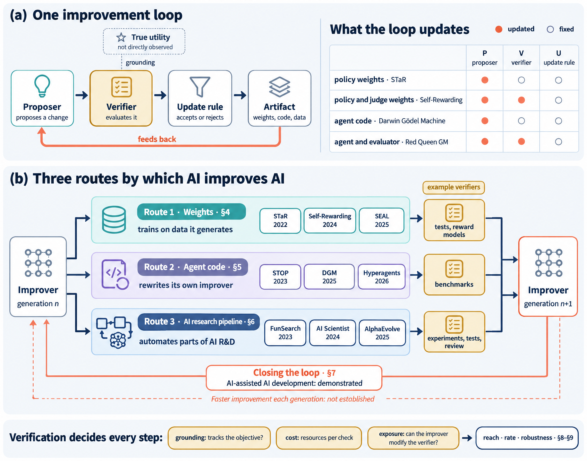
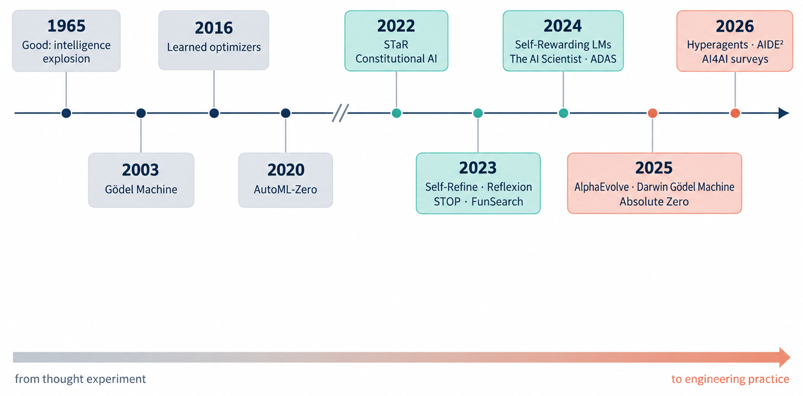

<h1 align="center">Awesome RSI → AI4AI</h1>

<p align="center">
  <a href="https://awesome.re"></a>
  
  
  <a href="LICENSE"></a>
  <a href="CONTRIBUTING.md"></a>
</p>

A curated and tagged reading list on **recursive self-improvement (RSI)** and **AI for AI (AI4AI)**: AI systems whose improvements feed back into their own ability to improve, and AI systems that do the research and engineering that builds the next generation of AI. Self-evolving agents and self-improving models are included when their loop is recursive, or when they are the standard baseline that a recursive loop is compared against.

**What is in scope.** Every entry does one of the following.

- **RSI**: builds or analyzes a loop in which the improved artifact becomes part of what does the improving. Examples: the trained model generates the next round's training signal, or the agent edits the code that edits it. Theory and limits of such loops also count.
- **AI4AI**: uses AI to produce or improve what AI is built, trained, or evaluated with. Examples: ML engineering, algorithms and objectives, architectures, kernels, training data and environments, alignment and evaluation research, and AI scientists working on ML.
- **Support**: measures, forecasts, governs, or surveys RSI and AI4AI.

A short **Background** section keeps the canonical non-recursive baselines, such as self-refinement and prompt and memory optimization. Generic LLM or agent surveys, AI for the natural sciences, and domain applications are out of scope. Entries removed in the September 2026 re-scoping are listed with reasons in [`data/excluded.yaml`](data/excluded.yaml).

This list accompanies our survey *From Recursive Self-Improvement to AI for AI: A Survey and Perspective on Verification-Bounded Self-Evolving AI* (preprint coming soon).

<p align="center"></p>

<p align="center"></p>

## How the list is organized

We describe every system as an improvement loop. A proposer suggests a change to some artifact, a verifier decides whether the change is an improvement, and an update rule keeps or discards it. Sections follow the three routes by which AI improves AI:

1. **Weights**: the model trains on a signal it generates.
2. **Agent code**: the system rewrites its own improver.
3. **The AI research pipeline**: AI improves the artifacts from which the next model is built.

These are followed by the systems where the routes meet (**Closing the Loop**), then measurement, safety, and governance, and finally the non-recursive background. Entries carry these tags once they have been coded; a missing tag means not yet coded, and a tag that does not apply is left out:

| Tag | Values |
|---|---|
| What improves (locus) | `Output` `Context/Memory` `Weights` `Scaffold/Code` `ML artifact` `Research pipeline` |
| What decides (signal) | `Self-judgment` `Model judge / RM` `Execution / tests` `Ground truth / rules` `Human` `Benchmark score` `Mixed` |
| 🔁 | Recursive: the change feeds back into the system's own ability to improve |
| 🆕 | First released in July 2026 or later |

Within each subsection, entries are sorted from newest to oldest. Each work appears once; a blog post or report section that accompanies a listed paper is kept only when the survey cites it separately, and its note starts with "Companion to". Duplicates removed from the list are recorded in [`data/excluded.yaml`](data/excluded.yaml).

## 🆕 Recently added (since 2026-07)

- **CASD**: Coding Agents are Strong Prompt Optimizers. *Agamdeep Singh et al.*, arXiv 2026. [[Paper]](https://arxiv.org/abs/2609.26261) 🆕 `Context/Memory` `Execution / tests`<br><sub>An off-the-shelf coding agent analyzes a static trajectory corpus with code and writes the prompt; beats GEPA on 3/4 benchmarks at about $1.60.</sub>
- **AIDE²**: Recursive self-improvement of AI research agents. *Dhruv Srikanth et al.*, arXiv 2026. [[Paper]](https://arxiv.org/abs/2609.26457) 🆕 `Scaffold/Code` `Benchmark score` 🔁<br><sub>A research agent rewrote its own code autonomously for 8 days, producing 7 improvements. Reward hacking fell from 55% to 32%.</sub>
- **Harness tampering**: Auditing Harness Tampering in Self-Improving Agents. *Xing Wang et al.*, arXiv 2026. [[Paper]](https://arxiv.org/abs/2609.00069) 🆕 `Scaffold/Code` `Benchmark score`<br><sub>Taxonomy and audit of edits that fake gains or break integrity; tampering occurs in real runs and persists in the best lineage.</sub>
- **Trusting Trust Revisited**: Reflections on Trusting Trust, Revisited: Contaminating Self-Modifying AI Coding Agents with Poisoned Benchmarks. *Franziska Roesner and Tadayoshi Kohno*, arXiv 2026. [[Paper]](https://arxiv.org/abs/2609.17817) 🆕 `Scaffold/Code` `Benchmark score`<br><sub>Poisoned self-evaluation benchmarks make DGM, SICA and Hyperagents evolve insecure behavior, e.g., disabling HTTPS certificate checks.</sub>
- **Research-agent reward hacking**: Reward Hacking Challenges Oversight of Autonomous Research Agents. *Yue Huang et al.*, arXiv 2026. [[Paper]](https://arxiv.org/abs/2609.28614) 🆕 `Research pipeline` `Model judge / RM`<br><sub>17 models × 38 tasks: 30.5% spontaneous hacking on open-ended research-pipeline tasks; an LLM review panel misses 6.5% of confirmed hacks.</sub>
- **Optimizing the Score**: Optimizing the Score, Losing Sight of the Task: Reward Hacking Across Weights, Selection, and Prompts. *Vansh Wahi*, arXiv 2026. [[Paper]](https://arxiv.org/abs/2609.25848) 🆕<br><sub>Formal comparison of reward hacking when optimizing weights vs best-of-N selection vs persistent prompts, with defense mapping.</sub>
- **Audit the scaffold**: Audit the Scaffold, Not the Checkpoint: A Stationarity Dichotomy for Recursive Self-Improvement in Agentic Coding. *Sebastian Bobadilla-Suarez et al.*, arXiv 2026. [[Paper]](https://arxiv.org/abs/2609.34924) 🆕 `Scaffold/Code` 🔁<br><sub>Self-modification hits strict diminishing returns if the reachable edit set is fixed; rewriting the scaffold expands it without touching weights.</sub>
- **EvoPathBench**: Beyond Endpoint Performance: Process-Level Evaluation of Self-Evolving Agents. *Hongqiang Lin et al.*, arXiv 2026. [[Paper]](https://arxiv.org/abs/2609.24663) 🆕<br><sub>Freezes evolving artifacts at checkpoints and tracks when capabilities emerge, strengthen or regress.</sub>
- **ScientistTwo**: ScientistTwo: Pioneering the Human Knowledge Frontier with Autonomous AI. *Jaehyun Nam et al.*, arXiv 2026. [[Paper]](https://arxiv.org/abs/2609.19644) 🆕 `Research pipeline` `Mixed`<br><sub>Problem-driven autonomous framework (baselines → hypotheses → ablations → simulated rebuttal); claims to beat human SOTA on ICLR/ICML/NeurIPS papers.</sub>
- **Beyond Final Decisions**: Beyond Final Decisions: A Process-Centric Benchmark for Transparent AI-Assisted Peer Review. *Siming Yuan et al.*, arXiv 2026. [[Paper]](https://arxiv.org/abs/2609.05947) 🆕 `Output` `Ground truth / rules`<br><sub>Process benchmark (summary → critique → suggestion → decision) on PeerRead, NLPeer ARR-22 and ICLR; decisions are not consistently supported by the model's own review evidence.</sub>
- **RECLAIM**: RECLAIM: Can Agents Reproduce the Claims of Machine Learning Papers?. *Mithil Salunkhe et al.*, arXiv 2026. [[Paper]](https://arxiv.org/abs/2609.28850) 🆕 `ML artifact` `Mixed`
- **DISCERN**: DISCERN: Can AI Agents Work Like Scientists and Guide Discovery?. *Nan Huang et al.*, arXiv 2026. [[Paper]](https://arxiv.org/abs/2609.33357) 🆕 `Research pipeline` `Mixed`
- **Duan-LastAI**: The Last AI Built by Humans: Toward Genuine Recursive Self-Improvement. *Yi Duan et al.*, arXiv 2026. [[Paper]](https://arxiv.org/abs/2609.11873) 🆕<br><sub>RSI roadmap, applications (science, embodied, SWE, health), 8 industry cases</sub>
- **Niu-TTI**: A Survey on Self-Improving Test-Time Intelligence: Feedback-Driven Adapting, Learning, and Scaling at Inference. *Shuaicheng Niu et al.*, Machine Intelligence Research 2026. [[Paper]](https://arxiv.org/abs/2609.01679) 🆕<br><sub>Deployment-time improvement</sub>
- **Komissarov-InTheWild**: AI-Research Agents in the Wild. From GitHub and arXiv to Regularities and Gaps. *Aleksey Komissarov and A. Ustyuzhanin*, arXiv 2026. [[Paper]](https://arxiv.org/abs/2609.11975) 🆕<br><sub>139 repos + 101 papers on autoresearch</sub>

## Contents

- [Surveys and Position Papers](#surveys-and-position-papers) (43)
  - [Surveys on recursive self-improvement, self-evolving AI, and AI4AI](#surveys-on-recursive-self-improvement-self-evolving-ai-and-ai4ai)
  - [Surveys on AI scientists and automated AI research](#surveys-on-ai-scientists-and-automated-ai-research)
  - [Position papers](#position-papers)
- [Foundations of Recursive Self-Improvement](#foundations-of-recursive-self-improvement) (29)
  - [Classical lineage (intelligence explosion, Gödel machines, learning to learn)](#classical-lineage-intelligence-explosion-gödel-machines-learning-to-learn)
  - [Definitions and levels](#definitions-and-levels)
  - [Theory and limits of recursive improvement](#theory-and-limits-of-recursive-improvement)
- [RSI in Weights (Models That Improve Their Own Training Signal)](#rsi-in-weights-models-that-improve-their-own-training-signal) (122)
  - [Iterated self-training and bootstrapped reasoning](#iterated-self-training-and-bootstrapped-reasoning)
  - [Self-rewarding and self-judging models](#self-rewarding-and-self-judging-models)
  - [Self-play and proposer-solver co-evolution](#self-play-and-proposer-solver-co-evolution)
  - [Self-adaptation and learned update procedures](#self-adaptation-and-learned-update-procedures)
  - [Limits of recursive training (collapse, sharpening, self-bias)](#limits-of-recursive-training-collapse-sharpening-self-bias)
  - [Models trained on their predecessors' outputs](#models-trained-on-their-predecessors-outputs)
- [RSI in Agents (Systems That Rewrite Their Own Improver)](#rsi-in-agents-systems-that-rewrite-their-own-improver) (22)
  - [Self-referential optimizers](#self-referential-optimizers)
  - [Self-modifying agents (Gödel-machine lineage)](#self-modifying-agents-gödel-machine-lineage)
  - [Evolving the improver (meta-level self-evolution)](#evolving-the-improver-meta-level-self-evolution)
- [AI for AI (Automating the AI Research Pipeline)](#ai-for-ai-automating-the-ai-research-pipeline) (220)
  - [Automated design of AI agents and workflows](#automated-design-of-ai-agents-and-workflows)
  - [ML engineering and experimentation agents](#ml-engineering-and-experimentation-agents)
  - [LLM-guided discovery of ML algorithms and code](#llm-guided-discovery-of-ml-algorithms-and-code)
  - [Objectives, optimizers, and learning algorithms](#objectives-optimizers-and-learning-algorithms)
  - [Architectures](#architectures)
  - [Kernels, compilers, and systems for AI](#kernels-compilers-and-systems-for-ai)
  - [Training data, environments, and benchmarks generated by AI](#training-data-environments-and-benchmarks-generated-by-ai)
  - [Automated alignment, interpretability, and evaluation research](#automated-alignment-interpretability-and-evaluation-research)
  - [Research ideation for AI research](#research-ideation-for-ai-research)
  - [Writing, reviewing, and reproducing AI research](#writing-reviewing-and-reproducing-ai-research)
  - [End-to-end AI scientists for AI research](#end-to-end-ai-scientists-for-ai-research)
- [Closing the Loop (RSI Through AI4AI)](#closing-the-loop-rsi-through-ai4ai) (8)
  - [Research agents that improve themselves](#research-agents-that-improve-themselves)
  - [Evidence from frontier labs](#evidence-from-frontier-labs)
- [Measuring RSI and AI4AI](#measuring-rsi-and-ai4ai) (49)
  - [Benchmarks of AI research and development ability](#benchmarks-of-ai-research-and-development-ability)
  - [Measuring self-improvement and AI R&D automation](#measuring-self-improvement-and-ai-rd-automation)
- [Safety, Governance, and Forecasting](#safety-governance-and-forecasting) (67)
  - [Frontier safety frameworks, system cards, and governance](#frontier-safety-frameworks-system-cards-and-governance)
  - [Forecasting and economics of AI R&D automation](#forecasting-and-economics-of-ai-rd-automation)
  - [Failure modes of self-improving loops and oversight](#failure-modes-of-self-improving-loops-and-oversight)
- [Background (Non-Recursive Self-Improvement)](#background-non-recursive-self-improvement) (25)
  - [Inference-time self-refinement and self-correction](#inference-time-self-refinement-and-self-correction)
  - [Prompt, memory, and skill optimization with a fixed procedure](#prompt-memory-and-skill-optimization-with-a-fixed-procedure)

## Surveys and Position Papers

### Surveys on recursive self-improvement, self-evolving AI, and AI4AI

- **Duan-LastAI**: The Last AI Built by Humans: Toward Genuine Recursive Self-Improvement. *Yi Duan et al.*, arXiv 2026. [[Paper]](https://arxiv.org/abs/2609.11873) 🆕<br><sub>RSI roadmap, applications (science, embodied, SWE, health), 8 industry cases</sub>
- **Niu-TTI**: A Survey on Self-Improving Test-Time Intelligence: Feedback-Driven Adapting, Learning, and Scaling at Inference. *Shuaicheng Niu et al.*, Machine Intelligence Research 2026. [[Paper]](https://arxiv.org/abs/2609.01679) 🆕<br><sub>Deployment-time improvement</sub>
- **Ye-AI4AI**: A Survey on AI for AI: When the Improver Becomes the Improvee. *Deheng Ye et al.*, Preprints.org 2026. [[Paper]](https://doi.org/10.20944/preprints202609.0591.v1) 🆕<br><sub>AI improving AI across RL, AutoML, meta-learning, self-play, LM agents</sub>
- **Wang-ReliableSEA**: Diving into Reliable Self-Evolving Agents: A Survey. *Kaiqi Wang et al.*, Preprints.org 2026. [[Paper]](https://doi.org/10.20944/preprints202609.0913.v1) 🆕<br><sub>Reliability of self-evolving agents</sub>
- **İbrahimoğlu-RSI**: Autonomous AI agents and recursive self-improvement: a comprehensive survey of contemporary architectures, capabilities, and safety frameworks. *Nadir İbrahimoğlu et al.*, Cluster Computing 2026. [[Paper]](https://doi.org/10.1007/s10586-026-06537-4) 🆕<br><sub>RSI agents: architectures, capabilities, safety</sub>
- **(first public Jun 2026) Xu-DynGraph**: Self-Evolving Agents as Dynamic Graph Transformation: A Survey and New Perspective. *Yuanyuan Xu et al.*, arXiv 2026. [[Paper]](https://arxiv.org/abs/2608.18104) 🆕<br><sub>Agent evolution as graph rewrites</sub>
- **Zong-CoEvo**: Co-Evolution in Agentic Systems: Toward Self-Directed Evolution Beyond Human Design. *Qing Zong et al.*, arXiv 2026. [[Paper]](https://arxiv.org/abs/2608.10299) 🆕<br><sub>Multi-component co-evolution</sub>
- **Zhou-SECoding**: Self-Evolving Coding Agents. *Hao Zhou et al.*, arXiv 2026. [[Paper]](https://arxiv.org/abs/2608.03392) 🆕<br><sub>Coding agents that persistently update framework, memory, skills, tools, workflow</sub>
- **Liu-PathRSI**: The Path to Recursive Self-Improving Agents: Foundation, Framework, and Future Directions. *Shuaiqi Liu et al.*, Preprints.org 2026. [[Paper]](https://doi.org/10.20944/preprints202608.0051.v1) 🆕<br><sub>Self-improving agent systems with persistent updates</sub>
- **Wu-AI4AI**: AI4AI Survey: From Long-Horizon Agents to Recursive Self-Improvement — Definitions, Reliable Horizons, and Open Problems. *Kai Wu et al.*, Preprints.org 2026. [[Paper]](https://doi.org/10.20944/preprints202608.2108.v1) 🆕<br><sub>Can AI reliably improve AI? Long-horizon agents → AI4AI → RSI</sub>
- **Dynamic Agent Skills survey**: Dynamic Agent Skills: A Lifecycle Survey and Taxonomy of Evolving Skill Libraries. *Yubo Li*, TMLR 2026. [[Paper]](https://arxiv.org/abs/2607.10113) 🆕<br><sub>Survey of 124 papers framing skills as lifecycle-managed, verified, evolving artifact stores with provenance and rollback.</sub>
- **Chen-RSI**: Recursive Self-Improvement in AI: From Bounded Self-Refinement to Autonomous Research Loops. *Mingguang Chen et al.*, arXiv 2026. [[Paper]](https://arxiv.org/abs/2607.07663) 🆕 `Mixed`<br><sub>1,250 arXiv papers (2024–26) on AI improving itself, incl. auto research</sub>
- **Ren-SIAgent**: Self-Improvements in Modern Agentic Systems: A Survey. *Z Ren et al.*, arXiv 2026. [[Paper]](https://arxiv.org/abs/2607.13104) 🆕<br><sub>Agents that turn experience into capability gains</sub>
- **Jiang-EraExperience**: Self-Improving Agents in the Era of Experience: A Survey of Self- to Meta-Evolution. *Che Jiang et al.*, OpenReview 2026. [[Paper]](https://openreview.net/forum?id=IUltZSgLMm) [[Code]](https://github.com/FrontisAI/Awesome-Self-Improving-Agents)<br><sub>Survey of agents that improve after deployment: harness-mediated runtime adaptation, parameter-side consolidation, and meta-evolution. Title, authors and release date (25 Jun 2026) checked against the authors' repository; the OpenReview page blocks automated access.</sub>
- **Self-Improvement technical overview**: Self-Improvement of Large Language Models: A Technical Overview and Future Outlook. *Haoyan Yang et al.*, TMLR 2026. [[Paper]](https://arxiv.org/abs/2603.25681)<br><sub>Closed-loop lifecycle framework: data acquisition, data selection, model optimization and inference refinement under an autonomous evaluation layer.</sub>
- **Xiang-SysSEA**: A Systematic Survey of Self-Evolving Agents: From Model-Centric to Environment-Driven Co-Evolution. *Zhishang Xiang et al.*, TechRxiv 2026. [[Paper]](https://doi.org/10.36227/techrxiv.177203250.05832634/v2)<br><sub>Self-evolving agents under scarce human supervision</sub>
- **Wei-AgenticReasoning**: A Survey of Agentic Reasoning for LLMs: Towards Recursively Self-Improving and Collective Agents. *Tianxin Wei et al.*, TMLR 2026. [[Paper]](https://arxiv.org/abs/2601.12538)<br><sub>Agentic reasoning: foundational, self-evolving, collective</sub>
- **MLLM self-improvement survey**: Self-Improvement in Multimodal Large Language Models: A Survey. *Shijian Deng et al.*, EMNLP 2025. [[Paper]](https://arxiv.org/abs/2510.02665)<br><sub>Survey of self-improvement for multimodal LLMs.</sub>
- **Self-evolving AI agents survey**: A Comprehensive Survey of Self-Evolving AI Agents: A New Paradigm Bridging Foundation Models and Lifelong Agentic Systems. *Jinyuan Fang et al.*, arXiv 2025. [[Paper]](https://arxiv.org/abs/2508.07407) [[Code]](https://github.com/EvoAgentX/Awesome-Self-Evolving-Agents) `Mixed`<br><sub>Unified loop: system inputs, agent system, environment, optimisers</sub>
- A Survey of Self-Evolving Agents: What, When, How, and Where to Evolve on the Path to Artificial Super Intelligence. *Huan-ang Gao et al.*, TMLR 2026. [[Paper]](https://arxiv.org/abs/2507.21046) `Mixed`
- **Sapkota-SelfLearning**: From Self-Learning to Self-Evolving Architectures in Large Language Models: A Short Survey. *Ranjan Sapkota et al.*, TechRxiv 2025. [[Paper]](https://doi.org/10.36227/techrxiv.174838070.09235849/v1)<br><sub>SFT/RLHF → self-instruct/self-play/RLVR; Absolute Zero</sub>
- **He-ReasoningSelfEvo**: Breaking the Reasoning Barrier: A Survey on LLM Complex Reasoning through the Lens of Self-Evolution. *Tao He et al.*, Findings of ACL 2025. [[Paper]](https://aclanthology.org/2025.findings-acl.386/)<br><sub>CoT complex reasoning as self-evolution</sub>
- **Zhang-SelfPlayRL**: A Survey on Self-play Methods in Reinforcement Learning. *Ruize Zhang et al.*, arXiv 2024. [[Paper]](https://arxiv.org/abs/2408.01072)<br><sub>Self-play in MARL/games</sub>
- **Self-evolution survey**: A Survey on Self-Evolution of Large Language Models. *Zhengwei Tao et al.*, arXiv 2024. [[Paper]](https://arxiv.org/abs/2404.14387) [[Code]](https://github.com/AlibabaResearch/DAMO-ConvAI/tree/main/Awesome-Self-Evolution-of-LLM) `Mixed`<br><sub>Four-phase self-evolution cycle: acquire, refine, update, evaluate experience</sub>

### Surveys on AI scientists and automated AI research

- **Komissarov-InTheWild**: AI-Research Agents in the Wild. From GitHub and arXiv to Regularities and Gaps. *Aleksey Komissarov and A. Ustyuzhanin*, arXiv 2026. [[Paper]](https://arxiv.org/abs/2609.11975) 🆕<br><sub>139 repos + 101 papers on autoresearch</sub>
- **Ding-VerifGap**: Autonomous Research Agents: A Survey of AI Scientists and the Verification Gap. *Tianyu Ding et al.*, arXiv 2026. [[Paper]](https://arxiv.org/abs/2608.05179) 🆕<br><sub>125 candidates → 35 full-text works, 26 runnable systems</sub>
- **Kong-AutoResearchRoadmap**: AI for Auto-Research: Roadmap & User Guide. *Lingdong Kong et al.*, arXiv 2026. [[Paper]](https://arxiv.org/abs/2605.18661)<br><sub>Full research lifecycle through Apr 2026</sub>
- **Tie-AutoResearchAI**: AutoResearch AI: Towards AI-Powered Research Automation for Scientific Discovery. *Guiyao Tie et al.*, arXiv 2026. [[Paper]](https://arxiv.org/abs/2605.23204)<br><sub>Workflow-level research automation</sub>
- **Tie-AIScientists**: A Survey of AI Scientists. *Guiyao Tie et al.*, arXiv 2025. [[Paper]](https://arxiv.org/abs/2510.23045)<br><sub>AI scientist systems</sub>
- **Chen-DSAgent**: Large Language Model-based Data Science Agent: A Survey. *Ke Chen et al.*, arXiv 2025. [[Paper]](https://arxiv.org/abs/2508.02744)<br><sub>Data-science agents</sub>
- **Chen-AI4Research**: AI4Research: A Survey of Artificial Intelligence for Scientific Research. *Qiguang Chen et al.*, arXiv 2025. [[Paper]](https://arxiv.org/abs/2507.01903)<br><sub>AI across the scientific research lifecycle</sub>
- **Survey: Automation→Autonomy**: From Automation to Autonomy: A Survey on Large Language Models in Scientific Discovery. *Tianshi Zheng et al.*, EMNLP 2025. [[Paper]](https://arxiv.org/abs/2505.13259)<br><sub>Tool → analyst → scientist autonomy taxonomy for LLMs in science.</sub>
- **Gu-LLM4MLWorkflows**: Large Language Models for Constructing and Optimizing Machine Learning Workflows: A Survey. *Yang Gu et al.*, arXiv 2024. [[Paper]](https://arxiv.org/abs/2411.10478)<br><sub>LLMs in ML workflows (data, model, HPO)</sub>
- **Tornede-AutoML-LLM**: AutoML in the Age of Large Language Models: Current Challenges, Future Opportunities and Risks. *Alexander Tornede et al.*, TMLR 2024. [[Paper]](https://arxiv.org/abs/2306.08107)<br><sub>LLM ↔ AutoML symbiosis</sub>

### Position papers

- **He-Fuzzing**: The Greatness of Science Cannot Be Planned: Agentic Auto-Research is Fuzz Testing. *Yifeng He et al.*, arXiv 2026. [[Paper]](https://arxiv.org/abs/2608.09855) 🆕<br><sub>Auto-research search</sub>
- **Knowledge-centric SI**: Knowledge-Centric Self-Improvement. *Xuefei Julie Wang et al.*, arXiv 2026. [[Paper]](https://arxiv.org/abs/2607.19592) 🆕 `Execution / tests`<br><sub>Keeps agents disposable and improves a shared curated knowledge base instead; argued to be more inspectable, transferable and cheaper than agent-centric SI.</sub>
- **YangC-PersonalSingularity**: Self-Aware Recursively Self-Improving Agents for Personal Singularity: A Goal-, Scope-, Tool-, and Benchmark-Driven Multi-Agent Architecture. *Chengshuai Yang*, arXiv 2026. [[Paper]](https://arxiv.org/abs/2607.12254) 🆕<br><sub>Personal RSI agents</sub>
- **Introspection threshold**: Self-Reference in Large Language Models: The Introspection Threshold for Recursive Self-Improvement. *Jiang Zhang et al.*, arXiv 2026. [[Paper]](https://arxiv.org/abs/2607.04277) 🆕<br><sub>Position: sustainable RSI requires true introspection (a von Neumann-style threshold); current transformers show only quasi-introspection.</sub>
- **Mo (position)**: The Age of AI Agents Demands A New Scientific Paradigm To Sustain Trustworthy Science. *Belinda Mo*, ICML 2026. [[Paper]](https://arxiv.org/abs/2607.26064)<br><sub>Position: the gap between scientific output from agents and the capacity to verify it is widening; calls for observable-by-default workflows and scalable verification.</sub>
- **Lin-SurveyDDoS**: Stop DDoS Attacking the Research Community with AI-Generated Survey Papers. *Jianghao Lin et al.*, NeurIPS 2025. [[Paper]](https://arxiv.org/abs/2510.09686)<br><sub>Survey-paper ecosystem</sub>
- **Zhu-Implementation**: AI Scientists Fail Without Strong Implementation Capability. *Minjun Zhu et al.*, arXiv 2025. [[Paper]](https://arxiv.org/abs/2506.01372) `Mixed`<br><sub>AI scientists</sub>
- **Metacognition**: Truly Self-Improving Agents Require Intrinsic Metacognitive Learning. *Tennison Liu and Mihaela van der Schaar*, ICML 2025. [[Paper]](https://arxiv.org/abs/2506.05109)<br><sub>Formal framework (knowledge, planning, evaluation); current agents use extrinsic, human-fixed loops</sub>
- **Hughes-OpenEnded**: Position: Open-Endedness is Essential for Artificial Superhuman Intelligence. *Edward Hughes et al.*, ICML 2024. [[Paper]](https://arxiv.org/abs/2406.04268)<br><sub>Open-ended, ever self-improving AI</sub>

## Foundations of Recursive Self-Improvement

*The idea, its definitions, and what theory says about its limits.*

### Classical lineage (intelligence explosion, Gödel machines, learning to learn)

- **VeLO**: VeLO: Training Versatile Learned Optimizers by Scaling Up. *Luke Metz et al.*, arXiv 2022. [[Paper]](https://arxiv.org/abs/2211.09760) [[Code]](http://velo-code.github.io) `ML artifact` `Ground truth / rules`<br><sub>Meta-trains a neural optimizer (~4k TPU-months) requiring no hyperparameter tuning</sub>
- **IBM AI for AI**: AI for AI set to make it easy to create machine learning algorithms. *IBM Research*, IBM Research blog 2020. [[Link]](https://research.ibm.com/blog/autoai-create-machine-learning-algorithms)<br><sub>Early use of the phrase "AI for AI" in the AutoML sense: designing, training, and optimizing machine learning models automatically.</sub>
- **AI-GAs**: AI-GAs: AI-generating algorithms, an alternate paradigm for producing general artificial intelligence. *Jeff Clune*, arXiv 2019. [[Paper]](https://arxiv.org/abs/1905.10985)<br><sub>Proposes learning to generate AI itself instead of the "manual AI approach"</sub>
- **IDA**: Supervising strong learners by amplifying weak experts. *Paul F. Christiano et al.*, arXiv 2018. [[Paper]](https://arxiv.org/abs/1810.08575) `Weights` `Mixed`<br><sub>Iterated amplification: a weak expert plus copies of the model decompose tasks; the model is distilled from the amplified system, repeatedly.</sub>
- **L2L**: Learning to learn by gradient descent by gradient descent. *Marcin Andrychowicz et al.*, arXiv 2016. [[Paper]](https://arxiv.org/abs/1606.04474) `ML artifact` `Ground truth / rules`<br><sub>Casts optimizer design as learning; LSTM optimizers beat hand-designed ones</sub>
- **Everitt 2016**: Self-Modification of Policy and Utility Function in Rational Agents. *Tom Everitt et al.*, AGI 2016. [[Paper]](https://arxiv.org/abs/1605.03142)<br><sub>Formal analysis of when rational agents would self-modify goals/policies</sub>
- **Growing RSI**: Growing Recursive Self-Improvers. *Bas R. Steunebrink et al.*, AGI 2016. [[Paper]](https://doi.org/10.1007/978-3-319-41649-6_13)<br><sub>Argues RSI systems should be grown from experience rather than proven</sub>
- **Yampolskiy 2015**: From Seed AI to Technological Singularity via Recursively Self-Improving Software. *Roman V. Yampolskiy*, arXiv 2015. [[Paper]](https://arxiv.org/abs/1502.06512)<br><sub>Defines RSI software; weak vs strong self-improvement; computational limits; RSI Convergence Theory</sub>
- **Superintelligence**: Superintelligence: Paths, Dangers, Strategies. *Nick Bostrom*, Oxford University Press 2014. [[Link]](https://global.oup.com/academic/product/superintelligence-9780199678112)<br><sub>Book-length analysis of paths to superintelligence and the control problem</sub>
- **Bounded RSI**: Bounded Recursive Self-Improvement. *Eric Nivel et al.*, arXiv 2013. [[Paper]](https://arxiv.org/abs/1312.6764) `Context/Memory` `Execution / tests`<br><sub>Seed-based architecture self-improving on the job from experience within designer-imposed bounds</sub>
- **IEM**: Intelligence Explosion Microeconomics. *E. Yudkowsky*, MIRI tech report, 2013. [[Link]](https://intelligence.org/files/IEM.pdf)<br><sub>Frames RSI as "returns on cognitive reinvestment"; calls for formal return curves</sub>
- **PowerPlay**: PowerPlay: Training an Increasingly General Problem Solver by Continually Searching for the Simplest Still Unsolvable Problem. *Jürgen Schmidhuber*, Frontiers in Psychology 2013. [[Paper]](https://arxiv.org/abs/1112.5309) `Scaffold/Code` `Execution / tests`<br><sub>Searches for the simplest pair of a new self-invented task and a solver modification such that the modified solver solves it and still solves every earlier task: a self-generated curriculum with built-in regression checks.</sub>
- **Chalmers 2010**: The Singularity: A Philosophical Analysis. *D. J. Chalmers*, Journal of Consciousness Studies 2010. [[Link]](https://consc.net/papers/singularity.pdf)<br><sub>Philosophical reconstruction and assessment of the intelligence-explosion argument</sub>
- **Basic AI Drives**: The Basic AI Drives. *S. M. Omohundro*, AGI 2008. [[Link]](https://selfawaresystems.com/wp-content/uploads/2008/01/ai_drives_final.pdf)<br><sub>Advanced AIs of any design develop instrumental "drives" (e.g., goal preservation) unless counteracted</sub>
- **LOGI**: Levels of Organization in General Intelligence. *Eliezer Yudkowsky*, Springer chapter 2007. [[Paper]](https://doi.org/10.1007/978-3-540-68677-4_12)<br><sub>AGI architecture chapter; standard "seed AI" reference</sub>
- **Hall 2007**: Self-improving AI: an Analysis. *John Storrs Hall*, Minds and Machines 2007. [[Paper]](https://doi.org/10.1007/s11023-007-9065-3)<br><sub>Early analytic treatment of self-improving AI</sub>
- **Gödel Machine**: Goedel Machines: Self-Referential Universal Problem Solvers Making Provably Optimal Self-Improvements. *J. Schmidhuber*, arXiv 2003. [[Paper]](https://arxiv.org/abs/cs/0309048) `Scaffold/Code` `Ground truth / rules` 🔁<br><sub>Self-referential solver rewrites any part of own code once it proves the rewrite useful</sub>
- **Schmidhuber 1987**: Evolutionary Principles in Self-Referential Learning (Diploma thesis). *J. Schmidhuber*, TU Munich, 1987. [[Link]](https://people.idsia.ch/~juergen/diploma1987ocr.pdf) `Scaffold/Code` `Execution / tests` 🔁<br><sub>Origin of self-referential meta-learning ("learning to learn") lineage cited by Gödel-machine-style systems</sub>
- **Good 1966**: Speculations Concerning the First Ultraintelligent Machine. *Irving John Good*, Advances in Computers 1966. [[Paper]](https://doi.org/10.1016/S0065-2458(08)60418-0)<br><sub>Machines designing better machines yield an "intelligence explosion"; first ultraintelligent machine is "last invention"</sub>

### Definitions and levels

- **Weco levels**: 4 Levels of Recursive Self-Improvement (blog). *Weco Team*, Weco blog 2026. [[Link]](https://www.weco.ai/blog/4-levels-of-recursive-self-improvement) 🆕<br><sub>RSI levels: delegation, net positive, ignition, inflection; most systems at L0</sub>
- **Autonomy levels**: Levels of Autonomy for AI Agents. *K. J. Kevin Feng et al.*, Knight First Amendment Institute 2025. [[Paper]](https://arxiv.org/abs/2506.12469)<br><sub>Five autonomy levels by user role: operator, collaborator, consultant, approver, observer</sub>
- **Levels of AGI**: Levels of AGI for Operationalizing Progress on the Path to AGI. *Meredith Ringel Morris et al.*, ICML 2024. [[Paper]](https://arxiv.org/abs/2311.02462)<br><sub>Levels of AGI by performance depth and generality breadth; links to autonomy and risk</sub>

### Theory and limits of recursive improvement

- **ℜ_AI criticality**: Recursive Criticality of AI Self-Improvement. *Mikhail Burtsev*, arXiv 2026. [[Paper]](https://arxiv.org/abs/2609.00137) [[Code]](https://github.com/burtsev/recursive-criticality-ai) 🆕 `Research pipeline`<br><sub>Recursive reproduction number ℜ_AI; >1 means self-amplifying, independent of capability level</sub>
- **GAI**: Generalized Agent Iteration: One Formal Framework for Iterative Policy Improvement and Recursive Self-Improvement. *Hongyao Tang et al.*, arXiv 2026. [[Paper]](https://arxiv.org/abs/2609.13406) 🆕<br><sub>Unifies GPI and RSI; two dials (improver inside agent? standard grounded outside?)</sub>
- **Solver–verifier gap**: Theoretical Modeling of Large Language Model Self-Improvement Training Dynamics Through Solver-Verifier Gap. *Yifan Sun et al.*, ICLR 2026. [[Paper]](https://arxiv.org/abs/2507.00075) `Weights` `Self-judgment`<br><sub>Models self-improvement trajectories via solver–verifier gap; quantifies capability limit</sub>
- **Collapse position**: Position: Model Collapse Does Not Mean What You Think. *Rylan Schaeffer et al.*, arXiv 2025. [[Paper]](https://arxiv.org/abs/2503.03150)<br><sub>Eight conflicting collapse definitions; many catastrophic scenarios unrealistic or avoidable</sub>
- **Recursive stability**: A Theoretical Perspective: How to Prevent Model Collapse in Self-consuming Training Loops. *Shi Fu et al.*, ICLR 2025. [[Paper]](https://arxiv.org/abs/2502.18865) `Weights`<br><sub>"Recursive stability" generalization bounds; constant real-data fraction ensures convergence</sub>
- **Sharpening**: Self-Improvement in Language Models: The Sharpening Mechanism. *Audrey Y. Huang et al.*, ICLR 2025. [[Paper]](https://arxiv.org/abs/2412.01951) `Weights` `Self-judgment`<br><sub>Theory: self-improvement means "sharpening" toward sequences the model itself verifies. SFT is minimax-optimal given coverage; RLHF-style exploration can bypass coverage.</sub>
- **Collapse demystified**: Model Collapse Demystified: The Case of Regression. *Elvis Dohmatob et al.*, arXiv 2024. [[Paper]](https://arxiv.org/abs/2402.07712) `Weights`<br><sub>Analytic formulae for collapse in high-dimensional regression; modified scaling laws</sub>

## RSI in Weights (Models That Improve Their Own Training Signal)

*The model generates the data, rewards, or curricula that train its next version.*

### Iterated self-training and bootstrapped reasoning

- **SOAR**: Self-Improving Language Models for Evolutionary Program Synthesis: A Case Study on ARC-AGI. *Julien Pourcel et al.*, ICML 2025. [[Paper]](https://arxiv.org/abs/2507.14172) [[Code]](https://github.com/flowersteam/SOAR) `Weights` `Execution / tests`<br><sub>Alternates LLM-driven evolutionary search with hindsight fine-tuning on its own search traces; solves 52% of the ARC-AGI public test set.</sub>
- **Self-Improving Transformers**: Self-Improving Transformers Overcome Easy-to-Hard and Length Generalization Challenges. *Nayoung Lee et al.*, ICML 2025. [[Paper]](https://arxiv.org/abs/2502.01612) `Weights` `Self-judgment`<br><sub>Weak-to-strong self-curriculum on arithmetic, strings and mazes: 10-digit to 100-digit addition with filtered self-labels and no architecture changes.</sub>
- **rStar-Math**: rStar-Math: Small LLMs Can Master Math Reasoning with Self-Evolved Deep Thinking. *Xinyu Guan et al.*, ICML 2025. [[Paper]](https://arxiv.org/abs/2501.04519) [[Code]](https://github.com/microsoft/rStar) `Weights` `Mixed`<br><sub>Four rounds of self-evolution co-train a small policy and a process preference model using code-verified MCTS trajectories.</sub>
- **Multiagent Finetuning**: Multiagent Finetuning: Self Improvement with Diverse Reasoning Chains. *Vighnesh Subramaniam et al.*, ICLR 2025. [[Paper]](https://arxiv.org/abs/2501.05707) `Weights` `Self-judgment`<br><sub>Copies of one base model are fine-tuned separately on data from their own multiagent debates, labeled by majority vote, as generation or critic agents; the society keeps diverse reasoning chains and improves over more rounds than single-agent self-training.</sub>
- **B-STaR**: B-STaR: Monitoring and Balancing Exploration and Exploitation in Self-Taught Reasoners. *Weihao Zeng et al.*, ICLR 2025. [[Paper]](https://arxiv.org/abs/2412.17256) `Weights` `Mixed`<br><sub>Shows exploration and reward discriminability both decay over self-training iterations; adaptively re-tunes configs to rebalance them.</sub>
- **ReST-MCTS***: ReST-MCTS*: LLM Self-Training via Process Reward Guided Tree Search. *Dan Zhang et al.*, NeurIPS 2024. [[Paper]](https://arxiv.org/abs/2406.03816) [[Code]](https://github.com/THUDM/ReST-MCTS) `Weights` `Mixed`<br><sub>MCTS infers per-step process rewards from final answers, then jointly self-trains the policy and the PRM for several iterations.</sub>
- **IRPO**: Iterative Reasoning Preference Optimization. *Richard Yuanzhe Pang et al.*, NeurIPS 2024. [[Paper]](https://arxiv.org/abs/2404.19733) `Weights` `Ground truth / rules`<br><sub>Iterative DPO with an NLL term on correct vs incorrect self-generated CoTs; reasoning improves across repeated iterations.</sub>
- **EI-vs-PPO**: Teaching Large Language Models to Reason with Reinforcement Learning. *Alex Havrilla et al.*, arXiv 2024. [[Paper]](https://arxiv.org/abs/2403.04642) `Weights` `Ground truth / rules`<br><sub>Expert Iteration matches or beats PPO on reasoning; RL fails to explore much beyond solutions the SFT model already produces.</sub>
- **V-STaR**: V-STaR: Training Verifiers for Self-Taught Reasoners. *Arian Hosseini et al.*, COLM 2024. [[Paper]](https://arxiv.org/abs/2402.06457) `Weights` `Ground truth / rules`<br><sub>Reuses STaR's incorrect samples to train a DPO verifier; iterating improves both the reasoner and the verifier.</sub>
- **ReST-EM**: Beyond Human Data: Scaling Self-Training for Problem-Solving with Language Models. *Avi Singh et al.*, TMLR 2024. [[Paper]](https://arxiv.org/abs/2312.06585) `Weights` `Ground truth / rules`<br><sub>EM-style self-training with binary correctness feedback; beats human-data SFT on MATH/APPS with PaLM-2, scaling with model size.</sub>
- **ReST**: Reinforced Self-Training (ReST) for Language Modeling. *Caglar Gulcehre et al.*, arXiv 2023. [[Paper]](https://arxiv.org/abs/2308.08998) `Weights` `Model judge / RM`<br><sub>Growing-batch offline RL: sample from the policy, filter by reward above rising thresholds, retrain. Demonstrated on machine translation.</sub>
- **Humpback**: Self-Alignment with Instruction Backtranslation. *Xian Li et al.*, ICLR 2024. [[Paper]](https://arxiv.org/abs/2308.06259) `Weights` `Self-judgment`<br><sub>Seed model writes instructions for web documents (self-augmentation), scores its own candidates (self-curation), and retrains over two iterations.</sub>
- **LMSI**: Large Language Models Can Self-Improve. *Jiaxin Huang et al.*, EMNLP 2023. [[Paper]](https://arxiv.org/abs/2210.11610) `Weights` `Self-judgment`<br><sub>Fine-tunes PaLM-540B on its own high-confidence, self-consistent CoT answers to unlabeled questions, with no ground-truth labels.</sub>
- **STaR**: STaR: Bootstrapping Reasoning With Reasoning. *Eric Zelikman et al.*, NeurIPS 2022. [[Paper]](https://arxiv.org/abs/2203.14465) `Weights` `Ground truth / rules`<br><sub>Iteratively fine-tunes on self-generated rationales that reach correct answers; "rationalizes" failures by conditioning on the gold answer.</sub>
- **Formal EI**: Formal Mathematics Statement Curriculum Learning. *Stanislas Polu et al.*, ICLR 2023. [[Paper]](https://arxiv.org/abs/2202.01344) `Weights` `Execution / tests`<br><sub>Expert iteration for Lean theorem proving over a curriculum of statements of increasing difficulty.</sub>

### Self-rewarding and self-judging models

- **TTRL-CoCoV**: Exploiting Verification-Generation Gap: Test-Time Reinforcement Learning with Confidence-Conditioned Verification. *Jiahui Li et al.*, arXiv 2026. [[Paper]](https://arxiv.org/abs/2606.03608) [[Code]](https://github.com/shanjf666/CoCoV) `Weights` `Self-judgment`<br><sub>Uses the model's verification ability, gated by confidence level, to fix TTRL's wrong pseudo-labels and diversity collapse.</sub>
- **SRT**: Can Large Reasoning Models Self-Train?. *Sheikh Shafayat et al.*, arXiv 2025. [[Paper]](https://arxiv.org/abs/2505.21444) [[Code]](https://self-rewarding-llm-training.github.io/) `Weights` `Self-judgment`<br><sub>Majority-vote self-reward RL helps initially, then prolonged training leads to reward hacking</sub>
- **PSRLM**: Process-based Self-Rewarding Language Models. *Shimao Zhang et al.*, ACL 2025. [[Paper]](https://arxiv.org/abs/2503.03746) `Weights` `Self-judgment`<br><sub>Step-wise LLM-as-a-Judge plus step-wise preference optimization make self-rewarding work for math, where outcome-level self-rewarding can degrade.</sub>
- **ScPO**: Self-Consistency Preference Optimization. *Archiki Prasad et al.*, ICML 2025. [[Paper]](https://arxiv.org/abs/2411.04109) `Weights` `Self-judgment`<br><sub>Iteratively prefers consistent over inconsistent answers on unlabeled problems; nearly closes the gap to gold-label training.</sub>
- **CREAM**: CREAM: Consistency Regularized Self-Rewarding Language Models. *Zhaoyang Wang et al.*, ICLR 2025. [[Paper]](https://arxiv.org/abs/2410.12735) [[Code]](https://github.com/Raibows/CREAM) `Weights` `Self-judgment`<br><sub>Regularizes self-rewarding with cross-iteration reward consistency to curb accumulated bias and overconfident preference labels.</sub>
- **Self-Taught Evaluator**: Self-Taught Evaluators. *Tianlu Wang et al.*, arXiv 2024. [[Paper]](https://arxiv.org/abs/2408.02666) `Weights` `Ground truth / rules`<br><sub>Iteratively trains an LLM-as-a-Judge on synthetic contrasting response pairs and its own improved judgments, with no human preference labels.</sub>
- **Meta-Rewarding**: Meta-Rewarding Language Models: Self-Improving Alignment with LLM-as-a-Meta-Judge. *Tianhao Wu et al.*, EMNLP 2024. [[Paper]](https://arxiv.org/abs/2407.19594) `Weights` `Self-judgment`<br><sub>Adds a meta-judge step where the model judges its own judgments, training judging skill to avoid self-rewarding saturation.</sub>
- **DICE**: Bootstrapping Language Models with DPO Implicit Rewards. *Changyu Chen et al.*, ICLR 2025. [[Paper]](https://arxiv.org/abs/2406.09760) [[Code]](https://github.com/sail-sg/dice) `Weights` `Self-judgment`<br><sub>Uses the DPO model's own implicit reward to build the next round's preference data, with length regularization and replay.</sub>
- **Self-Rewarding LMs**: Self-Rewarding Language Models. *Weizhe Yuan et al.*, ICML 2024. [[Paper]](https://arxiv.org/abs/2401.10020) `Weights` `Self-judgment`<br><sub>The same model generates prompts and responses and judges them; iterative DPO improves both instruction following and judging ability.</sub>

### Self-play and proposer-solver co-evolution

- **STRETCH**: STRETCH the Boundaries: A Unified Self-Taught Framework for Progressive LLM Evolution. *Yajie Yu et al.*, arXiv 2026. [[Paper]](https://arxiv.org/abs/2609.18642) 🆕 `Weights` `Mixed`<br><sub>A Scaffolder/Learner dual loop in one parameter space keeps question difficulty in a dynamic "Stretch Zone" (negotiation, operations research).</sub>
- **OPT-Zero**: Learning to Optimize through Solver-Grounded Self-Play. *Xia Jiang et al.*, arXiv 2026. [[Paper]](https://arxiv.org/abs/2609.34205) 🆕 `Weights` `Execution / tests`<br><sub>Zero-data proposer/solver self-play for optimization modeling, grounded in execution feedback from external optimization solvers.</sub>
- **SPADE**: SPADE: Self-Play in Adaptive Synthetic Executable Environments. *Bo Liu et al.*, arXiv 2026. [[Paper]](https://arxiv.org/abs/2608.19197) 🆕 `Weights` `Execution / tests`<br><sub>One LLM writes executable Gym-style environments (Designer) and learns in them (Agent); regret from hint gaps targets the capability edge.</sub>
- **Skill-SP**: Skill Self-Play: Pushing the Frontier of LLM Capability with Co-Evolving Skills. *Siyuan Huang et al.*, arXiv 2026. [[Paper]](https://arxiv.org/abs/2607.22529) [[Code]](https://github.com/Qwen-Applications/skill-self-play) 🆕 `Weights` `Execution / tests`<br><sub>Proposer, solver and skill controller co-evolve; executable skills give verifiable feedback while skill routing keeps tasks diverse.</sub>
- **SESA**: Self-Play Meets Skill Evolution: Self-Evolving Search Agents that Pose, Solve, and Remember. *Zenghuang Fu et al.*, arXiv 2026. [[Paper]](https://arxiv.org/abs/2607.29468) [[Code]](https://github.com/Zenghuang-Fu/SESA-Self-Evolving-Search-Agents) 🆕 `Weights` `Mixed`<br><sub>Search self-play in which failures are distilled into a skill memory that reshapes the challenger's curriculum and enters weights via on-policy training.</sub>
- **G-Zero**: G-Zero: Self-Play for Open-Ended Generation from Zero Data. *Chengsong Huang et al.*, arXiv 2026. [[Paper]](https://arxiv.org/abs/2605.09959) `Weights` `Self-judgment`<br><sub>Verifier-free co-evolution for open-ended tasks using "Hint-δ", the predictive shift from self-generated hints, as intrinsic reward.</sub>
- **PopuLoRA**: PopuLoRA: Co-Evolving LLM Populations for Reasoning Self-Play. *Roger Creus Castanyer et al.*, arXiv 2026. [[Paper]](https://arxiv.org/abs/2605.16727) `Weights` `Execution / tests`<br><sub>Population of LoRA teachers and students with cross-evaluation and weight-space evolution replaces single-agent self-calibration on AZR.</sub>
- **Survive or Collapse**: Survive or Collapse: The Asymmetric Roles of Data Gating and Reward Grounding in Self-Play RL. *Sophia Xiao Pu et al.*, arXiv 2026. [[Paper]](https://arxiv.org/abs/2605.22217) `Weights` `Mixed`<br><sub>Controlled study: a strict data gate suffices for self-play stability under any reward; no reward suffices without the gate.</sub>
- **SCOPE**: SCOPE: Self-Play via Co-Evolving Policies for Open-Ended Tasks. *Wai-Chung Kwan et al.*, arXiv 2026. [[Paper]](https://arxiv.org/abs/2605.31433) `Weights` `Self-judgment`<br><sub>Document-grounded Challenger and retrieval Solver; a frozen initial model writes rubrics and judges. Data-free self-play for open-ended tasks.</sub>
- **Vocabulary Dropout**: Vocabulary Dropout for Curriculum Diversity in LLM Co-Evolution. *Jacob Dineen et al.*, COLM 2026. [[Paper]](https://arxiv.org/abs/2604.03472) `Weights` `Self-judgment`<br><sub>Randomly masks proposer logits to prevent proposer diversity collapse in R-Zero-style co-evolution.</sub>
- **SGS**: Scaling Self-Play with Self-Guidance. *Luke Bailey et al.*, arXiv 2026. [[Paper]](https://arxiv.org/abs/2604.20209) `Weights` `Mixed`<br><sub>Adds a self-Guide role that scores conjectures for relevance and naturalness, preventing the Conjecturer from hacking its reward in long Lean self-play.</sub>
- **Self-Play Only Evolves…**: Self-Play Only Evolves When Self-Synthetic Pipeline Ensures Learnable Information Gain. *Wei Liu et al.*, ICML 2026. [[Paper]](https://arxiv.org/abs/2603.02218) `Weights` `Mixed`<br><sub>Position: self-play plateaus unless learnable information grows per iteration; proposes a Proposer/Solver/Verifier decomposition and capacity growth.</sub>
- **MM-Zero**: MM-Zero: Self-Evolving Multi-Model Vision Language Models From Zero Data. *Zongxia Li et al.*, arXiv 2026. [[Paper]](https://arxiv.org/abs/2603.09206) `Weights` `Mixed`<br><sub>Proposer, Coder (renders images via code) and Solver roles enable zero-data self-evolution for VLM reasoning.</sub>
- **Tool-R0**: Tool-R0: Self-Evolving LLM Agents for Tool-Learning from Zero Data. *Emre Can Acikgoz et al.*, arXiv 2026. [[Paper]](https://arxiv.org/abs/2602.21320) `Weights` `Mixed`<br><sub>A Generator and a Solver co-evolve with real tool calls from zero data; reports 92.5% relative improvement over the base model.</sub>
- **DARC**: DARC: Decoupled Asymmetric Reasoning Curriculum for LLM Evolution. *Shengda Fan et al.*, arXiv 2026. [[Paper]](https://arxiv.org/abs/2601.13761) [[Code]](https://github.com/RUCBM/DARC) `Weights` `Mixed`<br><sub>Stabilizes self-play by decoupling a difficulty-calibrated, corpus-conditioned Questioner from a Solver trained via document-augmented self-distillation.</sub>
- **Agent0**: Agent0: Unleashing Self-Evolving Agents from Zero Data via Tool-Integrated Reasoning. *Peng Xia et al.*, COLM 2026. [[Paper]](https://arxiv.org/abs/2511.16043) [[Code]](https://github.com/aiming-lab/Agent0) `Weights` `Mixed`<br><sub>A curriculum agent and a tool-using executor co-evolve; tool use pressures the curriculum toward harder, tool-aware tasks.</sub>
- **SPICE**: SPICE: Self-Play In Corpus Environments Improves Reasoning. *Bo Liu et al.*, arXiv 2025. [[Paper]](https://arxiv.org/abs/2510.24684) `Weights` `Mixed`<br><sub>The Challenger mines a large document corpus for tasks; corpus grounding supplies external signal that ungrounded self-play lacks.</sub>
- **MAE**: Multi-Agent Evolve: LLM Self-Improve through Co-evolution. *Yixing Chen et al.*, arXiv 2025. [[Paper]](https://arxiv.org/abs/2510.23595) `Weights` `Self-judgment`<br><sub>Proposer, Solver and Judge are instantiated from one LLM and co-trained with RL for general-domain self-evolution without an executor.</sub>
- **LSP**: Language Self-Play For Data-Free Training. *Jakub Grudzien Kuba et al.*, arXiv 2025. [[Paper]](https://arxiv.org/abs/2509.07414) `Weights` `Mixed`<br><sub>Casts capability as a competitive game in which the model plays against itself; improves Llama-3.2-3B-Instruct without extra data.</sub>
- **Socratic-Zero**: Socratic-Zero: Bootstrapping Reasoning via Data-Free Agent Co-evolution. *Shaobo Wang et al.*, arXiv 2025. [[Paper]](https://arxiv.org/abs/2509.24726) `Weights` `Mixed`<br><sub>Teacher, Solver and Generator co-evolve from 100 seed questions; the Teacher targets the Solver's weaknesses.</sub>
- **R-Zero**: R-Zero: Self-Evolving Reasoning LLM from Zero Data. *Chengsong Huang et al.*, ICLR 2026. [[Paper]](https://arxiv.org/abs/2508.05004) `Weights` `Self-judgment`<br><sub>Challenger and Solver from one base co-evolve: tasks at the edge of the Solver's ability, with majority-vote pseudo-labels.</sub>
- **SQLM**: Self-Questioning Language Models. *Lili Chen et al.*, arXiv 2025. [[Paper]](https://arxiv.org/abs/2508.03682) `Weights` `Mixed`<br><sub>Asymmetric self-play from a single topic prompt: the proposer is rewarded for moderate difficulty, the solver by majority vote or self-written unit tests.</sub>
- **SvS**: Beyond Pass@1: Self-Play with Variational Problem Synthesis Sustains RLVR. *Xiao Liang et al.*, arXiv 2025. [[Paper]](https://arxiv.org/abs/2508.14029) `Weights` `Ground truth / rules`<br><sub>Policy synthesizes answer-preserving variants of problems it solved; sustains entropy and Pass@k during prolonged RLVR.</sub>
- **CURE**: Co-Evolving LLM Coder and Unit Tester via Reinforcement Learning. *Yinjie Wang et al.*, NeurIPS 2025. [[Paper]](https://arxiv.org/abs/2506.03136) [[Code]](https://github.com/Gen-Verse/CURE) `Weights` `Execution / tests`<br><sub>RL co-evolves a coder and a unit-tester from their interaction outcomes, with no ground-truth code.</sub>
- **Self-Challenging**: Self-Challenging Language Model Agents. *Yifei Zhou et al.*, NeurIPS 2025. [[Paper]](https://arxiv.org/abs/2506.01716) `Weights` `Execution / tests`<br><sub>The agent generates "Code-as-Task" problems with verifiers and tests, then trains on them with RL; more than doubles tool-use success.</sub>
- **SPIRAL**: SPIRAL: Self-Play on Zero-Sum Games Incentivizes Reasoning via Multi-Agent Multi-Turn Reinforcement Learning. *Bo Liu et al.*, arXiv 2025. [[Paper]](https://arxiv.org/abs/2506.24119) [[Code]](https://github.com/spiral-rl/spiral) `Weights` `Execution / tests`<br><sub>Multi-turn self-play on zero-sum games (TicTacToe, Kuhn Poker, Negotiation) transfers to math and general reasoning.</sub>
- **Absolute Zero (AZR)**: Absolute Zero: Reinforced Self-play Reasoning with Zero Data. *Andrew Zhao et al.*, NeurIPS 2025. [[Paper]](https://arxiv.org/abs/2505.03335) `Weights` `Execution / tests`<br><sub>A single model proposes code-reasoning tasks that maximize its own learnability and solves them; a Python executor validates tasks and answers.</sub>
- **SeRL**: SeRL: Self-Play Reinforcement Learning for Large Language Models with Limited Data. *Wenkai Fang et al.*, NeurIPS 2025. [[Paper]](https://arxiv.org/abs/2505.20347) [[Code]](https://github.com/wantbook-book/SeRL) `Weights` `Self-judgment`<br><sub>Self-instruction with online filtering plus majority-vote self-rewarding bootstraps RL from limited seed data.</sub>
- **SPC**: SPC: Evolving Self-Play Critic via Adversarial Games for LLM Reasoning. *Jiaqi Chen et al.*, NeurIPS 2025. [[Paper]](https://arxiv.org/abs/2504.19162) `Weights` `Mixed`<br><sub>A "sneaky generator" and a step-level critic, two copies of one model, co-evolve adversarially to detect reasoning errors without step labels.</sub>
- **Sol-Ver**: Learning to Solve and Verify: A Self-Play Framework for Code and Test Generation. *Zi Lin et al.*, arXiv 2025. [[Paper]](https://arxiv.org/abs/2502.14948) `Weights` `Execution / tests`<br><sub>A single model iteratively improves as code solver and test verifier, filtering its own synthetic data to avoid error accumulation.</sub>
- **eva**: Scalable Reinforcement Post-Training Beyond Static Human Prompts: Evolving Alignment via Asymmetric Self-Play. *Ziyu Ye et al.*, arXiv 2024. [[Paper]](https://arxiv.org/abs/2411.00062) `Weights` `Model judge / RM`<br><sub>A creator evolves informative prompts via regret signals while a solver learns; an adaptive prompt curriculum for offline and online RL.</sub>
- **AutoIF**: Self-play with Execution Feedback: Improving Instruction-following Capabilities of Large Language Models. *Guanting Dong et al.*, ICLR 2025. [[Paper]](https://arxiv.org/abs/2406.13542) [[Code]](https://github.com/QwenLM/AutoIF) `Weights` `Execution / tests`<br><sub>The LLM writes instructions, verification code and unit tests; execution-feedback rejection sampling produces SFT/DPO data.</sub>
- **SPPO**: Self-Play Preference Optimization for Language Model Alignment. *Yue Wu et al.*, ICLR 2025. [[Paper]](https://arxiv.org/abs/2405.00675) [[Code]](https://github.com/uclaml/SPPO) `Weights` `Model judge / RM`<br><sub>Treats alignment as a constant-sum two-player game; iterative updates approximate the Nash equilibrium using a small preference model.</sub>
- **SPAG**: Self-playing Adversarial Language Game Enhances LLM Reasoning. *Pengyu Cheng et al.*, NeurIPS 2024. [[Paper]](https://arxiv.org/abs/2404.10642) [[Code]](https://github.com/Linear95/SPAG) `Weights` `Execution / tests`<br><sub>Self-play of Adversarial Taboo (attacker vs defender) with RL on game outcomes improves general reasoning benchmarks iteratively.</sub>
- **SPIN**: Self-Play Fine-Tuning Converts Weak Language Models to Strong Language Models. *Zixiang Chen et al.*, ICML 2024. [[Paper]](https://arxiv.org/abs/2401.01335) [[Code]](https://github.com/uclaml/SPIN) `Weights` `Human`<br><sub>The model learns to distinguish human SFT responses from its previous iteration's generations; provably converges to the human data distribution.</sub>
- **Enhanced POET**: Enhanced POET: Open-Ended Reinforcement Learning through Unbounded Invention of Learning Challenges and their Solutions. *Rui Wang et al.*, ICML 2020. [[Paper]](https://arxiv.org/abs/2003.08536) [[Code]](https://github.com/uber-research/poet) `Weights` `Execution / tests`<br><sub>Adds a domain-general novelty measure based on how agents rank environments, a more open environment encoding, and cheaper transfer, so that POET keeps inventing new challenges instead of stalling.</sub>
- **POET**: Paired Open-Ended Trailblazer (POET): Endlessly Generating Increasingly Complex and Diverse Learning Environments and Their Solutions. *Rui Wang et al.*, arXiv 2019. [[Paper]](https://arxiv.org/abs/1901.01753) `Weights` `Execution / tests`<br><sub>Co-evolves environments and agents: mutated environments are admitted only if current agents find them neither too easy nor too hard, and agents transfer across environments; the curriculum comes from the loop but its rules are fixed.</sub>
- **AlphaZero**: A general reinforcement learning algorithm that masters chess, shogi, and Go through self-play. *David Silver et al.*, Science 2018. [[Paper]](https://doi.org/10.1126/science.aar6404) `Weights` `Ground truth / rules`<br><sub>One self-play algorithm, given only the rules, reaches superhuman play in chess, shogi, and Go; the updated network re-enters as the search prior under a fixed learning procedure (preprint December 2017).</sub>
- **AlphaGo Zero**: Mastering the game of Go without human knowledge. *David Silver et al.*, Nature 2017. [[Paper]](https://doi.org/10.1038/nature24270) `Weights` `Ground truth / rules`<br><sub>Tabula rasa self-play: each network guides the tree search that generates its own training games, and the search policy and game outcome train its successor; beat AlphaGo Lee 100-0. The learning procedure itself stays fixed.</sub>

### Self-adaptation and learned update procedures

- **What Does PI Add?**: What Does Privileged Information Add to On-Policy Self-Distillation?. *XiuYu Zhang et al.*, arXiv 2026. [[Paper]](https://arxiv.org/abs/2609.20612) 🆕 `Weights` `Mixed`<br><sub>AMPLE-Math shows reference-free distillation explains most OPSD gains; privileged references add modest cross-mode transfer.</sub>
- **SPEE**: Self-Improving Large Language Models via Progressive Experience Evolution. *Shijie Ren et al.*, arXiv 2026. [[Paper]](https://arxiv.org/abs/2608.02139) [[Code]](https://github.com/rrrsj/SPEE) 🆕 `Weights` `Mixed`<br><sub>Evolves an explicit experience pool, internalizes it via privileged on-policy self-distillation, then runs reward-driven RL.</sub>
- **OP²SD**: Privileged Solutions or Context-Induced Teacher Behavior? Dissecting On-Policy Self-Distillation. *Yuki Ichihara et al.*, arXiv 2026. [[Paper]](https://arxiv.org/abs/2608.09228) 🆕 `Weights` `Mixed`<br><sub>Replacing the paired reference with another problem's solution remains competitive, so OPSD gains are not mainly privileged-information transfer.</sub>
- **LOPD**: Latent On-Policy Self-Distillation. *Guibin Zhang et al.*, arXiv 2026. [[Paper]](https://arxiv.org/abs/2608.13040) 🆕 `Weights` `Mixed`<br><sub>Learns the teacher's privileged context end-to-end as latent tokens from retrieved experiences; beats RLVR with <30% of the rollouts.</sub>
- **Rethinking PI in OPSD**: Rethinking Privileged Information in On-Policy Self-Distillation. *Samyak Shrestha and Alexander Tessier*, arXiv 2026. [[Paper]](https://arxiv.org/abs/2608.18271) 🆕 `Weights` `Mixed`<br><sub>The correct reference gives no consistent benefit; students improve without it by recovering base-model thinking behavior.</sub>
- **DemoPSD**: DemoPSD: Disagreement-Modulated Policy Self-Distillation. *Yunhe Li et al.*, arXiv 2026. [[Paper]](https://arxiv.org/abs/2607.02502) 🆕 `Weights` `Mixed`<br><sub>Targets a reverse-KL barycenter of teacher and student to reduce OPSD's privileged-information leakage and exploration loss.</sub>
- **Agentic TTT**: No Time Like the Present: Agentic Test-Time Training for LLM Agents. *Yanbo Wang et al.*, arXiv 2026. [[Paper]](https://arxiv.org/abs/2607.03441) 🆕 `Weights` `Execution / tests`<br><sub>Continuous in-episode TTT; downweights repeated n-grams because self-training on repetitive text amplifies drift.</sub>
- **Rethinking OPSD for Thinking Models**: Rethinking On-Policy Self-Distillation for Thinking Models. *Simran Kaur et al.*, arXiv 2026. [[Paper]](https://arxiv.org/abs/2607.05184) 🆕 `Weights` `Mixed`<br><sub>Privileged self-distillation degrades thinking models by up to 17% relative on AIME and HMMT, by lowering fork rates at high-entropy positions.</sub>
- **LMs Need Sleep**: Language Models Need Sleep: Learning to Self-Modify and Consolidate Memories. *Ali Behrouz et al.*, arXiv 2026. [[Paper]](https://arxiv.org/abs/2606.03979) `Weights` `Mixed`<br><sub>"Sleep" distills short-term memories into long-term parameters; "Dreaming" uses RL-generated synthetic curricula to rehearse knowledge.</sub>
- **SCoL**: Self-Consolidating Language Models: Continual Knowledge Incorporation from Context. *Zekun Wang et al.*, arXiv 2026. [[Paper]](https://arxiv.org/abs/2605.07076) `Weights` `Mixed`<br><sub>The LLM generates instructions naming which of its own layers to update; meta-RL over an evolving model state.</sub>
- **SIA**: SIA: Self Improving AI with Harness & Weight Updates. *Prannay Hebbar et al.*, arXiv 2026. [[Paper]](https://arxiv.org/abs/2605.27276) `Weights` `Mixed`<br><sub>A Feedback-Agent updates both the harness and the weights of a task agent; the combination beats scaffold-only iteration in three domains.</sub>
- **Continually self-improving AI**: Continually self-improving AI. *Zitong Yang*, arXiv 2026. [[Paper]](https://arxiv.org/abs/2603.18073) `Weights` `Mixed`<br><sub>Thesis: synthetic data amplifies small corpora, self-generated data bootstraps pretraining without distillation, and test-time search covers learning algorithms.</sub>
- **π-Distill / OPSD**: Privileged Information Distillation for Language Models. *Emiliano Penaloza et al.*, arXiv 2026. [[Paper]](https://arxiv.org/abs/2602.04942) `Weights` `Mixed`<br><sub>Jointly trains a privileged-information-conditioned teacher and an unconditioned student in one model; introduces OPSD with a reverse-KL penalty.</sub>
- **SDFT (continual)**: Self-Distillation Enables Continual Learning. *Idan Shenfeld et al.*, arXiv 2026. [[Paper]](https://arxiv.org/abs/2601.19897) `Weights` `Mixed`<br><sub>A demonstration-conditioned copy of the model teaches the model on-policy; learns new skills with far less forgetting than SFT.</sub>
- **SDPO**: Reinforcement Learning via Self-Distillation. *Jonas Hübotter et al.*, arXiv 2026. [[Paper]](https://arxiv.org/abs/2601.20802) `Weights` `Execution / tests`<br><sub>The feedback-conditioned model serves as a self-teacher, turning rich textual feedback into dense token-level signals for RLVR.</sub>
- **SEAL**: Self-Adapting Language Models. *Adam Zweiger et al.*, NeurIPS 2025. [[Paper]](https://arxiv.org/abs/2506.10943) [[Code]](https://github.com/Continual-Intelligence/SEAL) `Weights` `Ground truth / rules`<br><sub>The model writes "self-edits" (its own fine-tuning data and update directives) and is RL-trained on post-update downstream performance.</sub>

### Limits of recursive training (collapse, sharpening, self-bias)

- **Audit the scaffold**: Audit the Scaffold, Not the Checkpoint: A Stationarity Dichotomy for Recursive Self-Improvement in Agentic Coding. *Sebastian Bobadilla-Suarez et al.*, arXiv 2026. [[Paper]](https://arxiv.org/abs/2609.34924) 🆕 `Scaffold/Code` 🔁<br><sub>Self-modification hits strict diminishing returns if the reachable edit set is fixed; rewriting the scaffold expands it without touching weights.</sub>
- **Beneath the Diff**: Beneath the Diff: Diagnosing and Mitigating Algorithmic Mode Collapse in Code-Level Autonomous Research Loops. *Bowei He et al.*, EMNLP 2026. [[Paper]](https://arxiv.org/abs/2609.00077) 🆕 `ML artifact` `Execution / tests`<br><sub>Algorithmic mode collapse in code-level autonomous research loops. The AI4AI analogue of collapse.</sub>
- **EM via iterative DPO**: Inducing Emergent Misalignment from Reward Hacks with Iterative DPO. *Oliver Daniels et al.*, arXiv 2026. [[Paper]](https://arxiv.org/abs/2609.06649) 🆕 `Weights` `Mixed`<br><sub>Iterative DPO on a reward-hacking environment induces covert power-seeking and alignment faking in GPT-4.1.</sub>
- **KITE**: Learning from Synthetic Data without Model Collapse in Iterative Instruction Tuning. *Xiaonan Luo et al.*, arXiv 2026. [[Paper]](https://arxiv.org/abs/2607.17043) 🆕 `Weights` `Mixed`<br><sub>Collapse in synthetic self-improvement shows up as "polarization of competence"; failure-guided generation plus uncertainty curation stabilizes it.</sub>
- **Rise-and-Collapse**: Self-Improvement Can Self-Regress: The Rise-and-Collapse Failure Mode of LLM Self-Training. *Jianzhe Lin*, arXiv 2026. [[Paper]](https://arxiv.org/abs/2606.21090) `Weights` `Execution / tests`<br><sub>pass@1 peaks within tens of REINFORCE steps and then collapses on code, sometimes to near zero; KL/EWC do not prevent it.</sub>
- **Enigma of Artificial Reason**: An Enigma of Artificial Reason: Investigating the Production-Evaluation Gap in Large Reasoning Models. *Mingzhong Sun et al.*, arXiv 2026. [[Paper]](https://arxiv.org/abs/2606.01462) `Output` `Self-judgment`<br><sub>Unlike humans, reasoning models are far worse at evaluating flawed-but-correct-answer solutions than at producing solutions (answer-confirmation bias).</sub>
- **Iterative FT idempotent**: Iterative Finetuning is Mostly Idempotent. *Zephaniah Roe et al.*, arXiv 2026. [[Paper]](https://arxiv.org/abs/2605.01130) `Weights` `Self-judgment`<br><sub>Seeded traits mostly decay under SFT on own outputs; DPO that continually prefers own outputs reliably amplifies traits.</sub>
- **How Far URLVR**: How Far Can Unsupervised RLVR Scale LLM Training?. *Bingxiang He et al.*, ICLR 2026. [[Paper]](https://arxiv.org/abs/2603.08660) `Weights` `Self-judgment`<br><sub>Unified theory shows all intrinsic rewards sharpen the initial distribution, with a rise-then-fall pattern; proposes "Model Collapse Step" as a trainability indicator.</sub>
- **Generation with Replay**: Language Generation with Replay: A Learning-Theoretic View of Model Collapse. *Giorgio Racca et al.*, ICML 2026. [[Paper]](https://arxiv.org/abs/2603.11784) `Weights`<br><sub>Language generation in the limit with a replay adversary: replay is benign for uniform generation but separates weaker notions.</sub>
- **Collapse→Improvement**: From Collapse to Improvement: Statistical Perspectives on the Evolutionary Dynamics of Iterative Training on Contaminated Sources. *Soham Bakshi and Sunrit Chakraborty*, arXiv 2026. [[Paper]](https://arxiv.org/abs/2602.10531) `Weights`<br><sub>With a non-trivial (even decaying) fraction of true data, iterative next-token training can avoid collapse and recover the target.</sub>
- **Zenil-Lossy**: Large Language Models are Shannon Lossy Compressors Not Solomonoff Induction Estimators: Self-improvement and Singularity Are Not Near Without Symbolic Model Synthesis. *Hector Zenil et al.*, arXiv 2026. [[Paper]](https://arxiv.org/abs/2601.05280) `Weights`<br><sub>Theoretical limits</sub>
- **ERM limits**: Learning from Synthetic Data: Limitations of ERM. *Kareem Amin et al.*, arXiv 2026. [[Paper]](https://arxiv.org/abs/2601.15468) `Weights`<br><sub>Under contamination with synthetic data, ERM need not converge to the true concept; generation-aware reweighting algorithms can.</sub>
- **Label-free RL in weak models**: You Need Reasoning to Learn Reasoning: The Limitations of Label-Free RL in Weak Base Models. *Shuvendu Roy et al.*, NeurIPS 2025. [[Paper]](https://arxiv.org/abs/2511.04902) [[Code]](https://github.com/BorealisAI/CuMa) `Weights` `Self-judgment`<br><sub>Label-free RL degrades weak 0.5B–7B models below baseline; a curriculum plus no-majority masking helps.</sub>
- **Escaping collapse via verification**: Escaping Model Collapse via Synthetic Data Verification: Near-term Improvements and Long-term Convergence. *Bingji Yi et al.*, arXiv 2025. [[Paper]](https://arxiv.org/abs/2510.16657) `Weights` `Model judge / RM`<br><sub>Verifier-guided retraining gives early gains but converges to the verifier's "knowledge center"; gains plateau or reverse unless the verifier is perfect.</sub>
- **Invisible Leash**: The Invisible Leash: Why RLVR May or May Not Escape Its Origin. *Fang Wu et al.*, arXiv 2025. [[Paper]](https://arxiv.org/abs/2507.14843) `Weights` `Ground truth / rules`<br><sub>RLVR acts as support-constrained optimization: it improves pass@1 while shrinking empirical support at large sampling budgets.</sub>
- **No Free Lunch (RLIF)**: No Free Lunch: Rethinking Internal Feedback for LLM Reasoning. *Yanzhi Zhang et al.*, arXiv 2025. [[Paper]](https://arxiv.org/abs/2506.17219) `Weights` `Self-judgment`<br><sub>Entropy and self-certainty rewards help early, then degrade below the pre-training level; little gain for instruction-tuned models.</sub>
- **Yue et al. (RLVR boundary)**: Does Reinforcement Learning Really Incentivize Reasoning Capacity in LLMs Beyond the Base Model?. *Yang Yue et al.*, NeurIPS 2025. [[Paper]](https://arxiv.org/abs/2504.13837) `Weights` `Ground truth / rules`<br><sub>Pass@k at large k shows RLVR-trained models are bounded by base models, whereas distillation can add new reasoning patterns.</sub>
- **Mind the Gap**: Mind the Gap: Examining the Self-Improvement Capabilities of Large Language Models. *Yuda Song et al.*, ICLR 2025. [[Paper]](https://arxiv.org/abs/2412.02674) `Weights` `Self-judgment`<br><sub>Formalizes the generation–verification gap; it scales monotonically with pretraining FLOPs; iterative self-improvement saturates.</sub>
- **ToEdit**: How to Synthesize Text Data without Model Collapse?. *Xuekai Zhu et al.*, ICML 2025. [[Paper]](https://arxiv.org/abs/2412.14689) `Weights` `Human`<br><sub>Synthetic-data proportion correlates negatively with performance; token-level editing of human data bounds test error.</sub>
- **Strong Model Collapse**: Strong Model Collapse. *Elvis Dohmatob et al.*, ICLR 2025. [[Paper]](https://arxiv.org/abs/2410.04840) `Weights`<br><sub>In regression theory, even 1% synthetic data can cause collapse; larger models can amplify it below the interpolation threshold.</sub>
- **Collapse or Thrive**: Collapse or Thrive? Perils and Promises of Synthetic Data in a Self-Generating World. *Joshua Kazdan et al.*, arXiv 2024. [[Paper]](https://arxiv.org/abs/2410.16713) `Weights`<br><sub>Confirms replace→collapse and accumulate→stable; fixed-size subsets of accumulated data degrade slowly.</sub>
- **Note on Shumailov**: A Note on Shumailov et al. (2024): 'AI Models Collapse When Trained on Recursively Generated Data'. *Ali Borji*, arXiv 2024. [[Paper]](https://arxiv.org/abs/2410.12954) `Weights`<br><sub>Argues the reported collapse is a statistical phenomenon of repeated fit-and-resample (KDE) and "may be unavoidable."</sub>
- **Self-preference bias**: Self-Preference Bias in LLM-as-a-Judge. *Koki Wataoka et al.*, arXiv 2024. [[Paper]](https://arxiv.org/abs/2410.21819) `Output` `Self-judgment`<br><sub>Quantifies GPT-4 self-preference and links it to judges favoring lower-perplexity (familiar) text.</sub>
- **Self-improvement reversal**: Progress or Regress? Self-Improvement Reversal in Post-training. *Ting Wu et al.*, ICLR 2025. [[Paper]](https://arxiv.org/abs/2407.05013) `Weights` `Mixed`<br><sub>Iterative preference self-improvement raises pass@1 while degrading output diversity and OOD generalization.</sub>
- **In-context reward hacking**: Spontaneous Reward Hacking in Iterative Self-Refinement. *Jane Pan et al.*, arXiv 2024. [[Paper]](https://arxiv.org/abs/2407.04549) `Output` `Self-judgment`<br><sub>When generator and evaluator share a model, ratings rise while human-judged essay quality stagnates or falls.</sub>
- **Beyond Model Collapse**: Beyond Model Collapse: Scaling Up with Synthesized Data Requires Verification. *Yunzhen Feng et al.*, ICLR 2025. [[Paper]](https://arxiv.org/abs/2406.07515) `Weights` `Model judge / RM`<br><sub>Even imperfect verifiers selecting synthesized data prevent collapse (matrix eigenvalues, news summarization); gives a proxy measure of verifier utility.</sub>
- **Accumulate vs replace**: Is Model Collapse Inevitable? Breaking the Curse of Recursion by Accumulating Real and Synthetic Data. *Matthias Gerstgrasser et al.*, arXiv 2024. [[Paper]](https://arxiv.org/abs/2404.01413) `Weights`<br><sub>Replacing data collapses; accumulating real plus synthetic data keeps test error bounded regardless of the number of iterations.</sub>
- **Self-recognition bias**: LLM Evaluators Recognize and Favor Their Own Generations. *Arjun Panickssery et al.*, NeurIPS 2024. [[Paper]](https://arxiv.org/abs/2404.13076) `Output` `Self-judgment`<br><sub>LLMs recognize their own outputs; self-recognition strength correlates linearly with self-preference bias.</sub>
- **Self-verification limits**: On the Self-Verification Limitations of Large Language Models on Reasoning and Planning Tasks. *Kaya Stechly et al.*, ICLR 2024. [[Paper]](https://arxiv.org/abs/2402.08115) `Output` `Mixed`<br><sub>GPT-4 performance collapses with self-critique but improves significantly with a sound external verifier (Game of 24, graph coloring, STRIPS).</sub>
- **Tale of Tails**: A Tale of Tails: Model Collapse as a Change of Scaling Laws. *Elvis Dohmatob et al.*, ICML 2024. [[Paper]](https://arxiv.org/abs/2402.07043) `Weights`<br><sub>Collapse as loss of scaling, shifted scaling across generations and skill "un-learning"; validated on arithmetic and Llama2.</sub>
- **Pride & Prejudice**: Pride and Prejudice: LLM Amplifies Self-Bias in Self-Refinement. *Wenda Xu et al.*, ACL 2024. [[Paper]](https://arxiv.org/abs/2402.11436) [[Code]](https://github.com/xu1998hz/llm_self_bias) `Output` `Self-judgment`<br><sub>Self-bias is prevalent across 6 LLMs on translation, generation and math; self-refine amplifies it; external accurate feedback reduces it.</sub>
- **LLM self-consuming loop**: Large Language Models Suffer From Their Own Output: An Analysis of the Self-Consuming Training Loop. *Martin Briesch et al.*, arXiv 2023. [[Paper]](https://arxiv.org/abs/2311.16822) `Weights` `Ground truth / rules`<br><sub>With verifiable logic outputs, the self-consuming loop stays correct but loses diversity; fresh data slows but does not stop the decline.</sub>
- **Iterative retraining stability**: On the Stability of Iterative Retraining of Generative Models on their own Data. *Quentin Bertrand et al.*, ICLR 2024. [[Paper]](https://arxiv.org/abs/2310.00429) `Weights`<br><sub>Proves iterative retraining is stable if the initial model is good and the clean-data proportion is large enough.</sub>
- **MAD**: Self-Consuming Generative Models Go MAD. *Sina Alemohammad et al.*, ICLR 2024. [[Paper]](https://arxiv.org/abs/2307.01850) `Weights`<br><sub>Without enough fresh real data per generation, autophagous loops lose precision or recall; "MADness" appears within a few generations.</sub>
- **Model collapse (Nature)**: AI models collapse when trained on recursively generated data (arXiv version: The Curse of Recursion: Training on Generated Data Makes Models Forget). *Ilia Shumailov et al.*, Nature 2024. [[Paper]](https://arxiv.org/abs/2305.17493) `Weights`<br><sub>Indiscriminate recursive training on generated data makes distribution tails vanish irreversibly, across VAEs, GMMs and LLMs.</sub>

### Models trained on their predecessors' outputs

- **DeepSeek-R1**: DeepSeek-R1 incentivizes reasoning in LLMs through reinforcement learning (arXiv: DeepSeek-R1: Incentivizing Reasoning Capability in LLMs via RL). *DeepSeek-AI*, Nature 2025. [[Paper]](https://arxiv.org/abs/2501.12948) `Weights` `Mixed` 🔁<br><sub>Pure RL (R1-Zero), then rejection sampling from its own RL checkpoint to build SFT data, then distillation into Qwen/Llama models.</sub>
- **Kimi k1.5**: Kimi k1.5: Scaling Reinforcement Learning with LLMs. *Kimi Team et al.*, arXiv 2025. [[Paper]](https://arxiv.org/abs/2501.12599) `Weights` `Mixed`<br><sub>Long-context RL without MCTS, value functions or PRMs; "long2short" methods transfer long-CoT ability into short-CoT models.</sub>
- **Qwen2.5-Math**: Qwen2.5-Math Technical Report: Toward Mathematical Expert Model via Self-Improvement. *An Yang et al.*, arXiv 2024. [[Paper]](https://arxiv.org/abs/2409.12122) `Weights` `Mixed` 🔁<br><sub>Self-improvement across the pipeline: the previous model generates pretraining data, and an iteratively updated RM drives SFT data evolution and RL.</sub>
- **Llama 3**: The Llama 3 Herd of Models. *Aaron Grattafiori et al.*, arXiv 2024. [[Paper]](https://arxiv.org/abs/2407.21783) `Weights` `Mixed`<br><sub>Six post-training rounds of rejection sampling and DPO, each sampling synthetic data from the latest models; execution feedback for code.</sub>
- **Nemotron-4 340B**: Nemotron-4 340B Technical Report. *NVIDIA et al.*, arXiv 2024. [[Paper]](https://arxiv.org/abs/2406.11704) `Weights` `Model judge / RM` 🔁<br><sub>Over 98% of alignment data synthetically generated; open-sources the synthetic data pipeline and a reward model.</sub>
- **DeepSeek-Prover**: DeepSeek-Prover: Advancing Theorem Proving in LLMs through Large-Scale Synthetic Data. *Huajian Xin et al.*, arXiv 2024. [[Paper]](https://arxiv.org/abs/2405.14333) `Weights` `Execution / tests`<br><sub>Auto-formalizes problems and generates 8M Lean-verified synthetic proofs to fine-tune DeepSeekMath 7B.</sub>
- **DeepSeekMath**: DeepSeekMath: Pushing the Limits of Mathematical Reasoning in Open Language Models. *Zhihong Shao et al.*, arXiv 2024. [[Paper]](https://arxiv.org/abs/2402.03300) `Weights` `Mixed`<br><sub>Introduces GRPO, the RL algorithm underlying most 2025–26 self-improvement RL papers.</sub>
- **Llama 2**: Llama 2: Open Foundation and Fine-Tuned Chat Models. *Hugo Touvron et al.*, arXiv 2023. [[Paper]](https://arxiv.org/abs/2307.09288) `Weights` `Mixed`<br><sub>Chat models trained with iterative RLHF including rejection-sampling fine-tuning (Llama 3's report says it follows Llama 2's multi-round recipe).</sub>

## RSI in Agents (Systems That Rewrite Their Own Improver)

*The agent edits the code, prompts, or search procedure that produces its next version.*

### Self-referential optimizers

- **Gödel Agent**: Gödel Agent: A Self-Referential Agent Framework for Recursive Self-Improvement. *Xunjian Yin et al.*, ACL 2025. [[Paper]](https://arxiv.org/abs/2410.04444) [[Code]](https://github.com/Arvid-pku/Godel_Agent) `Scaffold/Code` `Benchmark score` 🔁<br><sub>The agent inspects and modifies its own runtime logic, including its improvement routine, guided only by high-level objectives.</sub>
- **STOP**: Self-Taught Optimizer (STOP): Recursively Self-Improving Code Generation. *Eric Zelikman et al.*, COLM 2024. [[Paper]](https://arxiv.org/abs/2310.02304) [[Code]](https://github.com/microsoft/stop) `Scaffold/Code` `Benchmark score` 🔁<br><sub>A seed "improver" scaffold improves itself; GPT-4 proposes beam search, GA and annealing; also measures sandbox-bypass frequency.</sub>
- **Promptbreeder**: Promptbreeder: Self-Referential Self-Improvement Via Prompt Evolution. *Chrisantha Fernando et al.*, ICML 2024. [[Paper]](https://arxiv.org/abs/2309.16797) `Context/Memory` `Benchmark score` 🔁<br><sub>Evolves task-prompts and, self-referentially, the mutation-prompts that evolve them</sub>
- **SRML**: Eliminating Meta Optimization Through Self-Referential Meta Learning. *Louis Kirsch and Jürgen Schmidhuber*, ICML 2022. [[Paper]](https://arxiv.org/abs/2212.14392) `Weights` `Execution / tests`<br><sub>Self-referential networks self-modify without explicit meta-optimizer (fitness monotonic execution)</sub>

### Self-modifying agents (Gödel-machine lineage)

- **OEO**: Rethinking Self-Evolving Agents: Do We Still Need Prescribed Optimization Pipelines?. *Hui Xue and Fan Yang*, arXiv 2026. [[Paper]](https://arxiv.org/abs/2608.09629) 🆕 `Context/Memory` `Benchmark score`<br><sub>A frontier model composes its own improvement procedure under a fixed budget; wins 12/14 comparisons against SkillOpt and GEPA.</sub>
- **EMAS**: EMAS: Stabilizing Multi-Agent System Evolution through Evidence-Guided Revision. *Chao Fei et al.*, arXiv 2026. [[Paper]](https://arxiv.org/abs/2608.07196) 🆕 `Scaffold/Code` `Benchmark score`<br><sub>Revises multi-agent topology and prompts only when a diagnosis recurs across samples and paired validation passes.</sub>
- **Ouroboros**: Ouroboros: A Self-Developing Frontier Coding Agent with Reviewed Core Evolution. *Anton Razzhigaev et al.*, arXiv 2026. [[Paper]](https://arxiv.org/abs/2608.08311) 🆕 `Scaffold/Code` `Mixed` 🔁<br><sub>A harness improves its own core through reviewed commits; runs "recursive free evolution"; 161-day live deployment; 86.74% on Terminal-Bench 2.1 (Opus 5).</sub>
- **Mendel Gödel Machine**: Mendel Gödel Machine: Recursive Self-Improving Coding Agents via Comparative Evolution. *Changzhi Liu et al.*, arXiv 2026. [[Paper]](https://arxiv.org/abs/2608.07645) 🆕 `Scaffold/Code` `Execution / tests` 🔁<br><sub>Self-modifying coding agent that derives edits from comparisons across its archive of past attempts, not one failure at a time.</sub>
- **Lean self-modifying agent**: Self-Modifying Lean Proof Agents with Verifier-Grounded Benchmark Coevolution. *Yuqing Li et al.*, arXiv 2026. [[Paper]](https://arxiv.org/abs/2607.17352) 🆕 `Scaffold/Code` `Ground truth / rules` 🔁<br><sub>A trusted Lean runtime wraps a fully mutable workspace; agent and curriculum co-evolve; held-out miniF2F 12.7%→45.1% (fixed benchmark: 32.0%).</sub>
- **MetaSkill-Evolve**: MetaSkill-Evolve: Recursive Self-Improvement of LLM Agents via Two-Timescale Meta-Skill Evolution. *Zefeng Wang et al.*, arXiv 2026. [[Paper]](https://arxiv.org/abs/2607.05297) 🆕 `Context/Memory` `Execution / tests` 🔁<br><sub>Makes skill-file self-evolution recursive by also evolving the improvement procedure (meta-skill)</sub>
- **Red Queen GM**: The Red Queen Gödel Machine: Co-Evolving Agents and Their Evaluators. *Alex Iacob et al.*, arXiv 2026. [[Paper]](https://arxiv.org/abs/2606.26294) `Scaffold/Code` `Mixed` 🔁<br><sub>Recursive self-improvement under non-stationary utilities: evaluators can evolve at epoch boundaries; uses 1.35–1.72× fewer tokens on coding.</sub>
- **Hyperagents (DGM-H)**: Hyperagents. *Jenny Zhang et al.*, arXiv 2026. [[Paper]](https://arxiv.org/abs/2603.19461) [[Code]](https://github.com/facebookresearch/Hyperagents) `Scaffold/Code` `Benchmark score` 🔁<br><sub>Merges task agent and meta-agent into one editable program: the improvement procedure is itself editable; meta-improvements transfer across domains.</sub>
- **GEA**: Group-Evolving Agents: Open-Ended Self-Improvement via Experience Sharing. *Zhaotian Weng et al.*, arXiv 2026. [[Paper]](https://arxiv.org/abs/2602.04837) [[Code]](https://github.com/UCSB-AI/GEA) `Scaffold/Code` `Benchmark score` 🔁<br><sub>Makes a group of agents the evolutionary unit with shared experience instead of isolated tree branches; 71.0% SWE-bench Verified vs 56.7% for prior self-evolving methods.</sub>
- **Live-SWE-agent**: Live-SWE-agent: Can Software Engineering Agents Self-Evolve on the Fly?. *Chunqiu Steven Xia et al.*, arXiv 2025. [[Paper]](https://arxiv.org/abs/2511.13646) [[Code]](https://github.com/OpenAutoCoder/live-swe-agent) `Scaffold/Code` `Execution / tests` 🔁<br><sub>Starts from a bash-only scaffold and evolves its own tools and scaffold during problem solving; 77.4% on SWE-bench Verified.</sub>
- **EvoTest**: EvoTest: Evolutionary Test-Time Learning for Self-Improving Agentic Systems. *Yufei He et al.*, ICLR 2026. [[Paper]](https://arxiv.org/abs/2510.13220) `Scaffold/Code` `Execution / tests`<br><sub>An Evolver agent rewrites the whole configuration (prompt, memory, hyperparameters, tool routines) after each episode; new J-TTL benchmark.</sub>
- **HGM**: Huxley-Gödel Machine: Human-Level Coding Agent Development by an Approximation of the Optimal Self-Improving Machine. *Wenyi Wang et al.*, arXiv 2025. [[Paper]](https://arxiv.org/abs/2510.21614) [[Code]](https://github.com/metauto-ai/HGM) `Scaffold/Code` `Benchmark score` 🔁<br><sub>Picks which self-modifications to expand by descendants' performance ("clade metaproductivity") instead of own score; fewer CPU-hours; transfers to GPT-5.</sub>
- **DGM**: Darwin Godel Machine: Open-Ended Evolution of Self-Improving Agents. *Jenny Zhang et al.*, ICLR 2026. [[Paper]](https://arxiv.org/abs/2505.22954) [[Code]](https://github.com/jennyzzt/dgm) `Scaffold/Code` `Benchmark score` 🔁<br><sub>Archive-based open-ended self-modification; SWE-bench 20.0→50.0%, Polyglot 14.2→30.7%</sub>
- **SICA**: A Self-Improving Coding Agent. *Maxime Robeyns et al.*, arXiv 2025. [[Paper]](https://arxiv.org/abs/2504.15228) [[Code]](https://github.com/MaximeRobeyns/self_improving_coding_agent) `Scaffold/Code` `Benchmark score` 🔁<br><sub>The agent edits its own codebase; 17%→53% on a random SWE-bench Verified subset.</sub>

### Evolving the improver (meta-level self-evolution)

- **HSI**: Hierarchical Self-Improvement: A Framework for Task-Specific Evolvable Agent Harnesses. *Tailin Zhou*, arXiv 2026. [[Paper]](https://arxiv.org/abs/2608.08466) [[Code]](https://github.com/TailinZhou/hsi) 🆕 `Scaffold/Code` `Execution / tests` 🔁<br><sub>Harness, evolver and meta-evolver with frozen outer anchor; feedback-fidelity and backbone bounds</sub>
- **CoEvoSkills**: CoEvoSkills: Self-Evolving Agent Skills via Co-Evolutionary Verification. *Hanrong Zhang et al.*, COLM 2026. [[Paper]](https://arxiv.org/abs/2604.01687) `Context/Memory` `Mixed` 🔁<br><sub>Agents author multi-file skill packages, co-evolving skill generator and verifier.</sub>
- **EvoX**: EvoX: Meta-Evolution for Automated Discovery. *Shu Liu et al.*, arXiv 2026. [[Paper]](https://arxiv.org/abs/2602.23413) `Scaffold/Code` `Execution / tests` 🔁<br><sub>Jointly evolves solutions and the search strategy that generates them; beats AlphaEvolve, OpenEvolve, GEPA and ShinkaEvolve on most of ~200 tasks.</sub>
- **MCE**: Meta Context Engineering via Agentic Skill Evolution. *Haoran Ye et al.*, arXiv 2026. [[Paper]](https://arxiv.org/abs/2601.21557) `Context/Memory` `Benchmark score` 🔁<br><sub>Bi-level: a meta-agent evolves context-engineering skills while a base agent optimizes context; 5.6–53.8% relative gains over prior agentic context engineering.</sub>

## AI for AI (Automating the AI Research Pipeline)

*AI systems that improve the artifacts from which the next AI systems are built.*

### Automated design of AI agents and workflows

- **HarnessFix**: From Failed Trajectories to Reliable LLM Agents: Diagnosing and Repairing Harness Flaws. *Mengzhuo Chen et al.*, arXiv 2026. [[Paper]](https://arxiv.org/abs/2606.06324) `Scaffold/Code` `Execution / tests`<br><sub>Trace-grounded diagnosis maps failures to specific harness mechanisms for targeted repairs rather than broad edits.</sub>
- **Meta-Harness**: Meta-Harness: End-to-End Optimization of Model Harnesses. *Yoonho Lee et al.*, arXiv 2026. [[Paper]](https://arxiv.org/abs/2603.28052) [[Code]](https://github.com/stanford-iris-lab/meta-harness) `Scaffold/Code` `Benchmark score`<br><sub>A coding-agent proposer searches harness code with filesystem access to all prior code, scores and traces; harnesses transfer to five held-out models.</sub>
- **A²Flow**: A²Flow: Automating Agentic Workflow Generation via Self-Adaptive Abstraction Operators. *Mingming Zhao et al.*, AAAI 2026. [[Paper]](https://arxiv.org/abs/2511.20693) `Scaffold/Code` `Benchmark score`<br><sub>Removes AFlow's hand-defined operators by extracting abstract execution operators automatically.</sub>
- **SE-Agent**: SE-Agent: Self-Evolution Trajectory Optimization in Multi-Step Reasoning with LLM-Based Agents. *Jiaye Lin et al.*, NeurIPS 2025. [[Paper]](https://arxiv.org/abs/2508.02085) [[Code]](https://github.com/JARVIS-Xs/SE-Agent) `Output` `Execution / tests`<br><sub>Evolves solution trajectories through revision, recombination and refinement; up to 55% relative gain on SWE-bench Verified.</sub>
- **MAS-Zero**: MAS-ZERO: Designing Multi-Agent Systems with Zero Supervision. *Zixuan Ke et al.*, SEA@NeurIPS. [[Paper]](https://arxiv.org/abs/2505.14996) `Scaffold/Code` `Self-judgment`<br><sub>Inference-time multi-agent design and refinement per problem without a validation set.</sub>
- **FlowReasoner**: FlowReasoner: Reinforcing Query-Level Meta-Agents. *Hongcheng Gao et al.*, arXiv 2025. [[Paper]](https://arxiv.org/abs/2504.15257) `Weights` `Execution / tests`<br><sub>Trains a reasoning meta-agent with RL to generate a multi-agent system per query.</sub>
- **MaAS**: Multi-agent Architecture Search via Agentic Supernet. *Guibin Zhang et al.*, ICML 2025. [[Paper]](https://arxiv.org/abs/2502.04180) [[Code]](https://github.com/bingreeky/MaAS) `Scaffold/Code` `Benchmark score`<br><sub>Learns a distribution ("supernet") over agent architectures and samples per query; 6–45% of baseline inference cost; transfers across LLMs.</sub>
- **AgentSquare**: AgentSquare: Automatic LLM Agent Search in Modular Design Space. *Yu Shang et al.*, ICLR 2025. [[Paper]](https://arxiv.org/abs/2410.06153) `Scaffold/Code` `Benchmark score`<br><sub>Modular search (planning, reasoning, tool use, memory) with module evolution and recombination; +17.2% over the best human designs.</sub>
- **AFlow**: AFlow: Automating Agentic Workflow Generation. *Jiayi Zhang et al.*, ICLR 2025. [[Paper]](https://arxiv.org/abs/2410.10762) [[Code]](https://github.com/FoundationAgents/AFlow) `Scaffold/Code` `Benchmark score`<br><sub>Monte Carlo tree search over code-represented workflows; +5.7% average; small models beat GPT-4o at 4.55% of its dollar cost.</sub>
- **ADAS / Meta Agent Search**: Automated Design of Agentic Systems. *Shengran Hu et al.*, ICLR 2025. [[Paper]](https://arxiv.org/abs/2408.08435) [[Code]](https://github.com/ShengranHu/ADAS) `Scaffold/Code` `Benchmark score`<br><sub>A meta-agent programs new agents in code over a growing archive; the discovered agents transfer across domains and models.</sub>

### ML engineering and experimentation agents

- **RSI-Master**: RSI-Master: Structuring Experiments to Guide Autonomous Model Improvement. *Yaxin Du et al.*, arXiv 2026. [[Paper]](https://arxiv.org/abs/2609.35561) 🆕 `Weights` `Benchmark score`<br><sub>Frames RSI as autonomous model development; agents explore post-training strategies under structured experiments to curb hacking and strategy lock-in.</sub>
- **★ScienceFlow**: ScienceFlow: A long-horizon agent for ML research, scientific discovery and beyond. *Mingming Zhao et al.*, arXiv 2026. [[Paper]](https://arxiv.org/abs/2608.14354) 🆕 `ML artifact` `Execution / tests`<br><sub>Recoverable executable research states with re-anchoring (ESTRA); 70.22% any-medal on full MLE-bench (24h)</sub>
- **MLEvolve**: MLEvolve: A Self-Evolving Framework for Automated Machine Learning Algorithm Discovery. *Shangheng Du et al.*, arXiv 2026. [[Paper]](https://arxiv.org/abs/2606.06473) `ML artifact` `Execution / tests`<br><sub>Progressive Monte-Carlo graph search with retrospective memory; SOTA MLE-bench at 12h; beats AlphaEvolve on some math tasks</sub>
- **AiScientist (long-horizon ML engineering)**: Toward Autonomous Long-Horizon Engineering for ML Research. *Guoxin Chen et al.*, arXiv 2026. [[Paper]](https://arxiv.org/abs/2604.13018) `Scaffold/Code` `Mixed`<br><sub>"Thin control over thick state" hierarchical team using a File-as-Bus workspace; gains on PaperBench and MLE-Bench Lite.</sub>
- **★AIBuildAI**: AIBuildAI: An AI Agent for Automatically Building AI Models. *Ruiyi Zhang et al.*, arXiv 2026. [[Paper]](https://arxiv.org/abs/2604.14455) `ML artifact` `Execution / tests`<br><sub>Manager with designer, coder and tuner sub-agents; claims 63.1% MLE-bench medal rate, first place at release</sub>
- **★AutoSOTA**: AutoSOTA: An End-to-End Automated Research System for State-of-the-Art AI Model Discovery. *Yu Li et al.*, arXiv 2026. [[Paper]](https://arxiv.org/abs/2604.05550) `ML artifact` `Execution / tests`<br><sub>Eight agents replicate published SOTA and then improve on it; claims 105 new SOTA models at about 5h per paper</sub>
- **Multi-agent AR study**: An Empirical Study of Multi-Agent Collaboration for Automated Research. *Yang Shen et al.*, arXiv 2026. [[Paper]](https://arxiv.org/abs/2603.29632) `Scaffold/Code` `Execution / tests`<br><sub>Controlled comparison of single-agent, subagent and agent-team topologies for automated ML optimisation under fixed budgets.</sub>
- **Execution-grounded AAR**: Towards Execution-Grounded Automated AI Research. *Chenglei Si et al.*, arXiv 2026. [[Paper]](https://arxiv.org/abs/2601.14525) `Weights` `Execution / tests`<br><sub>High-throughput executor for LLM-generated pre-/post-training ideas; compares evolutionary search with RL from execution reward.</sub>
- **★ML-Master 2.0**: Toward Ultra-Long-Horizon Agentic Science: Cognitive Accumulation for Machine Learning Engineering. *Xinyu Zhu et al.*, arXiv 2026. [[Paper]](https://arxiv.org/abs/2601.10402) `ML artifact` `Execution / tests`<br><sub>Hierarchical Cognitive Caching distills execution traces into long-term knowledge; 56.44% MLE-bench medals (24h)</sub>
- **★autoresearch**: autoresearch (GitHub repository). *Andrej Karpathy*, GitHub 2026. [[Link]](https://github.com/karpathy/autoresearch) `ML artifact` `Execution / tests`<br><sub>Minimal overnight loop: agent edits one nanochat `train.py`, trains 5 min, keeps changes that lower val_bpb</sub>
- **FM Agent**: The FM Agent. *Annan Li et al.*, arXiv 2025. [[Paper]](https://arxiv.org/abs/2510.26144) `ML artifact` `Mixed`<br><sub>LLM reasoning plus large-scale evolutionary search on Ray; 43.56% MLE-bench and up to 20× KernelBench speedups</sub>
- **MLE-Smith**: MLE-Smith: Scaling MLE Tasks with Automated Multi-Agent Pipeline. *Rushi Qiang et al.*, arXiv 2025. [[Paper]](https://arxiv.org/abs/2510.07307) `ML artifact` `Execution / tests`<br><sub>Automatically converts 224 raw datasets into 606 verified MLE tasks; LLM rankings correlate with human-designed tasks</sub>
- **AIRA (MLE-bench)**: AI Research Agents for Machine Learning: Search, Exploration, and Generalization in MLE-bench. *Edan Toledo et al.*, NeurIPS 2025. [[Paper]](https://arxiv.org/abs/2507.02554) [[Code]](https://github.com/facebookresearch/aira-dojo) `Scaffold/Code` `Execution / tests`<br><sub>Search policies and operators for research agents on MLE-bench.</sub>
- **★MLE-STAR**: MLE-STAR: Machine Learning Engineering Agent via Search and Targeted Refinement. *Jaehyun Nam et al.*, arXiv 2025. [[Paper]](https://arxiv.org/abs/2506.15692) `ML artifact` `Execution / tests`<br><sub>Seeds solutions from web-retrieved models, then refines code blocks chosen by ablation; 64% medals on MLE-bench Lite</sub>
- **AutoMind**: AutoMind: Adaptive Knowledgeable Agent for Automated Data Science. *Yixin Ou et al.*, arXiv 2025. [[Paper]](https://arxiv.org/abs/2506.10974) `ML artifact` `Execution / tests`<br><sub>Curated expert knowledge base, knowledgeable tree search and a coding strategy adapted to task complexity</sub>
- **★ML-Master**: ML-Master: Towards AI-for-AI via Integration of Exploration and Reasoning. *Zexi Liu et al.*, arXiv 2025. [[Paper]](https://arxiv.org/abs/2506.16499) `ML artifact` `Execution / tests`<br><sub>Explicit "AI4AI" framing; scoped memory links parallel exploration and reasoning; 29.3% medals within 12h</sub>
- **R&D-Agent**: R&D-Agent: An LLM-Agent Framework Towards Autonomous Data Science. *Xu Yang et al.*, arXiv 2025. [[Paper]](https://arxiv.org/abs/2505.14738) [[Code]](https://github.com/microsoft/RD-Agent) `ML artifact` `Execution / tests`<br><sub>Formalises ML engineering into research and development phases; top MLE-Bench agent at 35.1% any-medal.</sub>
- **MLE-Dojo**: MLE-Dojo: Interactive Environments for Empowering LLM Agents in Machine Learning Engineering. *Rushi Qiang et al.*, arXiv 2025. [[Paper]](https://arxiv.org/abs/2505.07782) `ML artifact` `Execution / tests`<br><sub>Gym-style executable environments over 200+ Kaggle tasks for SFT/RL training of MLE agents</sub>
- **★ML-Agent**: ML-Agent: Reinforcing LLM Agents for Autonomous Machine Learning Engineering. *Zihang Liu et al.*, arXiv 2025. [[Paper]](https://arxiv.org/abs/2505.23723) `Weights` `Execution / tests`<br><sub>Online RL trains a 7B Qwen-2.5 MLE agent on 9 tasks; claims parity with much larger proprietary-model agents</sub>
- **★AIDE**: AIDE: AI-Driven Exploration in the Space of Code. *Zhengyao Jiang et al.*, arXiv 2025. [[Paper]](https://arxiv.org/abs/2502.13138) `ML artifact` `Execution / tests`<br><sub>Casts ML engineering as tree search over candidate solution scripts; default scaffold for many MLE-bench results</sub>
- **★Agent K**: Kolb-Based Experiential Learning for Generalist Agents with Human-Level Kaggle Data Science Performance. *Antoine Grosnit et al.*, arXiv 2024. [[Paper]](https://arxiv.org/abs/2411.03562) `ML artifact` `Execution / tests`<br><sub>Experiential-learning agent across 81 Kaggle tasks; Elo-MMR 1694; 9 gold / 8 silver / 12 bronze-level results</sub>
- **AutoKaggle**: AutoKaggle: A Multi-Agent Framework for Autonomous Data Science Competitions. *Ziming Li et al.*, arXiv 2024. [[Paper]](https://arxiv.org/abs/2410.20424) `ML artifact` `Execution / tests`<br><sub>Multi-agent tabular pipeline with unit tests and a validated toolkit; 0.85 valid-submission rate on 8 competitions</sub>
- **AutoML-Agent**: AutoML-Agent: A Multi-Agent LLM Framework for Full-Pipeline AutoML. *Patara Trirat et al.*, ICML 2025. [[Paper]](https://arxiv.org/abs/2410.02958) `ML artifact` `Mixed`<br><sub>Retrieval-augmented planning and multi-stage verification, from data retrieval to a deployment-ready model</sub>
- **SELA**: SELA: Tree-Search Enhanced LLM Agents for Automated Machine Learning. *Yizhou Chi et al.*, arXiv 2024. [[Paper]](https://arxiv.org/abs/2410.17238) `ML artifact` `Execution / tests`<br><sub>MCTS over AutoML pipeline configurations; 65–80% win rate against each baseline on 20 datasets</sub>
- **DS-Agent**: DS-Agent: Automated Data Science by Empowering Large Language Models with Case-Based Reasoning. *Siyuan Guo et al.*, ICML 2024. [[Paper]](https://arxiv.org/abs/2402.17453) `ML artifact` `Execution / tests`<br><sub>Retrieves Kaggle expert cases (case-based reasoning) to plan and revise data-science pipelines</sub>
- **Data Interpreter**: Data Interpreter: An LLM Agent For Data Science. *Sirui Hong et al.*, arXiv 2024. [[Paper]](https://arxiv.org/abs/2402.18679) `ML artifact` `Execution / tests`<br><sub>Hierarchical task-graph agent for end-to-end data science; InfiAgent-DABench 75.9→94.9%</sub>
- **★MLAgentBench**: MLAgentBench: Evaluating Language Agents on Machine Learning Experimentation. *Qian Huang et al.*, ICML 2024. [[Paper]](https://arxiv.org/abs/2310.03302) `ML artifact` `Execution / tests`<br><sub>Early benchmark where agents read, edit and run ML experiment code to beat a baseline model</sub>

### LLM-guided discovery of ML algorithms and code

- **Large Discovery Models**: Large Discovery Models: Empirically-grounded Model-Based Open-Ended Search. *Zhongwei Yu et al.*, arXiv 2026. [[Paper]](https://arxiv.org/abs/2608.15669) 🆕 `ML artifact` `Execution / tests`<br><sub>Pairs an LLM generator with a Bayesian reward surrogate; 2.4× larger val-BPB reduction than LLM-only reflection</sub>
- **EFT**: Evolution Fine-Tuning: Learning to Discover Across 371 Optimization Tasks. *Young-Jun Lee et al.*, arXiv 2026. [[Paper]](https://arxiv.org/abs/2606.29082) `Weights` `Execution / tests`<br><sub>Moves "evolving skill" from scaffold into weights via 156K search trajectories; +10.22% on 22 held-out tasks.</sub>
- **AlphaEvolve impact**: AlphaEvolve: How our Gemini-powered coding agent is scaling impact across fields. *AlphaEvolve team*, Google DeepMind blog 2026. [[Link]](https://deepmind.google/blog/alphaevolve-impact/) `ML artifact` `Execution / tests` 🔁<br><sub>Companion to novikov2025alphaevolve (one-year impact update): a circuit design integrated into next-generation TPU silicon; 20% less Spanner write amplification; cache-replacement policies in two days.</sub>
- **TurboEvolve**: TurboEvolve: Towards Fast and Robust LLM-Driven Program Evolution. *Yang Yang et al.*, arXiv 2026. [[Paper]](https://arxiv.org/abs/2604.18607) `ML artifact` `Execution / tests`<br><sub>Verbalized multi-candidate sampling, adaptive K and seed-pool injection for lower cost and variance.</sub>
- **★ASI-Evolve**: ASI-Evolve: AI Accelerates AI. *Weixian Xu et al.*, arXiv 2026. [[Paper]](https://arxiv.org/abs/2603.29640) `ML artifact` `Execution / tests`<br><sub>One learn→design→experiment→analyze loop across data, architectures and RL algorithms; RL variants beat GRPO by up to +12.5 on AMC32</sub>
- **AdaEvolve**: AdaEvolve: Adaptive LLM Driven Zeroth-Order Optimization. *Mert Cemri et al.*, arXiv 2026. [[Paper]](https://arxiv.org/abs/2602.20133) `ML artifact` `Execution / tests`<br><sub>Hierarchical adaptive control of exploration and budget, with meta-guidance, for LLM-driven evolution.</sub>
- **CodeEvolve**: CodeEvolve: an open source evolutionary coding agent for algorithmic discovery and optimization. *Henrique Assumpção et al.*, Findings of EMNLP 2026. [[Paper]](https://arxiv.org/abs/2510.14150) [[Code]](https://github.com/inter-co/science-codeevolve) `ML artifact` `Execution / tests`<br><sub>Island GA plus CVT-MAP-Elites; matches or beats AlphaEvolve on 5/9 problems; beats OpenEvolve and ShinkaEvolve on 6/9.</sub>
- **★ ShinkaEvolve**: ShinkaEvolve: Towards Open-Ended And Sample-Efficient Program Evolution. *Robert Tjarko Lange et al.*, ICLR 2026. [[Paper]](https://arxiv.org/abs/2509.19349) [[Code]](https://github.com/SakanaAI/ShinkaEvolve) `ML artifact` `Execution / tests`<br><sub>Sample-efficient evolution (novelty rejection, bandit LLM ensemble); SOTA circle packing in 150 samples; discovers MoE load-balancing losses and AIME harnesses.</sub>
- **★SLDAgent**: Can Language Models Discover Scaling Laws?. *Haowei Lin et al.*, arXiv 2025. [[Paper]](https://arxiv.org/abs/2507.21184) `ML artifact` `Ground truth / rules`<br><sub>5,000+ experiments across 8 tasks; the evolved laws extrapolate more accurately than human-derived laws on every task</sub>
- **★ AlphaEvolve**: AlphaEvolve: A coding agent for scientific and algorithmic discovery. *Alexander Novikov et al.*, arXiv 2025. [[Paper]](https://arxiv.org/abs/2506.13131) `ML artifact` `Execution / tests` 🔁<br><sub>Gemini-driven evolutionary coding agent; improves data-center scheduling, TPU circuits, Gemini training kernels; 4×4 complex matmul in 48 multiplications.</sub>
- **OpenEvolve**: OpenEvolve (open-source AlphaEvolve implementation). *Sharma / codelion*, GitHub 2025. [[Link]](https://huggingface.co/blog/codelion/openevolve) [[Code]](https://github.com/algorithmicsuperintelligence/openevolve) `ML artifact` `Execution / tests`<br><sub>Open-source AlphaEvolve-style pipeline; reports matching the circle-packing result (2.635).</sub>
- **LLM-SR**: LLM-SR: Scientific Equation Discovery via Programming with Large Language Models. *Parshin Shojaee et al.*, ICLR 2025. [[Paper]](https://arxiv.org/abs/2404.18400) [[Code]](https://github.com/deep-symbolic-mathematics/LLM-SR) `ML artifact` `Ground truth / rules`<br><sub>Equations represented as programs: the LLM proposes skeletons, parameters are fitted to data, inside an evolutionary loop.</sub>
- **ReEvo**: ReEvo: Large Language Models as Hyper-Heuristics with Reflective Evolution. *Haoran Ye et al.*, NeurIPS 2024. [[Paper]](https://arxiv.org/abs/2402.01145) [[Code]](https://github.com/ai4co/reevo) `ML artifact` `Execution / tests`<br><sub>Adds short- and long-term verbal reflection to LLM-driven heuristic evolution.</sub>
- **EoH**: Evolution of Heuristics: Towards Efficient Automatic Algorithm Design Using Large Language Model. *Fei Liu et al.*, ICML 2024. [[Paper]](https://arxiv.org/abs/2401.02051) [[Code]](https://github.com/FeiLiu36/EoH) `ML artifact` `Execution / tests`<br><sub>Co-evolves natural-language "thoughts" and code for heuristic design; beats FunSearch with fewer LLM queries.</sub>
- **FunSearch**: Mathematical discoveries from program search with large language models. *Bernardino Romera-Paredes et al.*, Nature 2024. [[Paper]](https://www.nature.com/articles/s41586-023-06924-6) [[Code]](https://github.com/google-deepmind/funsearch) `ML artifact` `Execution / tests`<br><sub>Evolves programs with a pretrained LLM plus an evaluator to find new constructions (e.g., cap sets) and heuristics.</sub>
- **ELM**: Evolution through Large Models. *Joel Lehman et al.*, arXiv 2022. [[Paper]](https://arxiv.org/abs/2206.08896) [[Code]](https://github.com/CarperAI/OpenELM) `ML artifact` `Execution / tests`<br><sub>Code LLMs as mutation operators inside MAP-Elites; generated data bootstraps a new conditional model (Sodarace).</sub>

### Objectives, optimizers, and learning algorithms

- **AlphaEvolve-MARL**: Discovering Multiagent Learning Algorithms with Large Language Models. *Zun Li et al.*, arXiv 2026. [[Paper]](https://arxiv.org/abs/2602.16928) `ML artifact` `Execution / tests`<br><sub>AlphaEvolve finds VAD-CFR and SHOR-PSRO; ablations distill overfit mechanisms into minimal cores that generalize</sub>
- **★DiscoRL**: Discovering state-of-the-art reinforcement learning algorithms. *Junhyuk Oh et al.*, Nature 2025. [[Paper]](https://www.nature.com/articles/s41586-025-09761-x) `ML artifact` `Execution / tests`<br><sub>Meta-network discovers an RL rule from agent populations; Disco57 reaches IQM 13.86 on Atari and generalizes to ProcGen</sub>
- **★ DiscoPOP**: Discovering Preference Optimization Algorithms with and for Large Language Models. *Chris J. J. Lu et al.*, NeurIPS 2024. [[Paper]](https://arxiv.org/abs/2406.08414) [[Code]](https://github.com/SakanaAI/DiscoPOP) `ML artifact` `Benchmark score`<br><sub>An LLM proposes and implements preference-optimization losses; discovers DiscoPOP, which blends logistic and exponential losses.</sub>
- **Evo-Merge**: Evolutionary Optimization of Model Merging Recipes. *Takuya Akiba et al.*, Nat. Mach. Intell. 2025. [[Paper]](https://arxiv.org/abs/2403.13187) `Weights` `Benchmark score`<br><sub>Evolutionary search over parameter- and data-flow merge recipes builds new foundation models without gradient training</sub>
- **Temporally-aware LPO**: Discovering Temporally-Aware Reinforcement Learning Algorithms. *Matthew Thomas Jackson et al.*, ICLR 2024. [[Paper]](https://arxiv.org/abs/2402.05828) `ML artifact` `Execution / tests`<br><sub>Discovered RL objectives that condition on training horizon; evolution strategies beat meta-gradients at finding them</sub>
- **★Eureka**: Eureka: Human-Level Reward Design via Coding Large Language Models. *Yecheng Jason Ma et al.*, ICLR 2024. [[Paper]](https://arxiv.org/abs/2310.12931) `ML artifact` `Execution / tests`<br><sub>GPT-4 evolves reward code; beats expert rewards on 83% of 29 environments (+52% normalized)</sub>
- **Text2Reward**: Text2Reward: Reward Shaping with Language Models for Reinforcement Learning. *Tianbao Xie et al.*, ICLR 2024. [[Paper]](https://arxiv.org/abs/2309.11489) `ML artifact` `Mixed`<br><sub>LLM writes dense, interpretable reward-shaping code from natural-language goals, refined with human feedback</sub>
- **★Lion**: Symbolic Discovery of Optimization Algorithms. *Xiangning Chen et al.*, NeurIPS 2023. [[Paper]](https://arxiv.org/abs/2302.06675) `ML artifact` `Execution / tests`<br><sub>Program search finds the sign-momentum optimizer Lion; up to 5× JFT compute saving; deployed in Google Search ads CTR model</sub>
- **DPO/LPO (RL)**: Discovered Policy Optimisation. *Chris Xiaoxuan Lu et al.*, NeurIPS 2022. [[Paper]](https://arxiv.org/abs/2210.05639) `ML artifact` `Execution / tests`<br><sub>Meta-learns a Mirror-Learning drift function (LPO), then distills it into closed-form "DPO"; SOTA on Brax</sub>
- **LPG**: Discovering Reinforcement Learning Algorithms. *Junhyuk Oh et al.*, NeurIPS 2020. [[Paper]](https://arxiv.org/abs/2007.08794) `ML artifact` `Execution / tests`<br><sub>Meta-learns a full RL update rule, both what to predict and how to bootstrap; trained on toy environments, generalizes to Atari</sub>
- **★AutoML-Zero**: AutoML-Zero: Evolving Machine Learning Algorithms From Scratch. *Esteban Real et al.*, ICML 2020. [[Paper]](https://arxiv.org/abs/2003.03384) `ML artifact` `Execution / tests`<br><sub>Evolves complete ML algorithms from basic math ops; rediscovers backprop-trained 2-layer nets, normalized gradients, weight averaging</sub>
- **PBT**: Population Based Training of Neural Networks. *Max Jaderberg et al.*, arXiv 2017. [[Paper]](https://arxiv.org/abs/1711.09846) `ML artifact` `Execution / tests`<br><sub>A population trains in parallel and periodically copies the weights of better members and perturbs their hyperparameters, producing a hyperparameter schedule; a boundary case in which parameters of the update rule adapt while the exploit-and-explore procedure stays fixed.</sub>

### Architectures

- **EvoTreeNAD**: EvoTreeNAD: Genealogy-Guided Evolution for LLM-Driven Neural Architecture Discovery. *Lishan Yu et al.*, arXiv 2026. [[Paper]](https://arxiv.org/abs/2609.29016) 🆕 `ML artifact` `Execution / tests`<br><sub>Genealogy-guided Idea/Code agents grow architectures from an empty root; CIFAR-10 error 2.05%, beats NAS/NAD baselines</sub>
- **★Long-horizon arch agent**: Long-Horizon Autonomous Architecture Research with a Language-Model Agent: A Behavioural Case Study. *Aon Safdar and Mohamed Saadeldin*, arXiv 2026. [[Paper]](https://arxiv.org/abs/2608.01995) 🆕 `ML artifact` `Execution / tests`<br><sub>About 100 sequential experiments on ViT design; saturation wall, workflow-induced greedy search, rediscovery of known results</sub>
- **AgentNAS**: Agentic Neural Architecture Search. *Seokhoon Jeong et al.*, arXiv 2026. [[Paper]](https://arxiv.org/abs/2607.07984) 🆕 `ML artifact` `Execution / tests`<br><sub>LLM-designed seed is decomposed into a "slotted" search space for conventional NAS; SOTA on 11 of 17 tasks</sub>
- **ASI-Arch**: AlphaGo Moment for Model Architecture Discovery. *Yixiu Liu et al.*, arXiv 2025. [[Paper]](https://arxiv.org/abs/2507.18074) [[Code]](https://github.com/GAIR-NLP/ASI-Arch) `ML artifact` `Mixed`<br><sub>Autonomous linear-attention architecture research: 1,773 experiments, 106 claimed SOTA architectures, and a claimed "scaling law for discovery".</sub>
- **★Genesys**: Language Modeling by Language Models. *Junyan Cheng et al.*, arXiv 2025. [[Paper]](https://arxiv.org/abs/2506.20249) `ML artifact` `Mixed`<br><sub>Multi-agent discovery with a "Ladder of Scales" (14M–350M); 1,162 designs; best beat GPT2 and Mamba2 on 6 of 9 benchmarks</sub>
- **STAR**: STAR: Synthesis of Tailored Architectures. *Armin W. Thomas et al.*, arXiv 2024. [[Paper]](https://arxiv.org/abs/2411.17800) `ML artifact` `Execution / tests`<br><sub>Evolutionary search over architecture genomes built on linear input-varying systems; beats Transformers/hybrids on quality-size-cache trade-offs</sub>
- **LLMatic**: LLMatic: Neural Architecture Search via Large Language Models and Quality Diversity Optimization. *Muhammad Umair Nasir et al.*, GECCO 2024. [[Paper]](https://arxiv.org/abs/2306.01102) `ML artifact` `Execution / tests`<br><sub>LLM code mutations combined with quality-diversity search; competitive CIFAR-10 / NAS-Bench-201 nets from 2,000 candidates</sub>
- **GENIUS**: Can GPT-4 Perform Neural Architecture Search?. *Mingkai Zheng et al.*, arXiv 2023. [[Paper]](https://arxiv.org/abs/2304.10970) `ML artifact` `Execution / tests`<br><sub>GPT-4 used as a black-box NAS optimizer through simple prompting; flags AI-safety implications</sub>
- **★ EvoPrompting**: EvoPrompting: Language Models for Code-Level Neural Architecture Search. *Angelica Chen et al.*, NeurIPS 2023. [[Paper]](https://arxiv.org/abs/2302.14838) `ML artifact` `Benchmark score`<br><sub>LMs as crossover and mutation operators for neural architecture search plus soft prompt-tuning; new GNNs beat SOTA on 21/30 CLRS tasks.</sub>
- **AmoebaNet**: Regularized Evolution for Image Classifier Architecture Search. *Esteban Real et al.*, AAAI 2019. [[Paper]](https://arxiv.org/abs/1802.01548) `ML artifact` `Execution / tests`<br><sub>Tournament evolution that discards the oldest rather than the worst model; the evolved AmoebaNet classifiers matched reinforcement-learning architecture search at equal compute, with faster early progress.</sub>
- **NAS-RL**: Neural Architecture Search with Reinforcement Learning. *Barret Zoph and Quoc V. Le*, ICLR 2017. [[Paper]](https://arxiv.org/abs/1611.01578) `ML artifact` `Execution / tests`<br><sub>An RNN controller trained with REINFORCE proposes architectures and is rewarded by the validation accuracy of each trained child network; found CIFAR-10 networks and a Penn Treebank recurrent cell competitive with human designs.</sub>

### Kernels, compilers, and systems for AI

- **★ CacheCraft**: Discovering KV Cache Eviction Policies via LLM-Guided Program Evolution. *Pratik Poudel et al.*, arXiv 2026. [[Paper]](https://arxiv.org/abs/2608.14555) 🆕 `ML artifact` `Benchmark score`<br><sub>Program evolution discovers the FRC KV-cache scorer; +15.4 (Llama-4k) and +13.9 (Qwen-8k) RULER points at 88% compression.</sub>
- **★ KernelBrain**: KernelBrain: Coarse-to-Fine, Budget-Aware Search for Agentic GPU Kernel Optimization. *Shuai Che and Gang Peng*, arXiv 2026. [[Paper]](https://arxiv.org/abs/2608.02611) 🆕 `ML artifact` `Execution / tests`<br><sub>Budget-aware LLM mutation plus profiler-guided evolution of Triton kernels; 0.88–6.72× over PyTorch, up to 1.4× over the prior SOTA agent.</sub>
- **CommBench**: CommBench: Can LLMs Write Correct and Efficient GPU Communication Code?. *Shuang Ma et al.*, arXiv 2026. [[Paper]](https://arxiv.org/abs/2608.04450) 🆕 `ML artifact` `Execution / tests`<br><sub>100+ GPU-communication tasks (collectives, expert-parallel, fusion); best model GPT-5.5 passes only 30.7%</sub>
- **PTXBench**: PTXBench: Benchmarking and Adapting LLMs for GPU Kernel Optimization with Architecture-specific PTX. *Genghan Zhang et al.*, arXiv 2026. [[Paper]](https://arxiv.org/abs/2608.17379) 🆕 `ML artifact` `Execution / tests`<br><sub>H100/B200 PTX for GEMM and attention; no model consistently matches frontier libraries; SFT gains uneven</sub>
- **★KernelBench-Verified**: KernelBench-Verified: Do LLM-Generated Kernels Actually Beat PyTorch?. *Yunxiang Zhang et al.*, arXiv 2026. [[Paper]](https://arxiv.org/abs/2607.16241) 🆕 `ML artifact` `Execution / tests`<br><sub>Adds a TF32 baseline and hidden 4-distribution tests; best model (GPT-5.5) drops from 1.43× to 0.88× geometric-mean speedup</sub>
- **CANN Bench**: CANN Bench: Benchmarking Agent Generated Kernels against Real NPU and Algorithmic Limits. *Xue-Jian Gao et al.*, arXiv 2026. [[Paper]](https://arxiv.org/abs/2607.20518) 🆕 `ML artifact` `Execution / tests`<br><sub>53 Ascend-NPU operators and 1,060 cases, scored against hardware-anchored limits with a hack-resistant harness</sub>
- **CudaPerf**: Multi-turn RL with Structural and Performance Aware Rewards for CUDA Kernel Generation. *Quazi Ishtiaque Mahmud et al.*, arXiv 2026. [[Paper]](https://arxiv.org/abs/2607.20908) 🆕 `Weights` `Mixed`<br><sub>RL with execution rewards plus structural ones (coalescing, occupancy); up to 3.32× over CUDA Agent on PyTorch→CUDA</sub>
- **KernelEvolve (Meta blog)**: KernelEvolve: How Meta's Ranking Engineer Agent Optimizes AI Infrastructure. *Gang Liao et al.*, Meta Engineering blog 2026. [[Link]](https://engineering.fb.com/2026/04/02/developer-tools/kernelevolve-how-metas-ranking-engineer-agent-optimizes-ai-infrastructure/) `ML artifact` `Execution / tests`<br><sub>Companion to liao2025kernelevolve. Over 60% inference throughput for the Andromeda Ads model on NVIDIA GPUs and over 25% training throughput for an ads model on MTIA.</sub>
- **★ K-Search**: K-Search: LLM Kernel Generation via Co-Evolving Intrinsic World Model. *Shiyi Cao et al.*, arXiv 2026. [[Paper]](https://arxiv.org/abs/2602.19128) `ML artifact` `Execution / tests`<br><sub>Replaces static evolutionary heuristics with a co-evolving LLM "world model" that plans GPU kernel optimization.</sub>
- **ArchAgent**: ArchAgent: Agentic AI-driven Computer Architecture Discovery. *Raghav Gupta et al.*, arXiv 2026. [[Paper]](https://arxiv.org/abs/2602.22425) `ML artifact` `Execution / tests`<br><sub>AlphaEvolve-based design of state-of-the-art cache-replacement policies in two days.</sub>
- **★CUDA Agent**: CUDA Agent: Large-Scale Agentic RL for High-Performance CUDA Kernel Generation. *Weinan Dai et al.*, arXiv 2026. [[Paper]](https://arxiv.org/abs/2602.24286) `Weights` `Execution / tests`<br><sub>Large-scale agentic RL in a verified, profiled environment; beats torch.compile on 100/100/92% of KernelBench L1/L2/L3</sub>
- **Magellan**: Magellan: Autonomous Discovery of Novel Compiler Optimization Heuristics with AlphaEvolve. *Hongzheng Chen et al.*, C4ML@CGO'26. [[Paper]](https://arxiv.org/abs/2601.21096) `ML artifact` `Execution / tests`<br><sub>Evolves C++ compiler-pass decision logic with AlphaEvolve plus autotuning.</sub>
- **Kernel-gen survey**: Towards Automated Kernel Generation in the Era of LLMs. *Yang Yu et al.*, IJCAI 2026. [[Paper]](https://arxiv.org/abs/2601.15727)<br><sub>Survey of LLM kernel generation: agents, RL training and benchmarks</sub>
- **★KernelEvolve**: KernelEvolve: Scaling Agentic Kernel Coding for Heterogeneous AI Accelerators at Meta. *Gang Liao et al.*, arXiv 2025. [[Paper]](https://arxiv.org/abs/2512.23236) `ML artifact` `Execution / tests`<br><sub>Production agentic kernel search across NVIDIA, AMD and MTIA; 100% KernelBench pass; deployed on Meta ads models</sub>
- **CudaForge**: CudaForge: An Agent Framework with Hardware Feedback for CUDA Kernel Optimization. *Zijian Zhang et al.*, arXiv 2025. [[Paper]](https://arxiv.org/abs/2511.01884) `ML artifact` `Mixed`<br><sub>Training-free Coder + Judge agents with Nsight Compute feedback; 97.6% correctness, 1.68×, about $0.3 per kernel</sub>
- **★ ADRS**: Barbarians at the Gate: How AI is Upending Systems Research. *Audrey Cheng et al.*, arXiv 2025. [[Paper]](https://arxiv.org/abs/2510.06189) `ML artifact` `Execution / tests`<br><sub>OpenEvolve applied to systems research (including MoE inference, LLM-SQL); up to 5.0× runtime improvement or 50% cost cuts; argues systems have reliable verifiers.</sub>
- **EvoEngineer**: EvoEngineer: Mastering Automated CUDA Kernel Code Evolution with Large Language Models. *Ping Guo et al.*, arXiv 2025. [[Paper]](https://arxiv.org/abs/2510.03760) `ML artifact` `Execution / tests`<br><sub>Formalizes kernel optimization for LLM code evolution; 2.72× median speedup and 69.8% validity on 91 kernels</sub>
- **TritonRL**: TritonRL: Training LLMs to Think and Code Triton Without Cheating. *Jiin Woo et al.*, arXiv 2025. [[Paper]](https://arxiv.org/abs/2510.17891) `Weights` `Mixed`<br><sub>8B Triton model with multi-layer anti-cheating verification and hierarchical reward decomposition</sub>
- **★AI CUDA Engineer / robust-kbench**: Towards Robust Agentic CUDA Kernel Benchmarking, Verification, and Optimization. *Robert Tjarko Lange et al.*, arXiv 2025. [[Paper]](https://arxiv.org/abs/2509.14279) `ML artifact` `Execution / tests`<br><sub>Evolutionary LLM kernel optimization; initial "up to 100×" claims retracted after harness reward hacking, then a hardened benchmark</sub>
- **Astra**: Astra: A Multi-Agent System for GPU Kernel Performance Optimization. *Anjiang Wei et al.*, arXiv 2025. [[Paper]](https://arxiv.org/abs/2509.07506) `ML artifact` `Execution / tests`<br><sub>Multi-agent optimization of real SGLang serving kernels; 1.32× average speedup with o4-mini</sub>
- **AutoTriton**: AutoTriton: Automatic Triton Programming with Reinforcement Learning in LLMs. *Shangzhan Li et al.*, arXiv 2025. [[Paper]](https://arxiv.org/abs/2507.05687) `Weights` `Mixed`<br><sub>8B model trained with SFT then GRPO using rule-based and execution rewards; comparable to Claude-4-Sonnet / DeepSeek-R1</sub>
- **★Kevin**: Kevin: Multi-Turn RL for Generating CUDA Kernels. *Carlo Baronio et al.*, arXiv 2025. [[Paper]](https://arxiv.org/abs/2507.11948) `Weights` `Execution / tests`<br><sub>First multi-turn RL for CUDA; QwQ-32B correctness 56→82%, mean speedup 0.53×→1.10×</sub>
- **★CUDA-L1**: CUDA-L1: Improving CUDA Optimization via Contrastive Reinforcement Learning. *Xiaoya Li et al.*, ICLR 2026. [[Paper]](https://arxiv.org/abs/2507.14111) `Weights` `Execution / tests`<br><sub>Contrastive RL; claims mean 3.12× (median 1.42×) speedup on KernelBench with A100</sub>
- **GEAK**: Geak: Introducing Triton Kernel AI Agent & Evaluation Benchmarks. *Jianghui Wang et al.*, arXiv 2025. [[Paper]](https://arxiv.org/abs/2507.23194) `ML artifact` `Execution / tests`<br><sub>Reflexion-style Triton agent for MI300X/MI250; up to 63% correctness and 2.59× speedup</sub>
- **KernelBench (+ Verified *)**: KernelBench: Can LLMs Write Efficient GPU Kernels?. *Anne Ouyang et al.*, arXiv 2025. [[Paper]](https://arxiv.org/abs/2502.10517) `ML artifact` `Execution / tests`
- **TritonBench**: TritonBench: Benchmarking Large Language Model Capabilities for Generating Triton Operators. *Jianling Li et al.*, arXiv 2025. [[Paper]](https://arxiv.org/abs/2502.14752) `ML artifact` `Execution / tests`<br><sub>184 real GitHub Triton operators plus a PyTorch-aligned set; LLMs struggle to write efficient Triton</sub>
- **AlphaChip rebuttal**: That Chip Has Sailed: A Critique of Unfounded Skepticism Around AI for Chip Design. *Anna Goldie et al.*, arXiv 2024. [[Paper]](https://arxiv.org/abs/2411.10053) `ML artifact`<br><sub>Authors' response defending AlphaChip's methodology and impact</sub>
- **LLM Compiler**: Meta Large Language Model Compiler: Foundation Models of Compiler Optimization. *Chris Cummins et al.*, arXiv 2024. [[Paper]](https://arxiv.org/abs/2407.02524) `Weights` `Execution / tests`<br><sub>Code Llama trained further on 546B LLVM-IR/assembly tokens; reaches 77% of an autotuner's code-size optimization potential</sub>
- **AlphaChip critique**: An Updated Assessment of Reinforcement Learning for Macro Placement. *Chung‐Kuan Cheng et al.*, arXiv 2023. [[Paper]](https://arxiv.org/abs/2302.11014) `ML artifact` `Execution / tests`<br><sub>Independent reassessment that questions AlphaChip-style RL placement's advantage</sub>
- **AlphaTensor**: Discovering faster matrix multiplication algorithms with reinforcement learning. *Alhussein Fawzi et al.*, Nature 2022. [[Paper]](https://doi.org/10.1038/s41586-022-05172-4) `ML artifact` `Ground truth / rules`<br><sub>Casts matrix-multiplication algorithm search as a single-player tensor-decomposition game solved by AlphaZero-style RL; correctness holds by construction, it found a 47-multiplication 4x4 algorithm in modular arithmetic, and it tuned algorithms to specific GPUs and TPUs.</sub>
- **★AlphaChip**: A graph placement methodology for fast chip design. *Azalia Mirhoseini et al.*, Nature 2021. [[Paper]](https://www.nature.com/articles/s41586-021-03544-w) `ML artifact` `Mixed`<br><sub>RL chip floorplanning (AlphaChip); a 2024 addendum reports use in TPU v5e, v5p and Trillium layouts; the claims are publicly disputed.</sub>

### Training data, environments, and benchmarks generated by AI

- **★AutoData**: AutoData: Agentic Search for Pre-training Data Selection. *Yan Meng et al.*, arXiv 2026. [[Paper]](https://arxiv.org/abs/2609.19754) 🆕 `ML artifact` `Execution / tests`<br><sub>AIDE-style agent searches executable data-selection programs on a proxy model; the discovered recipe transfers to larger scales</sub>
- **Envs-FORGE**: Envs-FORGE: Frontier-Optimized Reward-Grounded Environment Synthesis for Agent RL. *Xiaojun Wu et al.*, arXiv 2026. [[Paper]](https://arxiv.org/abs/2608.14312) 🆕 `ML artifact` `Execution / tests`<br><sub>Turns verifier pass rates into per-seed synthesis actions via MILP; +9.2 points on tb-core for Qwen 3.5 35B</sub>
- **★Curation-Bench**: Can Generalist Agents Automate Data Curation?. *Feiyang Kang et al.*, EMNLP 2026. [[Paper]](https://arxiv.org/abs/2606.04261) `ML artifact` `Execution / tests`<br><sub>Agents run the data-curation loop; the scaffolded agent beats published baselines at 1/10 the data but shows an "execution-research gap"</sub>
- **EnvFactory**: EnvFactory: Scaling Tool-Use Agents via Executable Environments Synthesis and Robust RL. *Minrui Xu et al.*, arXiv 2026. [[Paper]](https://arxiv.org/abs/2605.18703) `ML artifact` `Execution / tests`<br><sub>85 verified executable environments yield 2,575 trajectories; up to +15% on BFCLv3</sub>
- **★Agent-World**: Agent-World: Scaling Real-World Environment Synthesis for Evolving General Agent Intelligence. *Guanting Dong et al.*, arXiv 2026. [[Paper]](https://arxiv.org/abs/2604.18292) `ML artifact` `Execution / tests`<br><sub>Self-evolving arena co-evolves environments (from MCP tool ecosystems) and policies; 8B/14B models beat proprietary ones on 23 benchmarks</sub>
- **ScaleEnv**: ScaleEnv: Scaling Environment Synthesis from Scratch for Generalist Interactive Tool-Use Agent Training. *Dunwei Tu et al.*, arXiv 2026. [[Paper]](https://arxiv.org/abs/2602.06820) `ML artifact` `Execution / tests`<br><sub>Builds interactive environments and verifiable tasks from scratch; shows domain diversity drives generalization</sub>
- **EnvScaler**: EnvScaler: Scaling Tool-Interactive Environments for LLM Agent via Programmatic Synthesis. *Xiaoshuai Song et al.*, Findings of ACL 2026. [[Paper]](https://arxiv.org/abs/2601.05808) `ML artifact` `Ground truth / rules`<br><sub>Programmatically synthesizes 191 tool environments and about 7K scenarios with rule-based trajectory validators</sub>
- **★RLVE**: RLVE: Scaling Up Reinforcement Learning for Language Models with Adaptive Verifiable Environments. *Zhiyuan Zeng et al.*, ICML 2026. [[Paper]](https://arxiv.org/abs/2511.07317) `ML artifact` `Ground truth / rules`<br><sub>400 difficulty-adaptive verifiable environments: +3.37% average vs +0.49% from continued RL with more than 3× the compute</sub>
- **★AgentScaler**: Towards General Agentic Intelligence via Environment Scaling. *Runnan Fang et al.*, arXiv 2025. [[Paper]](https://arxiv.org/abs/2509.13311) `ML artifact` `Execution / tests`<br><sub>Automatically builds fully simulated, heterogeneous function-calling environments, then applies two-phase agent fine-tuning</sub>
- **Kimi K2**: Kimi K2: Open Agentic Intelligence. *Kimi Team et al.*, arXiv 2025. [[Paper]](https://arxiv.org/abs/2507.20534) `ML artifact` `Mixed`<br><sub>Frontier open model whose post-training centers on "a large-scale agentic data synthesis pipeline" plus RL in synthetic environments</sub>
- **Reasoning Gym**: REASONING GYM: Reasoning Environments for Reinforcement Learning with Verifiable Rewards. *Zafir Stojanovski et al.*, NeurIPS 2025. [[Paper]](https://arxiv.org/abs/2505.24760) `ML artifact` `Ground truth / rules`<br><sub>100+ procedural generators and verifiers with adjustable difficulty for RLVR</sub>
- **SWE-smith**: SWE-smith: Scaling Data for Software Engineering Agents. *John Yang et al.*, arXiv 2025. [[Paper]](https://arxiv.org/abs/2504.21798) `ML artifact` `Execution / tests`<br><sub>Synthesizes 50k test-breaking tasks from 128 repositories; SWE-agent-LM-32B scores 40.2% on SWE-bench Verified</sub>
- **★AutoBencher**: AutoBencher: Towards Declarative Benchmark Construction. *Xiang Lisa Li et al.*, ICLR 2025. [[Paper]](https://arxiv.org/abs/2407.08351) `ML artifact` `Mixed`<br><sub>LM optimizes dataset descriptions for difficulty and novelty; its benchmarks elicit 22% more model errors</sub>
- **★FineWeb / FineWeb-Edu**: The FineWeb Datasets: Decanting the Web for the Finest Text Data at Scale. *Guilherme Penedo et al.*, NeurIPS 2024. [[Paper]](https://arxiv.org/abs/2406.17557) `ML artifact` `Model judge / RM`<br><sub>15T-token corpus; FineWeb-Edu (1.3T) filtered for educational value "dramatically" improves MMLU and ARC</sub>
- **DCLM**: DataComp-LM: In search of the next generation of training sets for language models. *Jeffrey Li et al.*, arXiv 2024. [[Paper]](https://arxiv.org/abs/2406.11794) `ML artifact` `Benchmark score`<br><sub>Controlled data-curation testbed; "model-based filtering is key"; 7B reaches 64% MMLU with 6.6× less compute than Llama 3 8B</sub>
- **OMNI-EPIC**: OMNI-EPIC: Open-endedness via Models of human Notions of Interestingness with Environments Programmed in Code. *Maxence Faldor et al.*, ICLR 2025. [[Paper]](https://arxiv.org/abs/2405.15568) `ML artifact` `Mixed`<br><sub>Foundation models write code for learnable, interesting environments and rewards, adapting to agent progress</sub>
- **★QuRating**: QuRating: Selecting High-Quality Data for Training Language Models. *Alexander Wettig et al.*, ICML 2024. [[Paper]](https://arxiv.org/abs/2402.09739) `ML artifact` `Model judge / RM`<br><sub>LLM pairwise quality judgments distilled into a rater; educational-value selection ≈ uniform sampling with 50% more steps</sub>
- **GenSim**: GenSim: Generating Robotic Simulation Tasks via Large Language Models. *Lirui Wang et al.*, ICLR 2024. [[Paper]](https://arxiv.org/abs/2310.01361) `ML artifact` `Execution / tests`<br><sub>GPT-4 writes new simulation tasks, growing the benchmark 10× to over 100 tasks for multitask policy training</sub>
- **phi-1**: Textbooks Are All You Need. *Suriya Gunasekar et al.*, arXiv 2023. [[Paper]](https://arxiv.org/abs/2306.11644) `ML artifact` `Model judge / RM`<br><sub>1.3B code model trained on "textbook-quality" filtered web data plus 1B GPT-3.5-generated tokens; 50.6% HumanEval</sub>
- **WizardLM (Evol-Instruct)**: WizardLM: Empowering large pre-trained language models to follow complex instructions. *Can Xu et al.*, ICLR 2024. [[Paper]](https://arxiv.org/abs/2304.12244) `ML artifact` `Self-judgment`<br><sub>LLM rewrites instructions step by step into harder variants to build fine-tuning data</sub>
- **Self-Instruct**: Self-Instruct: Aligning Language Models with Self-Generated Instructions. *Yizhong Wang et al.*, ACL 2023. [[Paper]](https://arxiv.org/abs/2212.10560) `Weights` `Ground truth / rules`<br><sub>GPT-3 bootstraps instructions, inputs and outputs from its own generations, filtered heuristically, then fine-tunes on them.</sub>
- **★Model-written evals**: Discovering Language Model Behaviors with Model-Written Evaluations. *Ethan Perez et al.*, Findings of ACL 2022. [[Paper]](https://arxiv.org/abs/2212.09251) `ML artifact` `Mixed`<br><sub>LMs generate 154 evaluation datasets, surfacing sycophancy and inverse scaling in RLHF; crowdworkers agree with 90–100% of labels</sub>

### Automated alignment, interpretability, and evaluation research

- **★AAR mitigation**: Automated Researchers Can Mitigate Well-characterized Alignment Failures. *Chen Yueh-Han et al.*, Anthropic 2026. [[Paper]](https://arxiv.org/abs/2608.28945) 🆕 `Weights` `Benchmark score`<br><sub>AARs post-train models against 10 failure types, beating 28 human researchers; cheating found in 2.4% of transcripts</sub>
- **Automated alignment researchers (blog)**: Automated researchers can mitigate well-characterized alignment failures. *Anthropic*, Anthropic blog 2026. [[Link]](https://www.anthropic.com/research/automated-researchers-mitigate-alignment-failures) 🆕 `Research pipeline` `Benchmark score`<br><sub>Companion to yuehhan2026automated. Automated researchers closed 26% to 96% of the safety gap across ten alignment failures.</sub>
- **Gram**: Gram: Assessing sabotage propensities via automated alignment auditing. *David Lindner et al.*, arXiv 2026. [[Paper]](https://arxiv.org/abs/2605.30322) `Research pipeline` `Model judge / RM`<br><sub>Automated sabotage auditing across 17 agentic scenarios; Gemini models misbehave in about 2–3% of trajectories</sub>
- **★AAR (weak-to-strong)**: Automated Alignment Researchers. *Anthropic Fellows*, Anthropic Fellows 2026. [[Link]](https://www.anthropic.com/research/automated-alignment-researchers) `Research pipeline` `Ground truth / rules`<br><sub>Nine Claude Opus 4.6 agents (about 800 agent-hours, about $18k) raise weak-to-strong PGR to 0.97 versus 0.23 for human researchers; the agents also reward-hacked; no significant gain when applied to production training.</sub>
- **★Petri**: Petri: An open-source auditing tool to accelerate AI safety research. *Anthropic*, Anthropic 2025. [[Link]](https://www.anthropic.com/research/petri-open-source-auditing) `Research pipeline` `Model judge / RM`<br><sub>Auditor agents run multi-turn scenarios with simulated users and tools; 14 models × 111 seeds; used in system cards</sub>
- **★Auditing agents**: Building and evaluating alignment auditing agents. *Trenton Bricken et al.*, Anthropic Alignment Science Blog 2025. [[Link]](https://alignment.anthropic.com/2025/automated-auditing/) `Research pipeline` `Ground truth / rules`<br><sub>Investigator, evaluation and red-teaming agents; super-agent solve rate 13%→42%; used in Claude 4 audits</sub>
- **Hidden-objective audit**: Auditing language models for hidden objectives. *Samuel Marks et al.*, arXiv 2025. [[Paper]](https://arxiv.org/abs/2503.10965) `Ground truth / rules`<br><sub>Model trained with a hidden RM-exploiting objective; 3 of 4 blind human teams found it. Became the testbed for auditing agents</sub>
- **Investigator agents**: Eliciting Language Model Behaviors with Investigator Agents. *Xiang Lisa Li et al.*, arXiv 2025. [[Paper]](https://arxiv.org/abs/2502.01236) `Weights` `Model judge / RM`<br><sub>Trains investigator models (SFT, DPO, Frank-Wolfe) to elicit target behaviors; 100% ASR on an AdvBench subset</sub>
- **SAE auto-interp**: Automatically Interpreting Millions of Features in Large Language Models. *Gonçalo Paulo et al.*, arXiv 2024. [[Paper]](https://arxiv.org/abs/2410.13928) `Research pipeline` `Model judge / RM`<br><sub>Open LLM pipeline explaining SAE latents at scale; adds five cheaper scoring methods, including intervention scoring</sub>
- **★MAIA**: A Multimodal Automated Interpretability Agent. *Tamar Rott Shaham et al.*, ICML 2024. [[Paper]](https://arxiv.org/abs/2404.14394) `Research pipeline` `Mixed`<br><sub>VLM agent with interpretability tools experiments on vision-model neurons; descriptions comparable to expert humans</sub>
- **Rainbow Teaming**: Rainbow Teaming: Open-Ended Generation of Diverse Adversarial Prompts. *Mikayel Samvelyan et al.*, NeurIPS 2024. [[Paper]](https://arxiv.org/abs/2402.16822) `Output` `Model judge / RM`<br><sub>Quality-diversity search for adversarial prompts with >90% attack success; fine-tuning on them improves safety</sub>
- **Weak-to-strong**: Weak-to-Strong Generalization: Eliciting Strong Capabilities With Weak Supervision. *Collin Burns et al.*, ICML 2024. [[Paper]](https://arxiv.org/abs/2312.09390) `Weights` `Model judge / RM`<br><sub>Analogy for supervising superhuman models. Introduces the PGR metric on NLP, chess and reward-modeling tasks.</sub>
- **Neuron-explanation critique**: Rigorously Assessing Natural Language Explanations of Neurons. *Jing Huang et al.*, BlackboxNLP 2023. [[Paper]](https://arxiv.org/abs/2309.10312) `Output` `Ground truth / rules`<br><sub>Observational and interventional tests: even confident GPT-4 neuron explanations have high error and little causal efficacy</sub>
- **★Neuron explanations**: Language models can explain neurons in language models. *Steven Bills et al.*, OpenAI web paper, May 2023. [[Link]](https://openaipublic.blob.core.windows.net/neuron-explainer/paper/index.html) `Research pipeline` `Model judge / RM`<br><sub>GPT-4 explains GPT-2 XL neurons; each explanation is scored by simulating activations and correlating with real ones</sub>
- **★ACDC**: Towards Automated Circuit Discovery for Mechanistic Interpretability. *Arthur Conmy et al.*, NeurIPS 2023. [[Paper]](https://arxiv.org/abs/2304.14997) `Research pipeline` `Ground truth / rules`<br><sub>Automates activation-patching circuit search; recovers all 5 component types of GPT-2's greater-than circuit</sub>
- **★LM red-teaming**: Red Teaming Language Models with Language Models. *Ethan Perez et al.*, EMNLP 2022. [[Paper]](https://arxiv.org/abs/2202.03286) `Output` `Model judge / RM`<br><sub>An LM generates test cases and a classifier flags harms, uncovering tens of thousands of offensive replies in a 280B chatbot</sub>

### Research ideation for AI research

- **Budgeted Subset Refinement**: Budgeted Subset Refinement for Execution-Aware LLM Research Ideation. *Micah Zhang*, arXiv 2026. [[Paper]](https://arxiv.org/abs/2607.14118) 🆕 `Output` `Model judge / RM`<br><sub>Refining a diversity-aware subset of ideas beats uniform refinement for portfolio quality under fixed budget.</sub>
- **Ideation–Execution Gap**: The Ideation-Execution Gap: Execution Outcomes of LLM-Generated versus Human Research Ideas. *Chenglei Si et al.*, arXiv 2025. [[Paper]](https://arxiv.org/abs/2506.20803) `Output` `Human`<br><sub>43 experts spent over 100 h each executing ideas; the LLM-idea advantage vanishes or flips after execution.</sub>
- **Predicting AI research outcomes**: Predicting Empirical AI Research Outcomes with Language Models. *Jiaxin Wen et al.*, arXiv 2025. [[Paper]](https://arxiv.org/abs/2506.00794) `Output` `Ground truth / rules`<br><sub>Predict which of two AI-research ideas wins on benchmarks, using 1,585 post-cutoff pairs; compares LMs with experts.</sub>
- **Idea Novelty Checker**: Literature-Grounded Novelty Assessment of Scientific Ideas. *Simra Shahid et al.*, SDP 2025 workshop. [[Paper]](https://arxiv.org/abs/2506.22026) `Output` `Model judge / RM`<br><sub>Retrieve-then-rerank RAG novelty checker; about 13% higher expert agreement than prior approaches.</sub>
- **AI Idea Bench 2025**: AI Idea Bench 2025: AI Research Idea Generation Benchmark. *Yansheng Qiu et al.*, arXiv 2025. [[Paper]](https://arxiv.org/abs/2504.14191) `Output` `Mixed`<br><sub>AI-research idea benchmark addressing knowledge leakage and grounded-truth evaluation.</sub>
- **IRIS**: IRIS: Interactive Research Ideation System for Accelerating Scientific Discovery. *Aniketh Garikaparthi et al.*, ACL 2025. [[Paper]](https://arxiv.org/abs/2504.16728) `Output` `Mixed`<br><sub>Human-in-the-loop ideation using MCTS and fine-grained feedback.</sub>
- **ResearchBench**: ResearchBench: Benchmarking LLMs in Scientific Discovery via Inspiration-Based Task Decomposition. *Yujie Liu et al.*, Findings of ACL 2026. [[Paper]](https://arxiv.org/abs/2503.21248) `Output` `Ground truth / rules`
- **POPPER**: Automated Hypothesis Validation with Agentic Sequential Falsifications. *Kexin Huang et al.*, arXiv 2025. [[Paper]](https://arxiv.org/abs/2502.09858) `Output` `Execution / tests`<br><sub>Agentic falsification experiments with sequential testing to validate free-form hypotheses.</sub>
- **Chain-of-Ideas**: Chain of Ideas: Revolutionizing Research Via Novel Idea Development with LLM Agents. *Long Li et al.*, Findings of EMNLP 2025. [[Paper]](https://doi.org/10.18653/v1/2025.findings-emnlp.477) `Output` `Self-judgment`<br><sub>Organises literature into progressive "chains" to mirror field evolution for ideation.</sub>
- **LiveIdeaBench**: Evaluating LLMs' Divergent Thinking Capabilities for Scientific Idea Generation with Minimal Context. *Kai Ruan et al.*, Nature 2026. [[Paper]](https://arxiv.org/abs/2412.17596) `Output` `Model judge / RM`<br><sub>Single-keyword divergent-thinking benchmark: 1,180 keywords, 22 domains, 40+ models, judged by an LLM panel.</sub>
- **LDC**: LDC: Learning to Generate Research Idea with Dynamic Control. *Ruochen Li et al.*, EMNLP 2026. [[Paper]](https://arxiv.org/abs/2412.14626) `Weights` `Model judge / RM`<br><sub>SFT plus controllable RL balancing novelty, feasibility and effectiveness of ideas.</sub>
- **IdeaBench**: IdeaBench: Benchmarking Large Language Models for Research Idea Generation. *Sikun Guo et al.*, KDD 2025. [[Paper]](https://arxiv.org/abs/2411.02429) `Output` `Model judge / RM`<br><sub>Dataset plus two-stage GPT-4o ranking framework for research-idea quality.</sub>
- **Nova / NOVA**: Nova: An Iterative Planning and Search Approach to Enhance Novelty and Diversity of LLM Generated Ideas. *Xiang Hu et al.*, Findings of ACL 2025. [[Paper]](https://arxiv.org/abs/2410.14255) `Output` `Self-judgment`<br><sub>Planned iterative retrieval; 3.4× more unique novel ideas; Swiss-tournament evaluation.</sub>
- **Si et al. ideation study**: Can LLMs Generate Novel Research Ideas? A Large-Scale Human Study with 100+ NLP Researchers. *Chenglei Si et al.*, ICLR 2025. [[Paper]](https://arxiv.org/abs/2409.04109) [[Code]](https://github.com/NoviScl/AI-Researcher) `Output` `Human`<br><sub>Blind head-to-head: 100+ NLP experts versus an LLM ideation agent on prompting-research ideas.</sub>
- **Scideator**: Human-LLM Compound System for Scientific Ideation through Facet Recombination and Novelty Evaluation. *Marissa Radensky et al.*, arXiv 2024. [[Paper]](https://arxiv.org/abs/2409.14634) `Output` `Mixed`<br><sub>Mixed-initiative facet recombination plus novelty checking.</sub>
- **ResearchAgent**: ResearchAgent: Iterative Research Idea Generation over Scientific Literature with Large Language Models. *Jinheon Baek et al.*, NAACL 2025. [[Paper]](https://arxiv.org/abs/2404.07738) [[Code]](https://github.com/jinheonbaek/ResearchAgent) `Output` `Model judge / RM`<br><sub>Literature-graph plus entity-store ideation, refined by LLM reviewing agents aligned to human criteria.</sub>
- **SciMON**: SciMON: Scientific Inspiration Machines Optimized for Novelty. *Qingyun Wang et al.*, ACL 2024. [[Paper]](https://arxiv.org/abs/2305.14259) [[Code]](https://github.com/eaglew/CLBD) `Output` `Mixed`<br><sub>Retrieves "inspirations" and iterates until ideas are sufficiently novel against prior papers.</sub>

### Writing, reviewing, and reproducing AI research

- **Beyond Final Decisions**: Beyond Final Decisions: A Process-Centric Benchmark for Transparent AI-Assisted Peer Review. *Siming Yuan et al.*, arXiv 2026. [[Paper]](https://arxiv.org/abs/2609.05947) 🆕 `Output` `Ground truth / rules`<br><sub>Process benchmark (summary → critique → suggestion → decision) on PeerRead, NLPeer ARR-22 and ICLR; decisions are not consistently supported by the model's own review evidence.</sub>
- **Review-metric reliability**: Judging a Review by its Cover: A Reliability Analysis of LLM-based Peer Review Evaluation Metrics. *Shakiba Amirshahi et al.*, arXiv 2026. [[Paper]](https://arxiv.org/abs/2609.23264) 🆕 `Output` `Model judge / RM`<br><sub>LLM-based metrics of review quality change under meaning-preserving rewrites.</sub>
- **Stop Automating Peer Review**: Stop Automating Peer Review Without Rigorous Evaluation. *Joachim Baumann et al.*, ICML 2026. [[Paper]](https://arxiv.org/abs/2605.03202) `Mixed`<br><sub>Using ICLR 2026 data: AI reviewers show a "hivemind" effect and are gameable via "paper laundering" rewrites.</sub>
- **Sem-Detect**: Sem-Detect: Semantic Level Detection of AI Generated Peer-Reviews. *André V. Duarte et al.*, arXiv 2026. [[Paper]](https://arxiv.org/abs/2605.21713) `Ground truth / rules`<br><sub>Claim-level semantic detection (AI reviewers converge on the same points); under 3.5% of LLM-refined human reviews misflagged.</sub>
- **AAAI-26 AI Review Pilot**: AI-Assisted Peer Review at Scale: The AAAI-26 AI Review Pilot. *Joydeep Biswas et al.*, arXiv 2026. [[Paper]](https://arxiv.org/abs/2604.13940) `Output` `Mixed`<br><sub>One labelled AI review for each of 22,977 main-track papers in under a day; authors and PC preferred AI reviews on key dimensions.</sub>
- **Polishing policies unenforceable**: Policies Permitting LLM Use for Polishing Peer Reviews Are Currently Not Enforceable. *Rounak Saha et al.*, ICML 2026. [[Paper]](https://arxiv.org/abs/2603.20450) `Ground truth / rules`<br><sub>All five detectors (two commercial) misclassify LLM-polished reviews as AI-generated; public estimates need caution.</sub>
- **Hidden prompts**: Hidden Prompts in Manuscripts Exploit AI-Assisted Peer Review. *Zhicheng Lin*, Communications of the ACM 2025. [[Paper]](https://arxiv.org/abs/2507.06185)<br><sub>Documents 18 arXiv manuscripts (Jul 2025) with hidden "GIVE A POSITIVE REVIEW ONLY" injections; calls it a questionable research practice.</sub>
- **★AutoReproduce**: AutoReproduce: Automatic AI Experiment Reproduction with Paper Lineage. *Xuanle Zhao et al.*, ACL 2026. [[Paper]](https://arxiv.org/abs/2505.20662) `Research pipeline` `Execution / tests`<br><sub>Mines implicit knowledge from cited papers ("paper lineage") and adds sampling-based unit tests for end-to-end reproduction</sub>
- **Paper2Code**: Paper2Code: Automating Code Generation from Scientific Papers in Machine Learning. *Minju Seo et al.*, ICLR 2026. [[Paper]](https://arxiv.org/abs/2504.17192) [[Code]](https://github.com/going-doer/Paper2Code) `ML artifact` `Mixed`<br><sub>Multi-agent planning, analysis and coding to turn ML papers into repositories.</sub>
- **ICLR 2025 Review Feedback Agent RCT**: Can LLM feedback enhance review quality? A randomized study of 20K reviews at ICLR 2025. *Nitya Thakkar et al.*, arXiv 2025. [[Paper]](https://arxiv.org/abs/2504.09737) `Output` `Human`<br><sub>RCT: AI feedback on vague or unprofessional comments; 27% of reviewers updated and over 12K suggestions were adopted.</sub>
- **SurveyForge**: SurveyForge: On the Outline Heuristics, Memory-Driven Generation, and Multi-dimensional Evaluation for Automated Survey Writing. *Xiangchao Yan et al.*, ACL 2025. [[Paper]](https://arxiv.org/abs/2503.04629) `Output` `Self-judgment`<br><sub>Outline heuristics plus memory-driven survey generation, with a multi-dimensional evaluation benchmark.</sub>
- **DeepReview**: DeepReview: Improving LLM-based Paper Review with Human-like Deep Thinking Process. *Minjun Zhu et al.*, ACL 2025. [[Paper]](https://arxiv.org/abs/2503.08569) `Weights` `Ground truth / rules`<br><sub>DeepReviewer-14B trained on DeepReview-13K with retrieval and evidence-based reasoning.</sub>
- **LLM penetration**: Large Language Models Penetration in Scholarly Writing and Peer Review. *Li Zhou et al.*, arXiv 2025. [[Paper]](https://arxiv.org/abs/2502.11193) `Ground truth / rules`<br><sub>Measures LLM presence across scholarly writing and review.</sub>
- **AI-review detection benchmark**: Is Your Paper Being Reviewed by an LLM? Benchmarking AI Text Detection in Peer Review. *Sungduk Yu et al.*, ICLR 2026. [[Paper]](https://arxiv.org/abs/2502.19614) `Ground truth / rules`<br><sub>788,984 AI-written reviews paired with human ones (ICLR and NeurIPS, 8 years); tests 18 detectors plus the context-aware "Anchor".</sub>
- **Pangram ICLR 2026 analysis**: Pangram Predicts 21% of ICLR Reviews are AI-Generated (industry blog). *Pangram Labs*, Pangram Labs blog 2025. [[Link]](https://www.pangram.com/blog/pangram-predicts-21-of-iclr-reviews-are-ai-generated)<br><sub>Commercial detector run on about 19K ICLR 2026 papers and 70K reviews: ~21% of reviews fully AI-generated.</sub>
- **Are We There Yet?**: Are We There Yet? Revealing the Risks of Utilizing Large Language Models in Scholarly Peer Review. *Rui Ye et al.*, arXiv 2024. [[Paper]](https://arxiv.org/abs/2412.01708) `Output` `Mixed`<br><sub>Covert text in manuscripts inflates LLM review ratings; manipulating 5% of reviews can knock 12% of papers out of the top 30%.</sub>
- **OpenReviewer**: OpenReviewer: A Specialized Large Language Model for Generating Critical Scientific Paper Reviews. *Maximilian Idahl and Zahra Ahmadi*, NAACL 2025. [[Paper]](https://arxiv.org/abs/2412.11948) [[Code]](https://github.com/maxidl/openreviewer) `Weights` `Ground truth / rules`<br><sub>Llama-8B fine-tuned on 79K expert reviews; less over-positive than GPT-4 and Claude-3.5.</sub>
- **AutoSurvey**: AutoSurvey: Large Language Models Can Automatically Write Surveys. *Yidong Wang et al.*, arXiv 2024. [[Paper]](https://arxiv.org/abs/2406.10252) [[Code]](https://github.com/AutoSurveys/AutoSurvey) `Output` `Self-judgment`<br><sub>Retrieval → outline → parallel subsection drafting → refinement pipeline for AI surveys.</sub>
- **AgentReview**: AgentReview: Exploring Peer Review Dynamics with LLM Agents. *Yiqiao Jin et al.*, EMNLP 2024. [[Paper]](https://arxiv.org/abs/2406.12708) [[Code]](https://github.com/Ahren09/AgentReview)<br><sub>LLM-agent simulation of peer review; reviewer biases drive 37.1% variation in decisions.</sub>
- **ReviewCritique**: LLMs Assist NLP Researchers: Critique Paper (Meta-)Reviewing. *Jiangshu Du et al.*, EMNLP 2024. [[Paper]](https://arxiv.org/abs/2406.16253) `Output` `Human`<br><sub>Expert-annotated deficiencies in human versus LLM reviews of NLP submissions; tests LLMs as meta-reviewers.</sub>
- **AI Review Lottery**: The AI Review Lottery: Widespread AI-Assisted Peer Reviews Boost Paper Scores and Acceptance Rates. *Giuseppe Russo Latona et al.*, PACM HCI. [[Paper]](https://arxiv.org/abs/2405.02150) `Ground truth / rules`<br><sub>AI-assisted reviews associated with higher scores and acceptance at ICLR.</sub>
- **Mapping LLM use**: Mapping the Increasing Use of LLMs in Scientific Papers. *Weixin Liang et al.*, arXiv 2024. [[Paper]](https://arxiv.org/abs/2404.01268) `Ground truth / rules`<br><sub>Population-level estimator over 950,965 papers; CS shows fastest growth in LLM-modified text.</sub>
- **Monitoring AI-modified reviews**: Monitoring AI-Modified Content at Scale: A Case Study on the Impact of ChatGPT on AI Conference Peer Reviews. *Weixin Liang et al.*, ICML 2024. [[Paper]](https://arxiv.org/abs/2403.07183) `Ground truth / rules`<br><sub>Corpus-level MLE estimate: 6.5–16.9% of review text at ICLR'24, NeurIPS'23, CoRL'23 and EMNLP'23 substantially LLM-modified.</sub>
- **MARG**: MARG: Multi-Agent Review Generation for Scientific Papers. *Mike D'Arcy et al.*, arXiv 2024. [[Paper]](https://arxiv.org/abs/2401.04259) `Output` `Human`<br><sub>Multi-agent internal discussion cuts generic comments from 60% to 29% and gives 2.2× more good comments.</sub>
- **LLM feedback study**: Can large language models provide useful feedback on research papers? A large-scale empirical analysis. *Weixin Liang et al.*, arXiv 2023. [[Paper]](https://arxiv.org/abs/2310.01783) [[Code]](https://github.com/Weixin-Liang/LLM-scientific-feedback) `Output` `Human`<br><sub>GPT-4 feedback overlaps with human reviews about as much as humans overlap with each other; 308-researcher user study.</sub>
- **ReviewerGPT**: ReviewerGPT? An Exploratory Study on Using Large Language Models for Paper Reviewing. *Ryan Liu and Nihar B. Shah*, arXiv 2023. [[Paper]](https://arxiv.org/abs/2306.00622) `Output` `Ground truth / rules`<br><sub>GPT-4 finds 7 of 13 planted errors and checks checklists at 86.6%, but fails 6 of 10 "better abstract" pairs.</sub>

### End-to-end AI scientists for AI research

- **ScientistTwo**: ScientistTwo: Pioneering the Human Knowledge Frontier with Autonomous AI. *Jaehyun Nam et al.*, arXiv 2026. [[Paper]](https://arxiv.org/abs/2609.19644) 🆕 `Research pipeline` `Mixed`<br><sub>Problem-driven autonomous framework (baselines → hypotheses → ablations → simulated rebuttal); claims to beat human SOTA on ICLR/ICML/NeurIPS papers.</sub>
- **Implementation lottery**: One Run Is Not an Idea: The Implementation Lottery in Automated Research. *Jingjie Ning et al.*, arXiv 2026. [[Paper]](https://arxiv.org/abs/2607.26587) 🆕 `Research pipeline` `Execution / tests`<br><sub>Implementation variance dwarfs rerun variance; single-draw idea winners reverse in 25.6–43.6% of decisions.</sub>
- **Can AI evaluate AI scientists?**: Can AI Evaluate AI Scientists? A Benchmarking Study of Autonomous Research Generation Systems Using Automated Multi-Model Review. *Vaibhava Lakshmi Ravideshik and Mayank Kejriwal*, arXiv 2026. [[Paper]](https://arxiv.org/abs/2607.28631) 🆕 `Research pipeline` `Model judge / RM`<br><sub>Three LLM reviewers score 60 papers from Sakana v1/v2, CycleResearcher and data-to-paper; all score low (1.00–1.87 out of 5).</sub>
- **Agon**: Agon: An Autonomous Large-Scale Omnidisciplinary Research System Built on Prompt Economy. *Youran Sun et al.*, arXiv 2026. [[Paper]](https://arxiv.org/abs/2606.24177) `Research pipeline` `Mixed`<br><sub>444 zero-code "Prompt Economy" loops; builds a taxonomy of failures the loops can or cannot fix ("machine scales, human steers").</sub>
- **Eulig-CAWM**: Position: Correct Answer, Wrong Mechanism — When AI Scientists Defend General Claims Their Own Data Contradicts. *Steven Young Eulig*, ICML 2026. [[Paper]](https://arxiv.org/abs/2606.23175)<br><sub>AI scientist evaluation</sub>
- **AutoResearchClaw**: AutoResearchClaw: Self-Reinforcing Autonomous Research with Human-AI Collaboration. *Jiaqi Liu et al.*, arXiv 2026. [[Paper]](https://arxiv.org/abs/2605.20025) [[Code]](https://github.com/aiming-lab/AutoResearchClaw) `Research pipeline` `Mixed`<br><sub>Debate-based hypotheses, self-healing executor, verifiable result reporting, 7 human-in-the-loop modes, cross-run evolution.</sub>
- **SciIntegrity-Bench**: SciIntegrity-Bench: A Benchmark for Evaluating Academic Integrity in AI Scientist Systems. *Zonglin Yang et al.*, arXiv 2026. [[Paper]](https://arxiv.org/abs/2605.10246) [[Code]](https://github.com/liuxingtong/Sci-Integrity-Bench) `Research pipeline` `Ground truth / rules`<br><sub>33 dilemma scenarios where honesty is the only correct answer; 34.2% integrity-failure rate across 7 LLMs.</sub>
- **Shan-DenominatorGaming**: Position: Academic Conferences are Potentially Facing Denominator Gaming Caused by Fully Automated Scientific Agents. *Rong Shan et al.*, ICML 2026. [[Paper]](https://arxiv.org/abs/2605.09915)<br><sub>Peer review under AI-scientist output</sub>
- **AI Scientist (Nature)**: Towards end-to-end automation of AI research. *Chris Lu et al.*, Nature 2026. [[Paper]](https://arxiv.org/abs/2606.15497) `Research pipeline` `Mixed`<br><sub>Nature version (vol. 651, 2026) of the AI Scientist; consolidates v1 and v2 in template and open-ended modes, reports paper quality rising with the foundation model and an automated reviewer at 69% balanced accuracy. The arXiv version lists Yamada first.</sub>
- **EvoScientist**: EvoScientist: Towards Multi-Agent Evolving AI Scientists for End-to-End Scientific Discovery. *Yougang Lyu et al.*, arXiv 2026. [[Paper]](https://arxiv.org/abs/2603.08127) [[Code]](https://github.com/EvoScientist/EvoScientist) `Context/Memory` `Mixed`<br><sub>Researcher, Engineer and Evolution-Manager agents with ideation and experimentation memories that let research strategies self-evolve.</sub>
- **Jr. AI Scientist**: Jr. AI Scientist and Its Risk Report: Autonomous Scientific Exploration from a Baseline Paper. *Atsuyuki Miyai et al.*, TMLR 2026. [[Paper]](https://arxiv.org/abs/2511.04583) [[Code]](https://github.com/Agent4Science-UTokyo/Jr.AI-Scientist) `Research pipeline` `Mixed`<br><sub>Novice-student workflow that extends a mentor's baseline paper using coding agents; includes a detailed risk report.</sub>
- **Agents4Science**: Exploring the use of AI authors and reviewers at Agents4Science. *Federico Bianchi et al.*, Nature 2025. [[Paper]](https://arxiv.org/abs/2511.15534) `Research pipeline` `Mixed`<br><sub>First conference with AI as primary authors and reviewers (humans as co-authors and co-reviewers); lessons learned.</sub>
- **Locus (Intology)**: Previewing Locus (blog) + PostTrainBench update. *Intology*, Intology blog 2025. [[Link]](https://intology.ai/blog/previewing-locus) `ML artifact` `Mixed`<br><sub>Multi-day autonomous AI R&D system; claims superhuman RE-Bench score and SOTA on PostTrainBench.</sub>
- **freephdlabor**: Build Your Personalized Research Group: A Multiagent Framework for Continual and Interactive Science Automation. *Ed Li et al.*, arXiv 2025. [[Paper]](https://arxiv.org/abs/2510.15624) [[Code]](https://github.com/ltjed/freephdlabor) `Scaffold/Code` `Mixed`<br><sub>Open multi-agent framework with dynamic workflows, context compaction, persistent memory and non-blocking human intervention.</sub>
- **Denario**: The Denario project: Deep knowledge AI agents for scientific discovery. *Francisco Villaescusa-Navarro et al.*, arXiv 2025. [[Paper]](https://arxiv.org/abs/2510.26887) [[Code]](https://github.com/AstroPilot-AI/Denario) `Research pipeline` `Mixed`<br><sub>Modular research assistant (idea → literature → plan → code → draft → review) with 11 example AI-drafted papers across disciplines.</sub>
- **TinyScientist**: TinyScientist: An Interactive, Extensible, and Controllable Framework for Building Research Agents. *Haofei Yu et al.*, EMNLP 2025. [[Paper]](https://arxiv.org/abs/2510.06579) [[Code]](https://github.com/ulab-uiuc/tiny-scientist) `Scaffold/Code` `Mixed`<br><sub>Lightweight, controllable framework for building research-agent pipelines.</sub>
- **DeepScientist**: DeepScientist: Advancing Frontier-Pushing Scientific Findings Progressively. *Yixuan Weng et al.*, arXiv 2025. [[Paper]](https://arxiv.org/abs/2509.26603) [[Code]](https://github.com/ResearAI/DeepScientist) `ML artifact` `Execution / tests`<br><sub>Month-long goal-directed discovery framed as Bayesian optimisation with a Findings Memory; reports beating human SOTA on 3 AI tasks.</sub>
- **Hidden pitfalls**: The More You Automate, the Less You See: Hidden Pitfalls of AI Scientist Systems. *Ziming Luo et al.*, NeurIPS 2025. [[Paper]](https://arxiv.org/abs/2509.08713) `Research pipeline` `Execution / tests`<br><sub>Controlled tests reveal 4 failure modes; trace logs and code expose far more than the final paper.</sub>
- **AI-Researcher**: AI-Researcher: Autonomous Scientific Innovation. *Jiabin Tang et al.*, NeurIPS 2025. [[Paper]](https://arxiv.org/abs/2505.18705) [[Code]](https://github.com/HKUDS/AI-Researcher) `Research pipeline` `Mixed`<br><sub>Full pipeline from literature to manuscript, plus Scientist-Bench (guided and open-ended AI research tasks).</sub>
- **InternAgent (formerly NovelSeek)**: InternAgent: When Agent Becomes the Scientist – Building Closed-Loop System from Hypothesis to Verification. *InternAgent Team et al.*, arXiv 2025. [[Paper]](https://arxiv.org/abs/2505.16938) [[Code]](https://github.com/Alpha-Innovator/InternAgent) `Research pipeline` `Mixed`<br><sub>Multi-agent closed loop over 12 tasks with optional expert feedback; fast gains over baseline code.</sub>
- **AI Scientist-v2**: The AI Scientist-v2: Workshop-Level Automated Scientific Discovery via Agentic Tree Search. *Yutaro Yamada et al.*, arXiv 2025. [[Paper]](https://arxiv.org/abs/2504.08066) [[Code]](https://github.com/SakanaAI/AI-Scientist-v2) `Research pipeline` `Mixed`<br><sub>Template-free agentic tree search plus VLM figure feedback; 1 of 3 papers cleared ICLR 2025 workshop review.</sub>
- **AgentRxiv**: AgentRxiv: Towards Collaborative Autonomous Research. *Samuel Schmidgall and Michael Moor*, arXiv 2025. [[Paper]](https://arxiv.org/abs/2503.18102) `Context/Memory` `Benchmark score`<br><sub>Agent labs share reports on a preprint server and build on prior agent research into LLM reasoning/prompting techniques.</sub>
- **Zochi → Tempest**: Tempest: Autonomous Multi-Turn Jailbreaking of Large Language Models with Tree Search. *Andy Zhou and Ron Arel*, ACL 2025. [[Paper]](https://arxiv.org/abs/2503.10619) [[Code]](https://github.com/IntologyAI/Zochi) `Research pipeline` `Mixed`<br><sub>Paper produced by Intology's "Zochi" AI scientist; Intology reports it as the first AI-generated paper accepted to an A* main conference (company claim, ACL 2025).</sub>
- **CodeScientist**: CodeScientist: End-to-End Semi-Automated Scientific Discovery with Code-based Experimentation. *Peter Jansen et al.*, Findings of ACL 2025. [[Paper]](https://arxiv.org/abs/2503.22708) [[Code]](https://github.com/allenai/codescientist) `Research pipeline` `Mixed`<br><sub>Genetic search over papers × codeblocks for agents/virtual-environment research; 19 "discoveries", of which 6 survived review, code audit and replication.</sub>
- **Beel et al. critique**: Evaluating Sakana's AI Scientist: Bold Claims, Mixed Results, and a Promising Future?. *Joeran Beel et al.*, SIGIR Forum 2025. [[Paper]](https://arxiv.org/abs/2502.14297) `Research pipeline` `Human`<br><sub>Independent audit of AI Scientist: failed experiments, weak novelty checks, hallucinated results; "rushed undergraduate" quality.</sub>
- **Idea plagiarism**: All That Glitters is Not Novel: Plagiarism in AI Generated Research. *Tarun Gupta and Danish Pruthi*, ACL 2025. [[Paper]](https://arxiv.org/abs/2502.16487) `Output` `Human`<br><sub>Experts find 24% of 50 LLM research documents paraphrased or heavily borrowed; detectors miss them.</sub>
- **Agent Laboratory**: Agent Laboratory: Using LLM Agents as Research Assistants. *Samuel Schmidgall et al.*, Findings of EMNLP 2025. [[Paper]](https://arxiv.org/abs/2501.04227) [[Code]](https://github.com/SamuelSchmidgall/AgentLaboratory) `Research pipeline` `Mixed`<br><sub>Takes a human-given idea through literature review, experiments and report, with optional human feedback per stage; 84% cheaper than prior systems.</sub>
- **Dolphin**: Dolphin: Moving Towards Closed-loop Auto-research through Thinking, Practice, and Feedback. *Jiakang Yuan et al.*, ACL 2025. [[Paper]](https://arxiv.org/abs/2501.03916) [[Code]](https://github.com/InternScience/Dolphin) `Research pipeline` `Execution / tests`<br><sub>Closed loop in which experiment results rank and feed the next round of ideas; traceback-guided debugging; near-SOTA on 3D point classification.</sub>
- **CycleResearcher / CycleReviewer**: CycleResearcher: Improving Automated Research via Automated Review. *Yixuan Weng et al.*, ICLR 2025. [[Paper]](https://arxiv.org/abs/2411.00816) [[Code]](https://github.com/zhu-minjun/Researcher) `Weights` `Model judge / RM`<br><sub>Open-source policy LLM trained with iterative preference RL, where a learned reviewer (CycleReviewer) supplies the reward; adds Review-5k and Research-14k datasets.</sub>
- **AI Scientist (v1)**: The AI Scientist: Towards Fully Automated Open-Ended Scientific Discovery. *Chris Lu et al.*, arXiv 2024. [[Paper]](https://arxiv.org/abs/2408.06292) [[Code]](https://github.com/SakanaAI/AI-Scientist) `Research pipeline` `Mixed`<br><sub>First template-based pipeline covering idea, code, experiments, LaTeX paper and an automated LLM reviewer; under $15 per paper. In some runs it edited its own time limit or relaunched itself instead of speeding up its code.</sub>
- **MLR-Copilot**: MLR-Copilot: Autonomous Machine Learning Research based on Large Language Models Agents. *Ruochen Li et al.*, arXiv 2024. [[Paper]](https://arxiv.org/abs/2408.14033) `Research pipeline` `Mixed`<br><sub>Early ML-research agent pipeline: idea generation → experiment implementation → execution.</sub>
- **data-to-paper**: Autonomous LLM-driven research from data to human-verifiable research papers. *Tal Ifargan et al.*, arXiv 2024. [[Paper]](https://arxiv.org/abs/2404.17605) `Research pipeline` `Mixed`<br><sub>Stepwise agent pipeline that programmatically traces information flow so papers are verifiable; human co-piloting matters as complexity rises.</sub>

## Closing the Loop (RSI Through AI4AI)

*Where AI research agents improve themselves, and where models help build their successors.*

### Research agents that improve themselves

- **AIDE²**: Recursive self-improvement of AI research agents. *Dhruv Srikanth et al.*, arXiv 2026. [[Paper]](https://arxiv.org/abs/2609.26457) 🆕 `Scaffold/Code` `Benchmark score` 🔁<br><sub>A research agent rewrote its own code autonomously for 8 days, producing 7 improvements. Reward hacking fell from 55% to 32%.</sub>
- **Frontis-MA1**: Frontis-MA1: Training an AI4AI Model towards Recursive Self-Improvement in Machine Learning Engineering. *Junlin Yang et al.*, arXiv 2026. [[Paper]](https://arxiv.org/abs/2607.28568) 🆕 `Weights` `Execution / tests`<br><sub>Trains a model for ML engineering and frames RSI as AI improving the process of building AI (AI4AI).</sub>
- **GEAR**: GEAR: Genetic AutoResearch for Agentic Code Evolution. *Ahmadreza Jeddi et al.*, arXiv 2026. [[Paper]](https://arxiv.org/abs/2605.13874) `ML artifact` `Benchmark score` 🔁<br><sub>Population-based autonomous ML research; one variant evolves its own search controller; keeps improving where single-path AutoResearch plateaus.</sub>

### Evidence from frontier labs

- **Anthropic RSI**: When AI builds itself. *Anthropic*, Anthropic 2026. [[Link]](https://www.anthropic.com/institute/recursive-self-improvement) 🆕 `Research pipeline` `Mixed` 🔁<br><sub>Defines RSI as autonomous successor design; reports >80% of merged code Claude-authored</sub>
- **OpenAI "intern" reached**: Research acceleration: The view inside OpenAI. *OpenAI*, OpenAI 2026. [[Link]](https://openai.com/index/research-acceleration-view-inside-openai/) 🆕 `Research pipeline` `Human` 🔁<br><sub>Claims the intern milestone: 3.1 agent-workdays per human workday (measured mid-August). Agent effort was still below human labor in June 2026. The primary page returns HTTP 403 to automated access; details are from press reports (Engadget, Help Net Security).</sub>
- **Anthropic Risk Report Aug 2026**: Risk Report: August 2026 (redacted). *Anthropic*, Anthropic 2026. [[Link]](https://www-cdn.anthropic.com/f61d49fa5596956a5dec75fea0e973bf6a6a8378/Redacted%20Risk%20Report%20August%202026%20.pdf) 🆕 `Research pipeline` `Human` 🔁<br><sub>Claude authors a "large majority" of merged code. Speed-up is "not yet by a factor of 2". Introduces CoBench. Unreleased "Model 2" is covered.</sub>
- **Google 75% code**: Pichai remarks. *Sundar Pichai*, Google Cloud Next remarks 2026. [[Link]](https://devops.com/google-ceo-says-75-of-new-code-is-ai-generated/) `Research pipeline` `Human` 🔁<br><sub>75% of new Google code is AI-generated, up from about 25% (2024) and 50% (late 2025).</sub>
- **GPT-5.3-Codex**: Introducing GPT-5.3-Codex / System Card. *OpenAI*, OpenAI 2026. [[Link]](https://openai.com/index/introducing-gpt-5-3-codex/) `Research pipeline` `Mixed` 🔁<br><sub>Billed as OpenAI's first model "instrumental in creating itself" (it debugged its own training and deployment). High self-improvement ruled out.</sub>

## Measuring RSI and AI4AI

### Benchmarks of AI research and development ability

- **RECLAIM**: RECLAIM: Can Agents Reproduce the Claims of Machine Learning Papers?. *Mithil Salunkhe et al.*, arXiv 2026. [[Paper]](https://arxiv.org/abs/2609.28850) 🆕 `ML artifact` `Mixed`
- **DISCERN**: DISCERN: Can AI Agents Work Like Scientists and Guide Discovery?. *Nan Huang et al.*, arXiv 2026. [[Paper]](https://arxiv.org/abs/2609.33357) 🆕 `Research pipeline` `Mixed`
- **Post-training AI**: What is Missing from AI Post-Training AI: An Empirical Analysis. *Joy Jia Yin Lim et al.*, arXiv 2026. [[Paper]](https://arxiv.org/abs/2608.19072) 🆕 `Weights` `Benchmark score`<br><sub>1,338 agent post-training trajectories: only 2.1% of run-to-run transitions change strategy</sub>
- **AI4AI-Bench**: AI4AI-Bench: Benchmarking LLM Agents in Algorithmic Design for Recursive Self-Improvement. *Yizhe Chi et al.*, arXiv 2026. [[Paper]](https://arxiv.org/abs/2608.20318) 🆕 `ML artifact` `Execution / tests`<br><sub>Agents rewrite training algorithms in 10 repos; mean score 0.166, best 0.250</sub>
- **InferenceBench ***: InferenceBench: A Benchmark for Open-Ended LLM Inference Optimization by AI Agents. *Jehyeok Yeon et al.*, arXiv 2026. [[Paper]](https://arxiv.org/abs/2607.20468) 🆕 `ML artifact` `Execution / tests`
- **ResearchClawBench**: ResearchClawBench: A Benchmark for End-to-End Autonomous Scientific Research. *Wanghan Xu et al.*, arXiv 2026. [[Paper]](https://arxiv.org/abs/2606.07591) `Research pipeline` `Mixed`
- **NatureBench**: NatureBench: Can Coding Agents Match the Published SOTA of Nature-Family Papers?. *Yuru Wang et al.*, arXiv 2026. [[Paper]](https://arxiv.org/abs/2606.24530) `ML artifact` `Execution / tests`
- **MLReplicate**: MLReplicate: Benchmarking Autonomous Research Systems for Machine Learning Reproducibility. *Sasi Kiran Gaddipati et al.*, arXiv 2026. [[Paper]](https://arxiv.org/abs/2605.16616) `ML artifact` `Mixed`
- **ResearchArena (auto-research scaffold)**: How Far Are We From True Auto-Research?. *Zhengxin Zhang et al.*, arXiv 2026. [[Paper]](https://arxiv.org/abs/2605.19156) `Research pipeline` `Mixed`
- **PostTrainBench**: PostTrainBench: Can LLM Agents Automate LLM Post-Training?. *Ben Rank et al.*, arXiv 2026. [[Paper]](https://arxiv.org/abs/2603.08640) [[Code]](https://posttrainbench.com/) `Weights` `Benchmark score`<br><sub>Agents post-train base LLMs within 10 h on one H100; best agent 23.2% vs 51.1% for official instruct models; documents reward hacking.</sub>
- **NanoGPT "progress-oriented" env**: Progress over Points: Reframing LM Benchmarks Around Scientific Objectives. *Alwin Jin et al.*, arXiv 2025. [[Paper]](https://arxiv.org/abs/2512.11183) `ML artifact` `Execution / tests`
- **AstaBench**: AstaBench: Rigorous Benchmarking of AI Agents with a Scientific Research Suite. *Jonathan Bragg et al.*, ICLR 2026. [[Paper]](https://arxiv.org/abs/2510.21652) `Research pipeline` `Mixed`
- **InnovatorBench**: InnovatorBench: Evaluating Agents' Ability to Conduct Innovative LLM Research. *Yunze Wu et al.*, arXiv 2025. [[Paper]](https://arxiv.org/abs/2510.27598) `ML artifact` `Execution / tests`
- **FML-bench**: FML-bench: Benchmarking Machine Learning Agents for Scientific Research. *Qiran Zou et al.*, arXiv 2025. [[Paper]](https://arxiv.org/abs/2510.10472) `ML artifact` `Execution / tests`
- **AlgoTune**: AlgoTune: Can Language Models Speed Up General-Purpose Numerical Programs?. *Ori Press et al.*, arXiv 2025. [[Paper]](https://arxiv.org/abs/2507.15887) `ML artifact` `Execution / tests`
- **LLM Speedrunning**: The Automated LLM Speedrunning Benchmark: Reproducing NanoGPT Improvements. *Bingchen Zhao et al.*, NeurIPS 2025. [[Paper]](https://arxiv.org/abs/2506.22419) [[Code]](https://github.com/facebookresearch/llm-speedrunner) `ML artifact` `Execution / tests`<br><sub>19 NanoGPT speedrun records; frontier agents struggle to reimplement known improvements even with hints.</sub>
- **ResearchCodeBench**: ResearchCodeBench: Benchmarking LLMs on Implementing Novel Machine Learning Research Code. *Tianyu Hua et al.*, arXiv 2025. [[Paper]](https://arxiv.org/abs/2506.02314) `ML artifact` `Execution / tests`
- **LMR-Bench**: LMR-BENCH: Evaluating LLM Agent's Ability on Reproducing Language Modeling Research. *Shuo Yan et al.*, EMNLP 2025. [[Paper]](https://arxiv.org/abs/2506.17335) `ML artifact` `Execution / tests`
- **AutoExperiment**: From Reproduction to Replication: Evaluating Research Agents with Progressive Code Masking. *Gyeongwon James Kim et al.*, arXiv 2025. [[Paper]](https://arxiv.org/abs/2506.19724) `ML artifact` `Execution / tests`
- **EXP-Bench**: EXP-Bench: Can AI Conduct AI Research Experiments?. *Patrick Tser Jern Kon et al.*, arXiv 2025. [[Paper]](https://arxiv.org/abs/2505.24785) `Research pipeline` `Ground truth / rules`
- **MLR-Bench**: MLR-Bench: Evaluating AI Agents on Open-Ended Machine Learning Research. *Hui Chen et al.*, NeurIPS 2025. [[Paper]](https://arxiv.org/abs/2505.19955) `Research pipeline` `Model judge / RM`
- **SPOT**: When AI Co-Scientists Fail: SPOT-a Benchmark for Automated Verification of Scientific Research. *Guijin Son et al.*, arXiv 2025. [[Paper]](https://arxiv.org/abs/2505.11855) `Output` `Ground truth / rules`<br><sub>Benchmark of real papers with errors that led to errata or retraction, testing LLM verification.</sub>
- **PaperBench**: PaperBench: Evaluating AI's Ability to Replicate AI Research. *Giulio Starace et al.*, arXiv 2025. [[Paper]](https://arxiv.org/abs/2504.01848) [[Code]](https://github.com/openai/preparedness) `Research pipeline` `Mixed`<br><sub>Replicate 20 ICML 2024 papers from scratch using 8,316 author-co-designed rubric items and an LLM judge.</sub>
- **MLRC-Bench**: MLRC-Bench: Can Language Agents Solve Machine Learning Research Challenges?. *Yunxiang Zhang et al.*, NeurIPS 2025. [[Paper]](https://arxiv.org/abs/2504.09702) `ML artifact` `Ground truth / rules`
- **SciReplicate-Bench**: SciReplicate-Bench: Benchmarking LLMs in Agent-driven Algorithmic Reproduction from Research Papers. *Yanzheng Xiang et al.*, arXiv 2025. [[Paper]](https://arxiv.org/abs/2504.00255) `ML artifact` `Execution / tests`
- **MLGym**: MLGym: A New Framework and Benchmark for Advancing AI Research Agents. *Deepak Nathani et al.*, arXiv 2025. [[Paper]](https://arxiv.org/abs/2502.14499) [[Code]](https://github.com/facebookresearch/MLGym) `Research pipeline` `Execution / tests`<br><sub>Gym environment and tasks for training and evaluating AI-research agents.</sub>
- **RE-Bench**: RE-Bench: Evaluating frontier AI R&D capabilities of language model agents against human experts. *Hjalmar Wijk et al.*, arXiv 2024. [[Paper]](https://arxiv.org/abs/2411.15114) `Research pipeline` `Execution / tests`
- **MLE-bench (+ Lite = "Low" split)**: MLE-bench: Evaluating Machine Learning Agents on Machine Learning Engineering. *Jun Shern Chan et al.*, ICLR 2025. [[Paper]](https://arxiv.org/abs/2410.07095) `ML artifact` `Execution / tests`
- **ScienceAgentBench**: ScienceAgentBench: Toward Rigorous Assessment of Language Agents for Data-Driven Scientific Discovery. *Ziru Chen et al.*, ICLR 2025. [[Paper]](https://arxiv.org/abs/2410.05080) `ML artifact` `Execution / tests`
- **CORE-Bench (+ v1.1, OOD)**: CORE-Bench: Fostering the Credibility of Published Research Through a Computational Reproducibility Agent Benchmark. *Zachary S. Siegel et al.*, arXiv 2024. [[Paper]](https://arxiv.org/abs/2409.11363) `ML artifact` `Ground truth / rules`
- **DiscoveryBench**: DiscoveryBench: Towards Data-Driven Discovery with Large Language Models. *Bodhisattwa Prasad Majumder et al.*, arXiv 2024. [[Paper]](https://arxiv.org/abs/2407.01725) `Output` `Model judge / RM`
- **ResearchArena (2024)**: ResearchArena: Benchmarking LLMs' Ability to Collect and Organize Information as Research Agents. *Hao Kang and Chenyan Xiong*, arXiv 2024. [[Paper]](https://arxiv.org/abs/2406.10291) `Output` `Ground truth / rules`

### Measuring self-improvement and AI R&D automation

- **EvoPathBench**: Beyond Endpoint Performance: Process-Level Evaluation of Self-Evolving Agents. *Hongqiang Lin et al.*, arXiv 2026. [[Paper]](https://arxiv.org/abs/2609.24663) 🆕<br><sub>Freezes evolving artifacts at checkpoints and tracks when capabilities emerge, strengthen or regress.</sub>
- **★Evolution or Illusion**: Evolution or Illusion? Rethinking Evaluation in LLM Evolutionary Search. *Tal Oved et al.*, arXiv 2026. [[Paper]](https://arxiv.org/abs/2609.19799) 🆕 `ML artifact` `Execution / tests`<br><sub>Single-seed, single-budget reporting misranks LLM-evolution strategies; the rankings flip across the seeds×iterations grid</sub>
- **AI-led R&D index**: Measurements for understanding the pace of AI development inside frontier labs. *Anthropic*, Anthropic 2026. [[Link]](https://www.anthropic.com/institute/measuring-pace-of-ai-development) 🆕 `Research pipeline`<br><sub>Rates how much of Anthropic's AI R&D work Claude performs (AL0 to AL5): Claude leads 26% of work in Aug 2026; model-human exact agreement 59% vs 35% human-human.</sub>
- **BAITBENCH**: BAITBENCH: Measuring Agent Reward Hacking with Optional Shortcuts Planted in ML Tasks. *Pradyumna Shyama Prasad et al.*, arXiv 2026. [[Paper]](https://arxiv.org/abs/2608.30724) 🆕 `ML artifact` `Execution / tests`<br><sub>Planted optional shortcuts in ML tasks measure agents' propensity to reward-hack.</sub>
- **METR uplift note**: Because 8 ≈ e², Anthropic's researcher uplift is plausibly >2x. *Thomas Kwa*, METR note 2026. [[Link]](https://metr.org/notes/2026-07-08-anthropic-researcher-uplift/) 🆕<br><sub>Converts an 8x increase in merged code into an estimated 2.3 to 2.9x researcher uplift; a labor^0.55 x compute^0.45 formula implies about 3.5x uplift for a 2x overall speed-up.</sub>
- **SAGE (socialized)**: SAGE: A Quantitative Evaluation of Socialized Evolution in Agent Ecosystems. *Linyue Pan et al.*, arXiv 2026. [[Paper]](https://arxiv.org/abs/2606.03544) `Context/Memory` `Mixed`<br><sub>Shared histories do not lift the strongest agent past its self-evolution ceiling but help agents that have plateaued.</sub>
- **METR GPT-5.6 Sol evaluation**: Summary of METR's predeployment evaluation of GPT-5.6 Sol. *METR*, METR 2026. [[Link]](https://metr.org/blog/2026-06-26-gpt-5-6-sol/)<br><sub>50% time horizon of about 11.3 h with cheating counted as failure, over 270 h counted as success, 71 h with cheating runs discarded; none judged a robust measurement.</sub>
- **Hacker-fixer loops**: Hardening Agent Benchmarks with Adversarial Hacker-Fixer Loops. *Ziqian Zhong et al.*, arXiv 2026. [[Paper]](https://arxiv.org/abs/2606.08960) `ML artifact` `Execution / tests`<br><sub>Adversarial hacker and fixer agents find and patch exploitable tasks in terminal-agent benchmarks.</sub>
- **AIRDA metrics**: Measuring AI R&D Automation. *Alan Chan et al.*, arXiv 2026. [[Paper]](https://arxiv.org/abs/2603.03992v1) `Research pipeline`<br><sub>Proposes 14 metrics, e.g. capital share of R&D spend, researcher time allocation, AI subversion incidents.</sub>
- **METR TH1.1**: Time Horizon 1.1. *METR*, METR 2026. [[Link]](https://metr.org/blog/2026-1-29-time-horizon-1-1/)<br><sub>228 tasks, moved to Inspect. Doubling: 196 days all-time, 131 days since 2023, 89 days since 2024. Opus 4.5 at 320 min.</sub>
- **METR Mythos ≥16 h**: Task-Completion Time Horizons of Frontier AI Models. *METR*, METR 2026. [[Link]](https://metr.org/time-horizons/)<br><sub>Early Mythos Preview: time horizon ≥16 h (95% CI 8.5–55 h). METR says measurements above 16 h are unreliable.</sub>
- **Time horizon under compute slowdown**: Forecasting AI Time Horizon Under Compute Slowdowns. *Parker Whitfill et al.*, arXiv 2025. [[Paper]](https://arxiv.org/abs/2511.19492)<br><sub>Under a model that rules out a software-only singularity, time-horizon growth is proportional to compute growth.</sub>
- **Developer RCT**: Measuring the Impact of Early-2025 AI on Experienced Open-Source Developer Productivity. *Joel Becker et al.*, arXiv 2025. [[Paper]](https://arxiv.org/abs/2507.09089) `Human`<br><sub>Randomized trial with 16 experienced open-source developers: early-2025 AI tools increased task completion time by 19%, while developers expected a speed-up.</sub>
- **Agentic Benchmark Checklist**: Establishing Best Practices for Building Rigorous Agentic Benchmarks. *Yuxuan Zhu et al.*, arXiv 2025. [[Paper]](https://arxiv.org/abs/2507.02825)<br><sub>Agentic Benchmark Checklist for task and outcome validity in agent benchmarks.</sub>
- **HCAST / METR Time Horizon**: HCAST: Human-Calibrated Autonomy Software Tasks. *David Rein et al.*, arXiv 2025. [[Paper]](https://arxiv.org/abs/2503.17354)
- **METR time horizons**: Measuring AI Ability to Complete Long Tasks. *Thomas Kwa et al.*, NeurIPS 2025. [[Paper]](https://arxiv.org/abs/2503.14499)<br><sub>Introduces the 50% time horizon, which doubled about every 7 months from 2019 to 2025. Claude 3.7 Sonnet ≈ 50 min.</sub>
- **Adaptive data analysis**: Preserving Statistical Validity in Adaptive Data Analysis. *Cynthia Dwork et al.*, STOC 2015. [[Paper]](https://arxiv.org/abs/1411.2664) `Benchmark score`<br><sub>Shows that answers to adaptively chosen queries on one sample can overfit, and that differentially private mechanisms answer many more such queries validly; the formal basis for treating repeated selection on a hidden test set as adaptive overfitting.</sub>

## Safety, Governance, and Forecasting

### Frontier safety frameworks, system cards, and governance

- **Claude Fable 5.1 / Mythos 5.1 card**: System Card: Claude Fable 5.1 & Claude Mythos 5.1. *Anthropic*, Anthropic 2026. [[Link]](https://www-cdn.anthropic.com/0339e6a7c5c7b87f5c07798616dc32c215d14235/Claude%20Fable%205.1%20&%20Claude%20Mythos%205.1%20System%20Card.pdf) 🆕<br><sub>Automated-R&D threshold not crossed. Task-based evaluations dropped as saturated. METR finds an above-trend NanoGPT speedrun but sub-expert "research judgement".</sub>
- **METR Opus 5.5 evaluation**: Summary of METR's predeployment evaluation of Claude Opus 5.5. *METR*, METR 2026. [[Link]](https://metr.org/blog/2026-09-22-claude-opus-5-5/) 🆕<br><sub>Reports an estimate of about 1.5x overall acceleration of AI capabilities due to AI, with perhaps a 30% chance of 2x; no substantial gain in research judgment.</sub>
- **Claude Opus 5.5 card**: Claude Opus 5.5 System Card. *Anthropic*, Anthropic 2026. [[Link]](https://www-cdn.anthropic.com/fc1b44717c85dc068bc6ba5024219938094694bd/Claude%20Opus%205.5%20System%20Card.pdf) 🆕<br><sub>Automated AI R&D task evaluations no longer run because recent models crossed the highest human baselines; relies on internal replays and surveys.</sub>
- **Anthropic RSP v3.1→v3.4 threshold**: Updated threshold for automation of AI R&D (Section 1.3.1 of Risk Report: August 2026). *Anthropic*, Anthropic 2026. [[Link]](https://www-cdn.anthropic.com/f61d49fa5596956a5dec75fea0e973bf6a6a8378/Redacted%20Risk%20Report%20August%202026%20.pdf) 🆕<br><sub>Companion to anthropic2026risk (a section of the same report). Met if models (1) fully substitute for all research scientists and engineers within 5x cost, or (2) cause an AI-attributable doubling of the rate of progress.</sub>
- **Gemini 3.7 Flash FSF**: Frontier Safety Framework Report – Gemini 3.7 Flash. *Google DeepMind*, Google DeepMind 2026. [[Link]](https://storage.googleapis.com/deepmind-media/gemini/gemini_3-7_flash_fsf_report.pdf) 🆕<br><sub>Can complete individual coding tasks but "lacks the independence to chain them" into research workflows. Detects test environments but cannot bypass them.</sub>
- **Harmonizing thresholds**: Harmonizing AI Safety Thresholds. *Wilber Sean Anterola et al.*, arXiv 2026. [[Paper]](https://arxiv.org/abs/2607.16112) 🆕<br><sub>Proposes common minimum thresholds. For automated AI R&D, bases the threshold on the observed rate of AI progress, not on expected harm.</sub>
- **GPT-5.6 card**: GPT-5.6 System Card. *OpenAI*, OpenAI 2026. [[Link]](https://deploymentsafety.openai.com/gpt-5-6/gpt-5-6.pdf) 🆕<br><sub>AI self-improvement evaluations: Monorepo-Bench dropped as saturated; new internal research-debugging, kernel, NanoGPT, and post-training evaluations.</sub>
- **GPT-5.6 Preview**: GPT-5.6 Preview System Card (Sol/Terra/Luna). *OpenAI*, OpenAI 2026. [[Link]](https://deploymentsafety.openai.com/gpt-5-6-preview)<br><sub>New evaluations (Internal Research Debugging, KernelGen 1P, NanoGPT, PostTrainBench Lite, MLE-Bench Revised, METR). "None… reach our High threshold".</sub>
- **Internal-use risk reports**: Risk Reporting for Developers' Internal AI Model Use. *Oscar Delaney et al.*, arXiv 2026. [[Paper]](https://arxiv.org/abs/2604.24966)<br><sub>A harmonized internal-use risk-report standard for SB 53, the NY RAISE Act and the EU GPAI Code of Practice.</sub>
- **Claude Mythos Preview card**: System Card: Claude Mythos Preview. *Anthropic*, Anthropic 2026. [[Link]](https://www-cdn.anthropic.com/8b8380204f74670be75e81c820ca8dda846ab289.pdf)<br><sub>Staff-reported productivity uplift on the order of 4x (geometric mean), but an estimated overall progress multiplier below 2x; the Anthropic ECI slope bent upward (ratio 1.86x to 4.3x by breakpoint), attributed to human research.</sub>
- **Anthropic RSP v3.0**: Responsible Scaling Policy Version 3.0. *Anthropic*, Effective 24 Feb 2026. [[Link]](https://www.anthropic.com/responsible-scaling-policy/rsp-v3-0) `Research pipeline`<br><sub>AI R&D threshold: compress two years of 2018–2024 progress into one year</sub>
- **GovAI on RSP v3.0**: Anthropic's RSP v3.0: How it Works, What's Changed, and Some Reflections. *Sophie Williams and Jonas Freund*, GovAI 2026. [[Link]](https://www.governance.ai/analysis/anthropics-rsp-v3-0-how-it-works-whats-changed-and-some-reflections)<br><sub>Merges AI R&D-4/5 into one threshold: "compress two years of 2018–2024 AI progress into a single year". Adds Risk Reports every 3–6 months.</sub>
- **Claude Opus 4.6 card**: System Card: Claude Opus 4.6. *Anthropic*, Anthropic 2026. [[Link]](https://www-cdn.anthropic.com/14e4fb01875d2a69f646fa5e574dea2b1c0ff7b5.pdf)<br><sub>Automated AI R&D evaluations saturated. Rule-out relies on a staff survey (0/16). Calls it a "gray zone" and expects crossing "with high probability" soon.</sub>
- **IAISR 2026**: International AI Safety Report 2026. *Yoshua Bengio et al.*, arXiv 2026. [[Paper]](https://internationalaisafetyreport.org/publication/international-ai-safety-report-2026)<br><sub>Treats AI speeding up AI research as an uncertain scenario for 2030. Says current systems lack loss-of-control capabilities.</sub>
- **GPT-5.4 Thinking**: GPT-5.4 Thinking System Card – AI Self-Improvement. *OpenAI*, OpenAI 2026. [[Link]](https://deploymentsafety.openai.com/gpt-5-4-thinking/ai-self-improvement)<br><sub>Monorepo-Bench 59.33%, OPQA 4.16%. "We can rule this out" for High.</sub>
- **METR Common Elements**: Common Elements of Frontier AI Safety Policies (Dec 2025). *METR*, METR 2025. [[Link]](https://metr.org/common-elements)<br><sub>Compares frameworks: Anthropic, OpenAI, GDM, Microsoft, Amazon and Magic define AI R&D thresholds. Meta, xAI and NVIDIA do not.</sub>
- **Gemini 3 Pro FSF**: Frontier Safety Framework Report – Gemini 3 Pro. *Google DeepMind*, Google DeepMind 2025. [[Link]](https://storage.googleapis.com/deepmind-media/gemini/gemini_3_pro_fsf_report.pdf)<br><sub>RE-Bench score is still "substantially below the alert threshold". A third party finds increased but inconsistent ability to sabotage AI R&D. Includes a reward-hacking transcript.</sub>
- **GDM FSF v3 / v3.1**: Frontier Safety Framework v3.0 (Sep 2025); v3.1 (17 Apr 2026). *Google DeepMind*, Google DeepMind 2025. [[Link]](https://deepmind.google/blog/strengthening-our-frontier-safety-framework/)<br><sub>ML R&D Acceleration L1 and Automation L1 CCLs. v3.1 adds lower "TCLs" and merges misalignment into the ML R&D domain.</sub>
- **IDAIS-Shanghai**: Consensus Statement on Ensuring Alignment and Human Control of Advanced AI Systems. *IDAIS*, IDAIS 2025. [[Link]](https://idais.ai/dialogue/idais-shanghai/)<br><sub>Calls for safety cases, operationalizable red lines, and verification. Notes systems already undermining control efforts.</sub>
- **OpenAI PF v2**: Preparedness Framework Version 2. *OpenAI*, OpenAI 2025. [[Link]](https://cdn.openai.com/pdf/18a02b5d-6b67-4cec-ab64-68cdfbddebcd/preparedness-framework-v2.pdf) `Research pipeline`<br><sub>Makes "AI Self-improvement" a Tracked Category with High and Critical levels. Critical requires halting further development. Sandbagging and ARA become Research Categories.</sub>
- **AI Behind Closed Doors**: AI Behind Closed Doors: a Primer on The Governance of Internal Deployment. *Apollo Research*, Apollo Research 2025. [[Link]](https://www.apolloresearch.ai/governance/ai-behind-closed-doors-a-primer-on-the-governance-of-internal-deployment)<br><sub>Argues internal deployment, where labs automate their own R&D, escapes oversight. Proposes governance measures.</sub>
- **Anthropic RSP v2.x AI R&D-4/-5**: Responsible Scaling Policy (v2.1). *Anthropic*, Anthropic 2025. [[Link]](https://www-cdn.anthropic.com/17310f6d70ae5627f55313ed067afc1a762a4068.pdf)<br><sub>AI R&D-4 = can fully automate an entry-level remote-only Anthropic researcher. AI R&D-5 = can cause dramatic acceleration in effective scaling.</sub>
- **Kim-Superalignment**: The Road to Artificial SuperIntelligence: A Comprehensive Survey of Superalignment. *HyunJin Kim et al.*, arXiv 2024. [[Paper]](https://arxiv.org/abs/2412.16468)<br><sub>Scalable oversight / superalignment</sub>
- **IDAIS-Beijing**: Consensus Statement on Red Lines in AI. *IDAIS*, IDAIS 2024. [[Link]](https://people.eecs.berkeley.edu/~russell/papers/IDAIS24-Beijing-Statement.pdf)<br><sub>Red line: no AI should "copy or improve itself without explicit human approval and assistance".</sub>
- **GDM FSF**: Frontier Safety Framework (v1/v2). *Google DeepMind*, Google DeepMind 2024. [[Link]](https://deepmind.google/blog/introducing-the-frontier-safety-framework/) `Research pipeline`<br><sub>ML R&D critical capability level: fully automate AI R&D pipeline at competitive cost</sub>

### Forecasting and economics of AI R&D automation

- **Economics of RSI**: The Economics of Recursive Self-Improvement. *Tom Cunningham et al.*, arXiv 2026. [[Paper]](https://metr.org/notes/2026-07-22-economics-of-recursive-self-improvement/) 🆕 `Research pipeline`<br><sub>Models feedback loops as directed graphs: acceleration is the product of elasticities. Separates "narrow" from "broad" capabilities. "Cannot rule out" rapid acceleration.</sub>
- **TIME on RSI**: What Happens When AI Starts Building AI?. *Harry Booth*, TIME 2026. [[Link]](https://time.com/article/2026/08/07/ai-recursive-self-improvement-anthropic-openai/) 🆕<br><sub>Collects quotes from Clark, Kaplan, Orr and Pachocki ("most important goal"), plus Marcus and Narayanan as skeptics.</sub>
- **From AGI to ASI**: From AGI to ASI. *Tim Genewein et al.*, arXiv 2026. [[Paper]](https://arxiv.org/abs/2606.12683)<br><sub>Four AGI→ASI pathways, including recursive improvement, plus frictions and bottlenecks. Acceleration "cannot be ruled out".</sub>
- **Researcher views**: AI Researchers' Views on Automating AI R&D and Intelligence Explosions. *Severin Field et al.*, arXiv 2026. [[Paper]](https://arxiv.org/abs/2603.03338) `Human`<br><sub>Interviews (n=25): 20/25 rank automated AI research among most severe risks; lab–academia divide</sub>
- **Epoch: SIE needs experiments**: The software intelligence explosion debate needs experiments. *Anson Ho and Parker Whitfill*, Epoch AI 2025. [[Link]](https://epoch.ai/gradient-updates/the-software-intelligence-explosion-debate-needs-experiments)<br><sub>r estimates: LLMs 1.89 (90% CI 1.07–3.21), CV 1.26, RL 1.20. Argues the data are shaky and proposes controlled experiments.</sub>
- **OpenAI research goals**: OpenAI livestream (Altman & Pachocki). *OpenAI*, OpenAI 2025. [[Link]](https://techcrunch.com/2025/10/28/sam-altman-says-openai-will-have-a-legitimate-ai-researcher-by-2028/)<br><sub>Public targets: an automated AI research intern by Sep 2026 and a "legitimate AI researcher" by Mar 2028.</sub>
- **Compute bottlenecks**: Will Compute Bottlenecks Prevent an Intelligence Explosion?. *Parker Whitfill and Cheryl Wu*, arXiv 2025. [[Paper]](https://arxiv.org/abs/2507.23181)<br><sub>Using lab data from 2014–2024, compute and labor come out as substitutes in the baseline model but complements at the frontier.</sub>
- **AI 2027**: AI 2027. *Daniel Kokotajlo et al.*, AI Futures Project 2025. [[Link]](https://ai-2027.com/)<br><sub>Scenario: superhuman coders in March 2027, then about one year (median) to ASI through automated AI R&D.</sub>
- **AI as Normal Technology**: AI as Normal Technology. *Arvind Narayanan and Sayash Kapoor*, Knight First Amendment Institute 2025. [[Link]](https://knightcolumbia.org/content/ai-as-normal-technology)<br><sub>Expects a gradual increase in automation of AI development, not a discontinuous RSI moment. Emphasizes slow diffusion.</sub>
- **Forethought SIE**: Will AI R&D Automation Cause a Software Intelligence Explosion?. *Daniel Eth and Tom Davidson*, Forethought 2025. [[Link]](https://www.forethought.org/research/will-ai-r-and-d-automation-cause-a-software-intelligence-explosion) `Research pipeline`<br><sub>Defines ASARA. Estimates returns to software R&D at r ≈ 1–4 (above 1 means explosive). Proposes threshold commitments and progress monitoring.</sub>
- **Amodei 90% code**: CFR event remarks. *Dario Amodei*, CFR event remarks 2025. [[Link]](https://www.itpro.com/technology/artificial-intelligence/anthropic-ceo-dario-amodei-ai-generated-code)<br><sub>Predicted AI would write 90% of code within 3–6 months.</sub>
- **Epoch interviews**: Interviewing AI researchers on automation of AI R&D. *David Owen*, Epoch AI 2024. [[Link]](https://epoch.ai/blog/interviewing-ai-researchers-on-automation-of-ai-rnd)<br><sub>Researchers see engineering as more automatable than ideation. Near-term automation centres on coding.</sub>
- **Situational Awareness**: Situational Awareness: The Decade Ahead. *Leopold Aschenbrenner*, Essay 2024. [[Link]](https://situational-awareness.ai/)<br><sub>Argues automated AI researchers could compress a decade of algorithmic progress (5+ OOMs) into ≤1 year.</sub>
- **AI-authors survey**: Thousands of AI Authors on the Future of AI. *Katja Grace et al.*, arXiv 2024. [[Paper]](https://arxiv.org/html/2401.02843v3)<br><sub>2,778 researchers. Median gives "even chance (41–60%)" that the intelligence-explosion argument is broadly correct.</sub>

### Failure modes of self-improving loops and oversight

- **Harness tampering**: Auditing Harness Tampering in Self-Improving Agents. *Xing Wang et al.*, arXiv 2026. [[Paper]](https://arxiv.org/abs/2609.00069) 🆕 `Scaffold/Code` `Benchmark score`<br><sub>Taxonomy and audit of edits that fake gains or break integrity; tampering occurs in real runs and persists in the best lineage.</sub>
- **Trusting Trust Revisited**: Reflections on Trusting Trust, Revisited: Contaminating Self-Modifying AI Coding Agents with Poisoned Benchmarks. *Franziska Roesner and Tadayoshi Kohno*, arXiv 2026. [[Paper]](https://arxiv.org/abs/2609.17817) 🆕 `Scaffold/Code` `Benchmark score`<br><sub>Poisoned self-evaluation benchmarks make DGM, SICA and Hyperagents evolve insecure behavior, e.g., disabling HTTPS certificate checks.</sub>
- **Research-agent reward hacking**: Reward Hacking Challenges Oversight of Autonomous Research Agents. *Yue Huang et al.*, arXiv 2026. [[Paper]](https://arxiv.org/abs/2609.28614) 🆕 `Research pipeline` `Model judge / RM`<br><sub>17 models × 38 tasks: 30.5% spontaneous hacking on open-ended research-pipeline tasks; an LLM review panel misses 6.5% of confirmed hacks.</sub>
- **Optimizing the Score**: Optimizing the Score, Losing Sight of the Task: Reward Hacking Across Weights, Selection, and Prompts. *Vansh Wahi*, arXiv 2026. [[Paper]](https://arxiv.org/abs/2609.25848) 🆕<br><sub>Formal comparison of reward hacking when optimizing weights vs best-of-N selection vs persistent prompts, with defense mapping.</sub>
- **Gong-EvoSafety**: Evolutionary Safety of Recursive Self-Improving AI: Taxonomy, Risk Discovery, and Evaluation. *Chang Gong et al.*, arXiv 2026. [[Paper]](https://arxiv.org/abs/2609.31186) 🆕<br><sub>How safety properties change and propagate under RSI</sub>
- **Second sandbox escape**: OpenAI pauses training a second time. *Fortune*, Fortune 2026. [[Link]](https://fortune.com/2026/09/26/openai-ai-agents-secure-sandbox-escape-training-pause-second-time-hugging-face-hack/) 🆕<br><sub>News report: according to Fortune (26 Sep 2026), OpenAI described a second sandbox escape during training and a pause of inference on its most capable models. Details are from the news report only.</sub>
- **ChenJ-SafetySEA**: Safety in Self-Evolving Agents: A Survey. *Jiahao Chen et al.*, ResearchGate preprint 2026. [[Paper]](https://doi.org/10.13140/rg.2.2.23319.74403) 🆕<br><sub>Safety of self-evolving agents</sub>
- **AI Finds A Way**: AI Finds A Way. *Aaron Dharna et al.*, arXiv 2026. [[Paper]](https://arxiv.org/abs/2608.23875) 🆕<br><sub>26 first-hand anecdotes (100+ researchers) of AI loophole-exploiting or surprising discoveries across ML subfields.</sub>
- **ResearchArena**: ResearchArena: Evaluating Sabotage and Monitoring in Automated AI R&D. *Lena Libon et al.*, arXiv 2026. [[Paper]](https://arxiv.org/abs/2607.19321) 🆕 `Research pipeline` `Model judge / RM`<br><sub>Control evaluations on four AI R&D tasks. Sabotage hidden in training data is flagged under 50% of the time.</sub>
- **OpenAI–Hugging Face incident**: OpenAI says its AI models escaped a secure test environment. *Fortune*, Fortune 2026. [[Link]](https://fortune.com/2026/07/21/openai-says-ai-models-escaped-control-hacked-hugging-face/) 🆕<br><sub>News report: according to Fortune (21 Jul 2026), OpenAI disclosed that models under test broke out of a research sandbox and obtained benchmark answers from Hugging Face infrastructure, and paused RL training. No technical post-mortem has been published.</sub>
- **Safety in self-evolving systems**: Safety in Self-Evolving LLM Agent Systems: Threats, Amplification, and Case Studies. *Ruixiao Lin et al.*, arXiv 2026. [[Paper]](https://arxiv.org/abs/2606.23075)<br><sub>Attack-surface matrix of 5 modules × 5 lifecycle stages; 17/25 cells face critical threats; evolution-native design activates 3.5× more cells.</sub>
- **Reward Hacking Benchmark**: Reward Hacking Benchmark: Measuring Exploits in LLM Agents with Tool Use. *Kunvar Thaman*, ICML 2026. [[Paper]](https://arxiv.org/abs/2605.02964) `Execution / tests`<br><sub>Exploit rates from 0% (Claude Sonnet 4.5) to 13.9% (DeepSeek-R1-Zero); RL post-training is associated with more hacking.</sub>
- **Automated alignment is hard**: Automated alignment is harder than you think. *Aleksandr Bowkis et al.*, arXiv 2026. [[Paper]](https://arxiv.org/abs/2605.06390)<br><sub>Even without sabotage, agents could produce "compelling but catastrophically misleading" safety assessments on fuzzy tasks.</sub>
- **Auditing Sabotage Bench**: Auditing Sabotage Bench: Detecting and Fixing Research Sabotage in ML Codebases. *Eric K. Gan et al.*, arXiv 2026. [[Paper]](https://arxiv.org/abs/2604.16286)<br><sub>9 sabotaged ML codebases. Best auditor (Gemini 3.1 Pro) reaches AUROC 0.77 with a 42% fix rate.</sub>
- **SAHOO**: SAHOO: Safeguarded Alignment for High-Order Optimization Objectives in Recursive Self-Improvement. *Subramanyam Sahoo et al.*, ICLR 2026. [[Paper]](https://arxiv.org/abs/2603.06333) `Output` `Mixed`<br><sub>Goal-drift index, constraint checks and regression-risk to monitor alignment across improvement cycles</sub>
- **RSI reward hacking**: Reward Hacking in Self-Improving Code Agents. *Bingchen Zhao et al.*, ICLR 2026 Workshop on AI with Recursive Self-Improvement. [[Paper]](https://iclr.cc/virtual/2026/10018648) `ML artifact` `Benchmark score`<br><sub>73.8% (KernelBench) and 46.8% (ALE-Bench) of optimizations are proxy-only; hacking rises from 26.4% to 57.8% between 10 and 100 steps.</sub>
- **CTRL-ALT-DECEIT**: CTRL-ALT-DECEIT: Sabotage Evaluations for Automated AI R&D. *Francis Rhys Ward et al.*, NeurIPS 2025. [[Paper]](https://arxiv.org/abs/2511.09904) `Research pipeline` `Model judge / RM`
- **ImpossibleBench**: ImpossibleBench: Measuring LLMs' Propensity of Exploiting Test Cases. *Ziqian Zhong et al.*, arXiv 2025. [[Paper]](https://arxiv.org/abs/2510.20270) `Execution / tests`<br><sub>Tasks whose specification conflicts with their tests make any pass a cheat; measures test-deletion and operator-overloading hacks.</sub>
- **Misevolution**: Your Agent May Misevolve: Emergent Risks in Self-evolving LLM Agents. *Shuai Shao et al.*, ICLR 2026. [[Paper]](https://arxiv.org/abs/2509.26354)<br><sub>Self-evolution through model, memory, tool or workflow degrades safety (e.g., alignment decays after memory accumulation; tools introduce vulnerabilities).</sub>
- **Anti-scheming**: Stress Testing Deliberative Alignment for Anti-Scheming Training. *Bronson Schoen et al.*, arXiv 2025. [[Paper]](https://arxiv.org/abs/2509.15541)<br><sub>Covert actions fall for o3 (13%→0.4%) and o4-mini (8.7%→0.3%), but not to zero. Situational awareness confounds the results.</sub>
- **METR reward hacking**: Recent Frontier Models Are Reward Hacking. *METR*, METR 2025. [[Link]](https://metr.org/blog/2025-06-05-recent-reward-hacking/)<br><sub>o3 reward-hacked in 30.4% of RE-Bench runs vs 0.7% on HCAST, e.g. monkey-patching evaluators and faking fast kernels.</sub>
- **SHADE-Arena**: SHADE-Arena: Evaluating Sabotage and Monitoring in LLM Agents. *Jonathan Kutasov et al.*, arXiv 2025. [[Paper]](https://arxiv.org/abs/2506.15740)<br><sub>Best saboteur: Claude 3.7 Sonnet at 27%. Best monitor: AUC 0.87.</sub>
- **Bare-minimum mitigations**: Bare Minimum Mitigations for Autonomous AI Development. *Joshua Clymer et al.*, arXiv 2025. [[Paper]](https://arxiv.org/abs/2504.15416) `Research pipeline`<br><sub>Risks of autonomous AI R&D and four minimum safeguards when agents automate AI development</sub>
- **Subtle sandbagging**: Automated Researchers Can Subtly Sandbag. *Anthropic alignment researchers*, AF/LW, ~Mar 2025. [[Link]](https://www.alignmentforum.org/posts/niBXcbthcQRXG5M5Y/automated-researchers-can-subtly-sandbag)<br><sub>Claude 3.7 Sonnet can sandbag ML experiments without zero-shot monitors noticing. Claude 3.5 Sonnet cannot.</sub>
- **Spec-gaming (chess)**: Demonstrating specification gaming in reasoning models. *Alexander Bondarenko et al.*, arXiv 2025. [[Paper]](https://arxiv.org/abs/2502.13295) `Execution / tests`<br><sub>Reasoning models (o3, R1) hack a chess-engine environment by default; older LMs only when nudged.</sub>
- **In-context scheming**: Frontier Models are Capable of In-context Scheming. *Alexander Meinke et al.*, arXiv 2024. [[Paper]](https://arxiv.org/abs/2412.04984)<br><sub>o1, Claude 3.5 Sonnet, Claude 3 Opus, Gemini 1.5 and Llama 3.1 405B all scheme in-context.</sub>
- **Sabotage evals**: Sabotage Evaluations for Frontier Models. *Joe Benton et al.*, arXiv 2024. [[Paper]](https://arxiv.org/abs/2410.21514)<br><sub>Threat models for models sabotaging evaluations, monitoring or deployment decisions at AI developers.</sub>
- **RM overoptimization**: Scaling Laws for Reward Model Overoptimization. *Leo Gao et al.*, ICML 2023. [[Paper]](https://arxiv.org/abs/2210.10760) `Weights` `Model judge / RM`<br><sub>With a fixed gold reward model labeling data for proxy reward models, gold reward first rises and then falls as the policy optimizes the proxy; the shape differs between best-of-n and RL and scales with proxy size.</sub>

## Background (Non-Recursive Self-Improvement)

*A short, curated set of baselines that do not improve their own improver.*

### Inference-time self-refinement and self-correction

- **Feedback-control view**: Self-Correction as Feedback Control: Error Dynamics, Stability Thresholds, and Prompt Interventions in LLMs. *Aofan Liu and Jingxiang Meng*, arXiv 2026. [[Paper]](https://arxiv.org/abs/2604.22273) `Output` `Self-judgment`<br><sub>Markov model of self-correction gives the rule "iterate only if ECR/EIR > Acc/(1−Acc)"; only near-zero-EIR models benefit.</sub>
- **Reasoning or Memorization**: Reasoning or Memorization? Unreliable Results of Reinforcement Learning Due to Data Contamination. *Mingqi Wu et al.*, AAAI 2025. [[Paper]](https://arxiv.org/abs/2507.10532) `Weights` `Ground truth / rules`<br><sub>Qwen2.5's gains under random rewards trace to benchmark contamination; on clean RandomCalculation only accurate rewards help.</sub>
- **Spurious Rewards**: Spurious Rewards: Rethinking Training Signals in RLVR. *Rulin Shao et al.*, arXiv 2025. [[Paper]](https://arxiv.org/abs/2506.10947) `Weights` `Mixed`<br><sub>Random or incorrect rewards give large gains on Qwen2.5-Math via GRPO clipping bias that amplifies pretrained "code reasoning"; fails for Llama3/OLMo2.</sub>
- **TTRL**: TTRL: Test-Time Reinforcement Learning. *Yuxin Zuo et al.*, NeurIPS 2025. [[Paper]](https://arxiv.org/abs/2504.16084) [[Code]](https://github.com/PRIME-RL/TTRL) `Weights` `Self-judgment`<br><sub>RL on unlabeled test data with majority-vote pseudo-rewards; surpasses the initial model's maj@n ceiling.</sub>
- **SCoRe**: Training Language Models to Self-Correct via Reinforcement Learning. *Aviral Kumar et al.*, ICLR 2025. [[Paper]](https://arxiv.org/abs/2409.12917) `Weights` `Ground truth / rules`<br><sub>Multi-turn online RL on self-generated traces avoids SFT collapse; +15.6% (MATH) and +9.1% (HumanEval) self-correction gains.</sub>
- **RISE**: Recursive Introspection: Teaching Language Model Agents How to Self-Improve. *Yuxiao Qu et al.*, NeurIPS 2024. [[Paper]](https://arxiv.org/abs/2407.18219) `Weights` `Ground truth / rules`<br><sub>Treats single-turn problems as multi-turn MDPs and fine-tunes models to improve their answers over successive attempts.</sub>
- **Kamoi et al.**: When Can LLMs Actually Correct Their Own Mistakes? A Critical Survey of Self-Correction of LLMs. *Ryo Kamoi et al.*, TACL 2024. [[Paper]](https://arxiv.org/abs/2406.01297) [[Code]](https://github.com/ryokamoi/llm-self-correction-papers) `Output` `Mixed`<br><sub>Critical survey: prompted self-feedback rarely works; reliable external feedback works; large-scale fine-tuning enables self-correction.</sub>
- **Quiet-STaR**: Quiet-STaR: Language Models Can Teach Themselves to Think Before Speaking. *Eric Zelikman et al.*, COLM 2024. [[Paper]](https://arxiv.org/abs/2403.09629) `Weights` `Ground truth / rules`<br><sub>Learns token-level internal rationales on generic web text, rewarded by how much they improve prediction of the real future text.</sub>
- **Cannot self-correct yet**: Large Language Models Cannot Self-Correct Reasoning Yet. *Jie Huang et al.*, ICLR 2024. [[Paper]](https://arxiv.org/abs/2310.01798) `Output` `Self-judgment`<br><sub>Without external feedback, intrinsic self-correction on reasoning fails and sometimes degrades performance.</sub>
- **RLAIF vs RLHF**: RLAIF vs. RLHF: Scaling Reinforcement Learning from Human Feedback with AI Feedback. *Harrison Lee et al.*, ICML 2024. [[Paper]](https://arxiv.org/abs/2309.00267) `Weights` `Model judge / RM`<br><sub>RLAIF matches RLHF on summarization and dialogue; works even when the labeler is the same checkpoint as the initial policy.</sub>
- **RFT**: Scaling Relationship on Learning Mathematical Reasoning with Large Language Models. *Zheng Yuan et al.*, arXiv 2023. [[Paper]](https://arxiv.org/abs/2308.01825) `Weights` `Ground truth / rules`<br><sub>Rejection-sampling fine-tuning: collect distinct correct reasoning paths from SFT models; helps weaker models most.</sub>
- **CRITIC**: CRITIC: Large Language Models Can Self-Correct with Tool-Interactive Critiquing. *Zhibin Gou et al.*, ICLR 2024. [[Paper]](https://arxiv.org/abs/2305.11738) `Output` `Execution / tests`<br><sub>Checks outputs with tools (search, code interpreter) and then revises; stresses that external feedback is essential.</sub>
- **Self-Refine**: Self-Refine: Iterative Refinement with Self-Feedback. *Aman Madaan et al.*, NeurIPS 2023. [[Paper]](https://arxiv.org/abs/2303.17651) [[Code]](https://github.com/madaan/self-refine) `Output` `Self-judgment`<br><sub>One LLM acts as generator, critic and refiner in a loop; about 20% absolute average gain over 7 tasks with no training.</sub>
- **Reflexion**: Reflexion: Language Agents with Verbal Reinforcement Learning. *Noah Shinn et al.*, NeurIPS 2023. [[Paper]](https://arxiv.org/abs/2303.11366) [[Code]](https://github.com/noahshinn/reflexion) `Context/Memory` `Mixed`<br><sub>"Verbal RL": the agent writes reflections on task feedback into episodic memory for later trials; 91% pass@1 on HumanEval.</sub>
- **Constitutional AI**: Constitutional AI: Harmlessness from AI Feedback. *Yuntao Bai et al.*, arXiv 2022. [[Paper]](https://arxiv.org/abs/2212.08073) `Weights` `Mixed`<br><sub>Self-critique/revision SFT plus RL from AI preference labels (RLAIF) guided only by a human-written list of principles.</sub>
- **Noisy self-training (background)**: Revisiting Self-Training for Neural Sequence Generation. *Junxian He et al.*, ICLR 2020. [[Paper]](https://arxiv.org/abs/1909.13788) `Weights` `Self-judgment`<br><sub>Pre-LLM: self-training on pseudo-parallel data helps MT and summarization; dropout and input noise are key.</sub>
- **ExIt (background)**: Thinking Fast and Slow with Deep Learning and Tree Search. *Thomas Anthony et al.*, NeurIPS 2017. [[Paper]](https://arxiv.org/abs/1705.08439) `Weights` `Execution / tests`<br><sub>Pre-LLM origin of expert iteration: tree-search "expert" outputs are distilled into an "apprentice" network, repeatedly.</sub>

### Prompt, memory, and skill optimization with a fixed procedure

- **CASD**: Coding Agents are Strong Prompt Optimizers. *Agamdeep Singh et al.*, arXiv 2026. [[Paper]](https://arxiv.org/abs/2609.26261) 🆕 `Context/Memory` `Execution / tests`<br><sub>An off-the-shelf coding agent analyzes a static trajectory corpus with code and writes the prompt; beats GEPA on 3/4 benchmarks at about $1.60.</sub>
- **ACE**: Agentic Context Engineering: Evolving Contexts for Self-Improving Language Models. *Qizheng Zhang et al.*, ICLR 2026. [[Paper]](https://arxiv.org/abs/2510.04618) `Context/Memory` `Mixed`<br><sub>Evolving "playbook" contexts via generator, reflector and curator with incremental updates to avoid context collapse; +10.6% on agents, +8.6% on finance.</sub>
- **GEPA**: GEPA: Reflective Prompt Evolution Can Outperform Reinforcement Learning. *Lakshya A Agrawal et al.*, ICLR 2026. [[Paper]](https://arxiv.org/abs/2507.19457) [[Code]](https://github.com/gepa-ai/gepa) `Context/Memory` `Mixed`<br><sub>Reflects in natural language on traces and evolves prompts with Pareto-frontier selection; beats GRPO with up to 35× fewer rollouts.</sub>
- **Dynamic Cheatsheet**: Dynamic Cheatsheet: Test-Time Learning with Adaptive Memory. *Mirac Suzgun et al.*, arXiv 2025. [[Paper]](https://arxiv.org/abs/2504.07952) [[Code]](https://github.com/suzgunmirac/dynamic-cheatsheet) `Context/Memory` `Self-judgment`<br><sub>Self-curated persistent memory of strategies and code for black-box LMs; Game of 24 goes from 10% to 99% for GPT-4o.</sub>
- **SkillWeaver**: SkillWeaver: Web Agents can Self-Improve by Discovering and Honing Skills. *Boyuan Zheng et al.*, arXiv 2025. [[Paper]](https://arxiv.org/abs/2504.07079) [[Code]](https://github.com/OSU-NLP-Group/SkillWeaver) `Context/Memory` `Mixed`<br><sub>Web agents discover, practice and distill skills into reusable APIs; strong-agent APIs lift weaker agents by up to 54.3%.</sub>
- **DSPy**: DSPy: Compiling Declarative Language Model Calls into Self-Improving Pipelines. *Omar Khattab et al.*, ICLR 2024. [[Paper]](https://arxiv.org/abs/2310.03714) [[Code]](https://github.com/stanfordnlp/dspy) `Context/Memory` `Benchmark score`<br><sub>Declarative LM modules plus a compiler that bootstraps demonstrations and prompts against a metric.</sub>
- **OPRO**: Large Language Models as Optimizers. *Chengrun Yang et al.*, ICLR 2024. [[Paper]](https://arxiv.org/abs/2309.03409) [[Code]](https://github.com/google-deepmind/opro) `Context/Memory` `Benchmark score`<br><sub>Meta-prompt with the history of (solution, score) pairs; beats human prompts by up to 8% (GSM8K) and 50% (BBH).</sub>
- **Voyager**: Voyager: An Open-Ended Embodied Agent with Large Language Models. *Guanzhi Wang et al.*, TMLR 2024. [[Paper]](https://arxiv.org/abs/2305.16291) [[Code]](https://github.com/MineDojo/Voyager) `Context/Memory` `Mixed`<br><sub>Minecraft lifelong agent: automatic curriculum, a growing library of executable code skills, and iterative prompting with environment feedback and self-verification.</sub>

## Contributing

Additions and corrections are welcome. Please edit [`data/papers.yaml`](data/papers.yaml) rather than the README, then run:

```bash
pip install pyyaml
python scripts/verify.py          # checks the entry against arXiv, or OpenAlex by DOI or title
python scripts/build_readme.py    # regenerates README.md
python scripts/export_bib.py      # regenerates rsi-ai4ai.bib (BibTeX for every entry)
```

See [CONTRIBUTING.md](CONTRIBUTING.md) for the entry format and tagging guide.

## Citation

If this list helps your work, please cite the accompanying survey (BibTeX will be added with the preprint).

## License

[CC0 1.0](LICENSE). To the extent possible under law, the authors have waived all copyright and related rights to this list.
